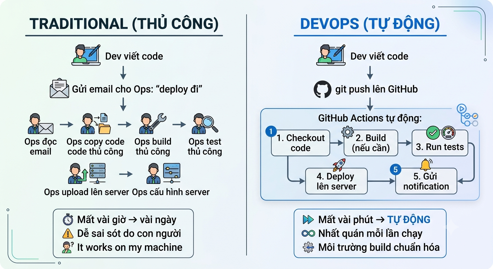
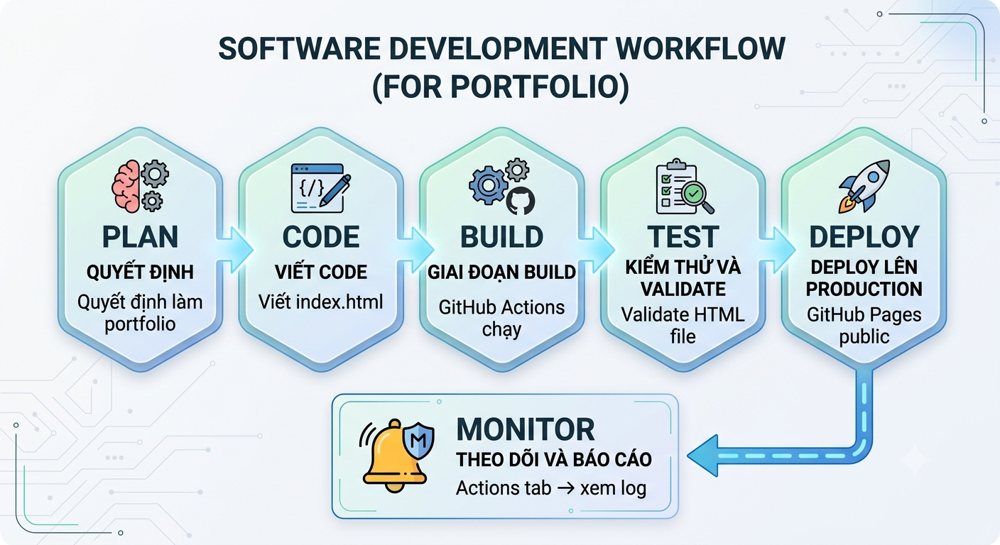

# Lab 1: Trải nghiệm DevOps Workflow End-to-End

> **Hướng dẫn chi tiết từng bước — Thời lượng: 60 phút**

> **Bài 1 — Tổng quan về Vận hành & Bảo trì Phần mềm**

---

## Mục tiêu

Sau lab này, bạn sẽ:

1. Trải nghiệm **toàn bộ vòng đời DevOps**: Plan → Code → Build → Test → Deploy → Monitor
2. Tự tay tạo CI/CD pipeline với **GitHub Actions** (miễn phí, không cần server)
3. Deploy website lên **GitHub Pages** — có URL thật để truy cập
4. So sánh DevOps tự động với cách làm thủ công truyền thống

---

## Yêu cầu

| Thành phần | Yêu cầu |
|------------|---------|
| **Tài khoản GitHub** | Có (đăng ký miễn phí tại github.com) |
| **Git** | ≥ 2.x |
| **VS Code** | Hoặc trình soạn thảo bất kỳ |
| **Trình duyệt** | Chrome/Firefox/Edge |

> **Không cần cài server, không cần cloud account, không cần thẻ tín dụng!**

---

## KIẾN THỨC NỀN — Vòng đời DevOps

<p align="center">
  
</p>


**Sinh viên sẽ trải nghiệm DevOps workflow ngay trong lab này!**

---

## BƯỚC 1: Tạo GitHub Repository + Web Tĩnh (15 phút)

### 1.1 Tạo Repository

1. Vào [github.com](https://github.com) → **New repository**
2. Repository name: `devops-lab1-portfolio`
3. Description: `Lab 1 — DevOps Course: My First CI/CD Pipeline`
4. Chọn **Public**
5. **TÍCH** "Add a README file" (để tạo file readme mô tả mục đích của kho GitHub!)
6. Create repository

### 1.2 Clone về máy

```bash
git clone https://github.com/<YOUR_USERNAME>/devops-lab1-portfolio.git
cd devops-lab1-portfolio
```

### 1.3 Tạo Web Tĩnh

Tạo file `index.html`:

```html
<!DOCTYPE html>
<html lang="vi">
<head>
    <meta charset="UTF-8">
    <meta name="viewport" content="width=device-width, initial-scale=1.0">
    <title>DevOps Lab 1 — My Portfolio</title>
    <style>
        * { margin: 0; padding: 0; box-sizing: border-box; }
        body {
            font-family: 'Segoe UI', Tahoma, Geneva, Verdana, sans-serif;
            background: linear-gradient(135deg, #667eea 0%, #764ba2 100%);
            min-height: 100vh;
            display: flex;
            justify-content: center;
            align-items: center;
            color: #333;
        }
        .container {
            background: white;
            border-radius: 16px;
            padding: 48px;
            max-width: 600px;
            box-shadow: 0 20px 60px rgba(0,0,0,0.3);
            text-align: center;
        }
        h1 { color: #667eea; margin-bottom: 8px; font-size: 32px; }
        h2 { color: #764ba2; margin-bottom: 24px; font-size: 18px; font-weight: normal; }
        .info { background: #f8f9fa; border-radius: 8px; padding: 20px; margin: 16px 0; text-align: left; }
        .info p { margin: 8px 0; }
        .badge {
            display: inline-block;
            background: #667eea;
            color: white;
            padding: 6px 14px;
            border-radius: 20px;
            font-size: 14px;
            margin: 4px;
        }
        .footer { margin-top: 24px; font-size: 13px; color: #999; }
        .status { color: #38a169; font-weight: bold; }
    </style>
</head>
<body>
    <div class="container">
        <h1> Hello, DevOps!</h1>
        <h2>Lab 1 — Trải nghiệm CI/CD Pipeline</h2>

        <div class="info">
            <p> <strong>Bài học:</strong> DevOps Lab 1 — Tổng quan</p>
            <p> <strong>Deploy bởi:</strong> GitHub Actions CI/CD</p>
            <p> <strong>Ngày deploy:</strong> <span id="date"></span></p>
            <p> <strong>Pipeline status:</strong> <span class="status"> Automated</span></p>
        </div>

        <div>
            <span class="badge">HTML5</span>
            <span class="badge">CSS3</span>
            <span class="badge">Git</span>
            <span class="badge">GitHub Actions</span>
            <span class="badge">CI/CD</span>
            <span class="badge">DevOps</span>
        </div>

        <div class="footer">
            <p>Deployed automatically via GitHub Actions Pipeline</p>
            <p> Push code → CI Build → Auto Deploy → Live! </p>
        </div>
    </div>

    <script>
        document.getElementById('date').textContent = new Date().toLocaleDateString('vi-VN');
    </script>
</body>
</html>
```

### 1.4 Test Local (Mở bằng Browser)

```bash
# Windows
start index.html

# macOS
open index.html

# Linux
xdg-open index.html
```

Bạn sẽ thấy trang portfolio hiển thị trong browser. Nhưng hiện tại nó chỉ chạy **local** — chưa ai khác xem được!

✅ **Tiêu chí chấm điểm 1:** `index.html` hiển thị trong browser local?

---

## BƯỚC 2: Viết GitHub Actions CI/CD Pipeline (15 phút)

Đây là **trái tim của DevOps** — file YAML định nghĩa pipeline tự động.

### 2.1 Tạo thư mục GitHub Actions

```bash
mkdir .github\workflows
Dùng: mkdir -p .github/workflows (nếu chạy trên Linux)
```

### 2.2 Viết Pipeline File: deploy.yml

Tạo file `.github/workflows/deploy.yml` (lưu ý: thay '/' bởi ' \ ' khi sử dụng hdh Window):

```yaml
# ============================================================
# DevOps Lab 1 — CI/CD Pipeline với GitHub Actions
# Tự động deploy website lên GitHub Pages mỗi khi push code
# ============================================================

name: Deploy to GitHub Pages

# === Khi nào pipeline chạy? ===
on:
  push:
    branches: [main]       # Chạy khi push lên nhánh main
  workflow_dispatch:        # Cho phép chạy thủ công từ GitHub UI

# === Các job trong pipeline ===
jobs:
  # Job 1: Build & Deploy
  build-and-deploy:
    runs-on: ubuntu-latest   # Chạy trên máy ảo Ubuntu (free)

    steps:
      # Step 1: Checkout code từ GitHub
      - name: Checkout Code
        uses: actions/checkout@v4

      # Step 2: Kiểm tra HTML cơ bản
      - name: Validate HTML
        run: |
          echo "Checking index.html exists..."
          if [ -f "index.html" ]; then
            echo "index.html found!"
            echo "File size: $(wc -c < index.html) bytes"
          else
            echo " index.html NOT found!"
            exit 1
          fi

      # Step 3: Deploy lên GitHub Pages
      - name: Deploy to GitHub Pages
        uses: peaceiris/actions-gh-pages@v3
        with:
          github_token: ${{ secrets.GITHUB_TOKEN }}
          publish_dir: ./
          publish_branch: gh-pages
          commit_message: "Auto-deploy from CI pipeline"
```

### 2.3 Giải thích từng dòng

| Phần | Ý nghĩa |
|------|---------|
| `name:` | Tên pipeline — hiển thị trên GitHub |
| `on: push: branches: [main]` | **Trigger**: pipeline tự chạy mỗi khi push code lên main |
| `workflow_dispatch:` | Cho phép chạy pipeline thủ công bằng nút bấm |
| `jobs:` | Danh sách các job (công việc) |
| `build-and-deploy:` | Job duy nhất: build + deploy |
| `runs-on: ubuntu-latest` | Chạy trên máy ảo Ubuntu (GitHub cung cấp miễn phí) |
| `steps:` | Các bước thực hiện tuần tự |
| `actions/checkout@v4` | Checkout source code từ repo |
| `Validate HTML` | Step custom: kiểm tra file tồn tại |
| `peaceiris/actions-gh-pages@v3` | Deploy lên GitHub Pages (branch `gh-pages`) |

### 2.4 Cấu hình GitHub Pages

1. Vào repo → **Settings** → **Pages**
2. Source: **Deploy from a branch**
3. Branch: `gh-pages` → `/ (root)` → **Save** (nếu chưa có branh 'gh-pages' thì tại cmd git tạo branch và đẩy lên GitHub bằng cách thực hiện tuần tự các lệnh sau:
   
   git checkout -b gh-pages
   
   git push origin gh-pages
   
   => Thực thi lệnh: git checkout main => Nếu muốn bật nhánh main làm nhánh hiện thời)
5. Đợi 1-2 phút → URL sẽ hiện ra: `https://<USER>.github.io/devops-lab1-portfolio/` . Ví dụ: https://phamthuongblog.github.io/devops-lab1-portfolio/

> Nếu chưa thấy phần "Pages", pipeline sẽ tự tạo branch `gh-pages` sau lần chạy đầu tiên.

✅ **Tiêu chí chấm điểm 2:** File `.github/workflows/deploy.yml` đã được tạo? Cấu trúc thư mục:
```
devops-lab1-portfolio/
├── .github/
│   └── workflows/
│       └── deploy.yml    ← Pipeline definition
├── index.html
└── README.md
```

---

## BƯỚC 3: Push Code & Quan sát CI/CD Pipeline (15 phút)

### 3.1 Push Code Lên GitHub

```bash
git add index.html .github/workflows/deploy.yml
git commit -m "feat: portfolio page + GitHub Actions CI/CD pipeline"
git push origin main
Lưu ý: nếu muốn trang web thay đổi nội dung, thì mọi update code cần đẩy lên nhánh :'gh-pages ' thay vì nhánh 'main' 
```

### 3.2 Quan sát Pipeline Chạy

1. Vào repo trên GitHub → tab **Actions**
2. Bạn sẽ thấy pipeline ` Deploy to GitHub Pages` đang chạy:

```
 Deploy to GitHub Pages
  └─ build-and-deploy
      ├─  Checkout Code ............  (2s)
      ├─  Validate HTML ............  (1s)  "index.html found! File size: 1234 bytes"
      └─  Deploy to GitHub Pages ...  (5s)
```

3. Nhấp vào từng step để xem log chi tiết

### 3.3 Xem Website Online!

Vào trình duyệt, truy cập:

```
https://<YOUR_USERNAME>.github.io/devops-lab1-portfolio/
```

 **Website của bạn đã ONLINE!** Bất kỳ ai trên thế giới cũng có thể truy cập!

### 3.4 Test CI/CD: Sửa Code → Push → Tự động Update

Sửa file `index.html`, thay đổi dòng tiêu đề:

```html
<h1> Xin chào, DevOps!</h1>
<h2>Lab 1 — Website đã được cập nhật tự động! </h2>
```

```bash
git add index.html
git commit -m "update: change title to Vietnamese"
git push origin main
```

Quay lại tab **Actions** → pipeline **tự động chạy lại** → đợi ~10 giây → **refresh website** → nội dung đã thay đổi!

>  **Bạn vừa trải nghiệm DevOps thực thụ: Push code → Tự động deploy → Live!**

✅ **Tiêu chí chấm điểm 3:** Website online tại `*.github.io`? Sửa code + push → website tự cập nhật?

---

## BƯỚC 4: So sánh DevOps vs Truyền thống (15 phút)

### 4.1 Điền vào Bảng So sánh

Dựa trên trải nghiệm lab, hãy điền bảng sau:

| Tiêu chí | Cách THỦ CÔNG (Traditional) | Cách DEVOPS (CI/CD Pipeline) |
|----------|---------------------------|------------------------------|
| **Làm sao để deploy?** | (tự điền) | Push code lên GitHub → pipeline tự chạy |
| **Mất bao lâu?** | (tự điền) | ~10 giây |
| **Ai làm deploy?** | (tự điền) | GitHub Actions (máy tự làm) |
| **Có bị sai sót không?** | (tự điền) | Không — pipeline nhất quán 100% |
| **Rollback nếu lỗi?** | (tự điền) | `git revert` + push → tự động rollback |
| **Làm sao biết deploy thành công?** | (tự điền) | GitHub Actions gửi notification ✅/❌ |

### 4.2 Vẽ DevOps Workflow của Bạn

Vẽ sơ đồ workflow bạn vừa trải nghiệm: 

<p align="center">
  
</p>


### 4.3 Trả lời Câu hỏi

1. **DevOps workflow tự động hóa những bước nào mà cách thủ công phải làm bằng tay?**
   → Build, test, deploy — tất cả đều được GitHub Actions làm tự động.

2. **Nếu bạn deploy sai (website bị lỗi), làm sao để quay lại phiên bản cũ?**
   → `git revert <commit>` hoặc `git reset --hard <commit>` rồi push → pipeline tự deploy bản cũ.

3. **GitHub Actions pipeline đã giúp bạn tiết kiệm bao nhiêu thời gian so với cách thủ công?**
   → Thủ công: download file → upload lên server → cấu hình → test (15-30 phút). DevOps: `git push` (10 giây).

✅ **Tiêu chí chấm điểm 4:** Đã điền bảng so sánh + vẽ workflow + trả lời 3 câu hỏi?

---

## TROUBLESHOOTING

| # | Lỗi | Cách khắc phục |
|---|------|---------------|
| 1 | Pipeline không chạy sau khi push | Kiểm tra: có push lên nhánh `main` không? File `.github/workflows/deploy.yml` có đúng tên không? |
| 2 | Website hiển thị 404 | Vào Settings → Pages → kiểm tra Source = `gh-pages` branch. Đợi 1-2 phút. |
| 3 | `actions/checkout@v4` báo lỗi | Có thể GitHub cần version mới hơn. Thử `actions/checkout@v5` |
| 4 | Permission denied khi push | Cấu hình Personal Access Token (xem Lab 5) hoặc dùng SSH key |
| 5 | Website không hiển thị CSS | Kiểm tra xem CSS có nằm trong `<style>` tag không (inline). GitHub Pages không hỗ trợ server-side rendering |
| 6 | Pipeline báo "index.html NOT found" | File `index.html` phải nằm ở thư mục GỐC của repo (không nằm trong thư mục con) |

---

## BÀI TẬP MỞ RỘNG

**Thêm ảnh đại diện:** Thêm ảnh avatar vào portfolio, push → xem pipeline deploy ảnh
**Multi-page:** Tạo thêm `about.html`, `contact.html` → thêm navigation
**Thêm Lighthouse CI:** Tích hợp Google Lighthouse để audit performance, accessibility, SEO tự động

---

## TIÊU CHÍ CHẤM ĐIỂM - TỔNG HỢP

| # | Tiêu chí | Điểm | Cách đánh giá |
|---|----------|:----:|--------------|
| 1 | **Repository** — public, có README, có index.html | 15% | Truy cập repo trên GitHub |
| 2 | **Pipeline** — `.github/workflows/deploy.yml` tồn tại | 25% | File YAML đúng cấu trúc |
| 3 | **Website Online** — URL `*.github.io` hoạt động | 35% | Mở URL thấy trang portfolio |
| 4 | **CI/CD Hoạt động** — Push code → pipeline chạy → web update | 15% | Actions tab hiển thị  |
| 5 | **Bảng So sánh + Workflow** — hiểu DevOps vs Traditional | 10% | File text hoặc ảnh chụp |
| **TỔNG** | | **100%** | |

### Cách Nộp bài

```
Lab1_HoTen_MSSV.zip
├── screenshots/
│   ├── 01-github-repo.png          ← Repository trên GitHub
│   ├── 02-pipeline-running.png     ← Actions tab — pipeline đang chạy
│   ├── 03-pipeline-success.png     ← Tất cả steps ✅ xanh
│   ├── 04-website-online.png       ← Website hiển thị trên browser
│   ├── 05-update-pipeline.png      ← Pipeline chạy lại sau khi sửa code
│   └── 06-comparison-table.png     ← Bảng so sánh DevOps vs Traditional
└── ho_ten_mssv.txt
```

---

> 🎯 **Lab này tương ứng với:** CDR 1.2 (Hiểu DevOps vs truyền thống) + CDR 1.3 (Hiểu vòng đời DevOps)
>
> 📅 **Cập nhật:** 2026-07-03
