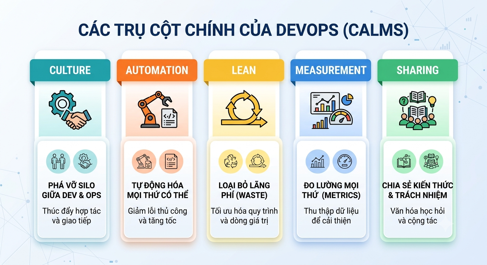

# Lab 2: Thiết lập Môi trường DevOps & Áp dụng Nguyên tắc CALMS

## Thông tin chung
- **Bài 2 — DevOps và các Nguyên tắc Cốt lõi** 
- **CDR:** 2.1 (Khái niệm DevOps) + 2.2 (Nguyên tắc cốt lõi) + 2.3 (Công cụ DevOps)
- **Mức Bloom:** Hiểu + Vận dụng cơ bản
- **Thời lượng:** 75 phút
- **Hình thức:** Sinh viên tự thực hành theo hướng dẫn

## Mục tiêu
Sau lab này, sinh viên có thể:
1. Cài đặt và cấu hình **DevOps Toolchain** cơ bản: VS Code + Git + Docker Desktop
2. Hiểu và áp dụng **5 nguyên tắc CALMS** qua bài tập thực hành
3. Tạo **automation script** đầu tiên — nguyên tắc Automation của DevOps
4. Vẽ được **DevOps Toolchain Map** — biết công cụ nào dùng cho giai đoạn nào

## CALMS Framework

  

## Nội dung Lab
| Step | Nội dung | CALMS | Thời gian |
|------|----------|:-----:|-----------|
| 1 | Cài đặt DevOps Toolchain | — | 20 phút |
| 2 | Automation: Script tự động hóa đầu tiên | A | 15 phút |
| 3 | Lean: Tối ưu quy trình với Docker | L | 15 phút |
| 4 | DevOps Toolchain Map + Tổng kết | M+S | 15 phút |
| 5 | CALMS Self-Assessment | C+M+S | 10 phút |
