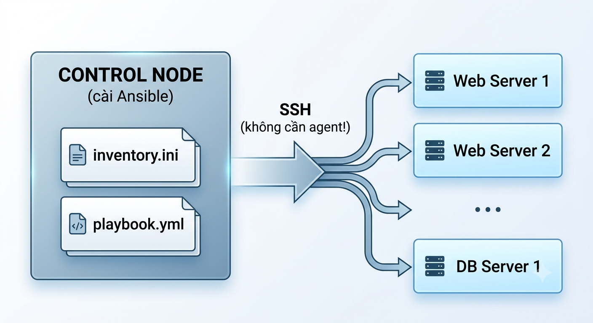

# Lab 4: Quản lý Cấu hình Hạ tầng với Ansible

> **Hướng dẫn chi tiết — 90 phút | Bài 4 — Quản lý Hạ tầng**

---

## Mục tiêu

Sau lab này, bạn sẽ:

1. Cài đặt Ansible + dựng **managed nodes** bằng Docker (không cần máy ảo thật!)
2. Viết **Inventory** để quản lý danh sách server
3. Dùng **Ad-hoc Commands** kiểm tra nhanh hàng loạt server
4. Viết **Playbook** tự động cấu hình web server + database
5. Áp dụng **Variables** và **Templates** — nền tảng của Ansible Roles

---

## Yêu cầu

| Thành phần | Yêu cầu |
|------------|---------|
| OS | Windows 10+/macOS/Linux |
| RAM | ≥ 4GB |
| **Docker Desktop** | ≥ 24.x |
| **Python** | ≥ 3.9 (Ansible yêu cầu) |
| **Ansible** | ≥ 9.x (sẽ cài trong lab) |

---

## KIẾN THỨC NỀN

### Ansible là gì?

> Ansible = công cụ **Configuration Management** (quản lý cấu hình) + **Automation**. Nó cho phép bạn quản lý hàng trăm server từ 1 máy control node, KHÔNG cần cài agent trên managed nodes.

### Kiến trúc Ansible

<p align="center">
  
</p>


### So sánh: IaC vs Config Management

| | Terraform (Bài 3) | Ansible (Bài 4) |
|---|---|---|
| **Loại** | Provisioning (IaC) | Configuration Management |
| **Làm gì?** | TẠO server, network, storage | CẤU HÌNH server (cài đặt, update) |
| **State** | Quản lý state file | Agentless (idempotent) |
| **Ngôn ngữ** | HCL | YAML |
| **Ví dụ** | "Tạo 3 EC2 instances" | "Cài Apache lên 3 servers đó" |

---

## BƯỚC 1: Cài đặt Ansible + Dựng Managed Nodes (15 phút)

### 1.1 Cài đặt Ansible

#### Windows (dùng WSL hoặc pip)
```powershell
# Cách 1: Dùng pip (đơn giản nhất)
pip install ansible

# Cách 2: Dùng Chocolatey
choco install ansible -y
```

#### macOS
```bash
brew install ansible
```

#### Linux (Ubuntu/Debian)
```bash
sudo apt update
sudo apt install -y ansible
```

**Kiểm tra:**
```bash
ansible --version
```

### 1.2 Tạo Managed Nodes bằng Docker

> 💡 Thay vì cần 3 máy ảo thật, ta dùng Docker containers đóng vai trò "server"!

```bash
# Tạo thư mục lab
mkdir lab4-ansible && cd lab4-ansible

# Tạo Docker network
docker network create ansible-lab

# Tạo 3 "server" containers (Ubuntu, có SSH)
docker run -d --name web-server-1 --network ansible-lab \
  -p 2201:22 rastasheep/ubuntu-sshd:18.04

docker run -d --name web-server-2 --network ansible-lab \
  -p 2202:22 rastasheep/ubuntu-sshd:18.04

docker run -d --name db-server-1 --network ansible-lab \
  -p 2203:22 rastasheep/ubuntu-sshd:18.04

# Kiểm tra containers đang chạy
docker ps --filter "network=ansible-lab"
```

> ⚠️ Image `rastasheep/ubuntu-sshd:18.04` có sẵn SSH với user `root`, password `root`.

**Kết quả mong đợi:** 3 containers: web-server-1, web-server-2, db-server-1 đều **Up**.

### 1.3 Test SSH vào Managed Nodes

```bash
# SSH vào web-server-1 (port 2201, password: root)
ssh -o StrictHostKeyChecking=no -p 2201 root@localhost

# Gõ "root" khi hỏi password → xem command prompt → exit
exit
```

✅ **CHECKPOINT 1:** Ansible + Docker cài đặt OK? SSH được vào container?

---

## BƯỚC 2: Ansible Inventory — Khai báo Server (10 phút)

### 2.1 Tạo Inventory File

Tạo file `inventory.ini`:

```ini
# ============================================
# Ansible Inventory — DevOps Lab 4
# ============================================

# Group: Web Servers
[webservers]
web-server-1 ansible_host=localhost ansible_port=2201
web-server-2 ansible_host=localhost ansible_port=2202

# Group: Database Servers
[dbservers]
db-server-1  ansible_host=localhost ansible_port=2203

# Group: All Production Servers
[production:children]
webservers
dbservers

# Global Variables
[all:vars]
ansible_user=root
ansible_password=root
ansible_connection=ssh
ansible_ssh_common_args='-o StrictHostKeyChecking=no'
```

### 2.2 Cấu hình Ansible

Tạo file `ansible.cfg`:

```ini
[defaults]
inventory = ./inventory.ini
host_key_checking = False
timeout = 30
stdout_callback = yaml
```

### 2.3 Test Inventory

```bash
# Liệt kê tất cả hosts
ansible-inventory --list

# Ping tất cả hosts
ansible all -m ping
```

**Kết quả mong đợi:**
```yaml
web-server-1:
  ping: pong
web-server-2:
  ping: pong
db-server-1:
  ping: pong
```

> 🎉 Nếu thấy `pong` từ cả 3 server → Ansible đã kết nối được!

✅ **CHECKPOINT 2:** `ansible all -m ping` trả về `pong` từ 3 hosts?

---

## BƯỚC 3: Ad-hoc Commands — Quản lý Nhanh (15 phút)

Ad-hoc = chạy 1 lệnh Ansible không cần viết playbook.

### 3.1 Kiểm tra Hệ thống

```bash
# Kiểm tra OS version của tất cả servers
ansible all -m shell -a "cat /etc/os-release | head -3"

# Kiểm tra disk usage
ansible all -m shell -a "df -h /"

# Kiểm tra memory
ansible all -m shell -a "free -m | head -2"

# Chỉ kiểm tra webservers group
ansible webservers -m shell -a "hostname"
```

### 3.2 Thao tác File & Package

```bash
# Tạo file trên tất cả servers
ansible all -m file -a "path=/tmp/ansible-test state=touch"

# Kiểm tra file đã tạo
ansible all -m shell -a "ls -la /tmp/ansible-test"

# Cài đặt package (ví dụ: curl)
ansible all -m apt -a "name=curl state=present update_cache=yes"

# Kiểm tra curl đã cài
ansible all -m shell -a "which curl"
```

### 3.3 Copy File & Quản lý Service

```bash
# Tạo file local
echo "Hello from Ansible!" > hello.txt

# Copy file lên tất cả webservers
ansible webservers -m copy -a "src=hello.txt dest=/tmp/hello.txt"

# Kiểm tra
ansible webservers -m shell -a "cat /tmp/hello.txt"
```

✅ **CHECKPOINT 3:** Ad-hoc commands chạy thành công? `curl` đã được cài trên các server?

---

## BƯỚC 4: Playbook Cơ bản — Cài đặt Web Server (20 phút)

### 4.1 Viết Playbook Đầu tiên

Tạo file `playbook-webserver.yml`:

```yaml
---
# ============================================
# DevOps Lab 4 — Playbook: Cấu hình Web Server
# ============================================
- name: Configure Web Servers
  hosts: webservers
  become: yes            # Chạy với quyền root
  gather_facts: yes      # Thu thập thông tin hệ thống

  vars:
    web_package: apache2
    web_service: apache2
    web_root: /var/www/html

  tasks:
    # Task 1: Cập nhật apt cache
    - name: Update apt cache
      apt:
        update_cache: yes
        cache_valid_time: 3600

    # Task 2: Cài đặt Apache Web Server
    - name: Install Apache web server
      apt:
        name: "{{ web_package }}"
        state: present

    # Task 3: Đảm bảo Apache đang chạy
    - name: Ensure Apache is running and enabled
      service:
        name: "{{ web_service }}"
        state: started
        enabled: yes

    # Task 4: Tạo file index.html tùy chỉnh
    - name: Create custom index.html
      copy:
        content: |
          <html>
          <head><title>DevOps Lab 4</title></head>
          <body>
          <h1>🚀 DevOps Lab 4 — Ansible Managed!</h1>
          <p>Server: {{ ansible_hostname }}</p>
          <p>OS: {{ ansible_distribution }} {{ ansible_distribution_version }}</p>
          <p>IP: {{ ansible_default_ipv4.address }}</p>
          <p>Managed by: <b>Ansible Playbook</b></p>
          </body>
          </html>
        dest: "{{ web_root }}/index.html"

    # Task 5: Mở port 80 trong firewall
    - name: Allow HTTP through firewall
      ufw:
        rule: allow
        port: '80'
        proto: tcp
      ignore_errors: yes   # Bỏ qua nếu firewall chưa cài
```

### 4.2 Chạy Playbook

```bash
# Dry-run — xem trước thay đổi mà không thực thi
ansible-playbook playbook-webserver.yml --check

# Chạy thật
ansible-playbook playbook-webserver.yml
```

**Kết quả mong đợi (rút gọn):**
```
PLAY [Configure Web Servers] **************************************
TASK [Update apt cache] *******************************************
ok: [web-server-1]
ok: [web-server-2]
TASK [Install Apache web server] **********************************
changed: [web-server-1]
changed: [web-server-2]
TASK [Ensure Apache is running] **********************************
ok: [web-server-1]
ok: [web-server-2]
TASK [Create custom index.html] **********************************
changed: [web-server-1]
changed: [web-server-2]

PLAY RECAP ********************************************************
web-server-1: ok=5 changed=2 ...
web-server-2: ok=5 changed=2 ...
```

### 4.3 Verify Web Server

```bash
# Kiểm tra Apache đang chạy trong container
docker exec web-server-1 curl -s http://localhost

# Hoặc expose port 80 và test từ local
# (thêm -p 8081:80 khi docker run nếu cần)
```

✅ **CHECKPOINT 4:** Playbook chạy thành công? Apache đã được cài trên cả 2 web servers?

---

## BƯỚC 5: Playbook Nâng cao — Multi-server + Templates (20 phút)

### 5.1 Playbook Tổng hợp

Tạo `playbook-full.yml`:

```yaml
---
# ============================================
# DevOps Lab 4 — Full Stack Playbook
# Cấu hình: Webservers + DB Server
# ============================================

# ----- Phần 1: Cấu hình Web Servers -----
- name: Configure Web Tier
  hosts: webservers
  become: yes

  tasks:
    - name: Install common packages
      apt:
        name:
          - curl
          - git
          - htop
          - vim
        state: present

    - name: Create application directory
      file:
        path: /opt/myapp
        state: directory
        mode: '0755'

    - name: Deploy application config
      copy:
        content: |
          APP_NAME=DevOpsLab4
          APP_ENV=production
          APP_PORT=8080
        dest: /opt/myapp/config.env

    - name: Create health check script
      copy:
        content: |
          #!/bin/bash
          echo "=== Health Check: $(date) ==="
          echo "Hostname: $(hostname)"
          echo "Uptime: $(uptime)"
          echo "Disk: $(df -h / | tail -1)"
          echo "Memory: $(free -m | grep Mem)"
        dest: /opt/myapp/health-check.sh
        mode: '0755'

- name: Setup Monitoring Agents
  hosts: all
  become: yes

  tasks:
    - name: Install monitoring tools
      apt:
        name:
          - sysstat
          - net-tools
        state: present
```

### 5.2 Chạy Full Playbook

```bash
# Kiểm tra syntax
ansible-playbook playbook-full.yml --syntax-check

# Chạy
ansible-playbook playbook-full.yml

# Kiểm tra kết quả
ansible all -m shell -a "/opt/myapp/health-check.sh"
ansible all -m shell -a "cat /opt/myapp/config.env"
```

### 5.3 Ansible Facts — Thông tin Tự động

```bash
# Ansible tự động thu thập "facts" về mỗi server
ansible all -m setup | head -100

# Lọc facts cụ thể
ansible all -m setup -a "filter=ansible_distribution"
ansible all -m setup -a "filter=ansible_memory_mb"
ansible all -m setup -a "filter=ansible_processor*"
```

### 5.4 Idempotency Demo — Chạy lại vẫn OK!

```bash
# Chạy lại playbook — Ansible sẽ báo "ok" (không "changed")
ansible-playbook playbook-webserver.yml
# Kết quả: changed=0 — vì mọi thứ đã được cấu hình đúng rồi!
```

> 💡 **Đây là SỨC MẠNH của Ansible:** idempotent — chạy 1 lần hay 100 lần, kết quả giống hệt!

✅ **CHECKPOINT 5:** Full playbook chạy OK? `ansible all -m shell -a "/opt/myapp/health-check.sh"` hoạt động?

---

## BƯỚC 6: Dọn dẹp (10 phút)

```bash
# Dừng và xóa containers
docker stop web-server-1 web-server-2 db-server-1
docker rm web-server-1 web-server-2 db-server-1

# Xóa Docker network
docker network rm ansible-lab
```

✅ **CHECKPOINT 6:** `docker ps -a` không còn containers lab4 nào?

---

## KIẾN THỨC TRỌNG TÂM — Phân biệt IaC vs Config Management

| | Terraform (Bài 3) | Ansible (Bài 4) |
|---|---|---|
| **Loại công cụ** | Provisioning (IaC) | Configuration Management |
| **Làm gì?** | Tạo/xóa server, network, storage | Cấu hình server sau khi đã tạo |
| **Ví dụ thực tế** | "Tạo 5 EC2 instances" | "Cài Apache lên 5 EC2 đó" |
| **Có state file?** | ✅ terraform.tfstate | ❌ Không (agentless) |
| **Ngôn ngữ** | HCL | YAML |
| **Quản lý multi-cloud?** | ✅ Có | ✅ Có |
| **Idempotent?** | ✅ | ✅ |

> 🔗 **Trong DevOps pipeline thực tế:** Terraform provision server → Ansible configure server → Jenkins deploy app. Cả 3 công cụ bổ trợ cho nhau!

---

## TROUBLESHOOTING

| # | Lỗi | Cách khắc phục |
|---|------|---------------|
| 1 | `ansible: command not found` | Chưa cài Ansible: `pip install ansible` |
| 2 | `Failed to connect to host via ssh` | Kiểm tra container đang chạy: `docker ps`. Kiểm tra port: `-p 2201:22` |
| 3 | `Permission denied` khi SSH | Password mặc định là `root`. Kiểm tra `ansible_password=root` trong inventory |
| 4 | `apt update` bị timeout | Container Ubuntu cũ, chạy `docker exec web-server-1 apt update` thủ công |
| 5 | Apache không start được | `docker exec web-server-1 service apache2 status` |
| 6 | `ansible_ssh_common_args` không hoạt động | Dùng `ansible_ssh_extra_args` thay thế |

---

## BÀI TẬP MỞ RỘNG

### 🟢 Cơ bản
1. **Thêm biến inventory:** Tách `ansible_user`, `ansible_password` thành biến group
2. **Thêm handler:** Thêm `notify: restart apache` khi index.html thay đổi

### 🟡 Trung bình
3. **Dùng Ansible Vault:** Mã hóa password thay vì để plaintext trong inventory
4. **Dùng Jinja2 Templates:** Thay `copy` bằng `template` module với file `.j2`

### 🔴 Nâng cao
5. **Ansible Role:** Tổ chức playbook thành role: `roles/webserver/`, `roles/database/`
6. **Ansible Galaxy:** Cài role `geerlingguy.apache` từ Ansible Galaxy — chỉ 1 dòng!

---

## TIÊU CHÍ CHẤM ĐIỂM

| # | Tiêu chí | Điểm |
|---|----------|:----:|
| 1 | Ansible cài đặt + Docker containers chạy | 20% |
| 2 | Inventory — ping `pong` từ 3 hosts | 15% |
| 3 | Ad-hoc commands — kiểm tra hệ thống thành công | 15% |
| 4 | Playbook web server — Apache cài đặt OK | 25% |
| 5 | Full playbook — multi-server config OK | 15% |
| 6 | Dọn dẹp containers | 10% |
| **TỔNG** | | **100%** |

### Cách Nộp bài

```
Lab4_HoTen_MSSV.zip
├── inventory.ini
├── ansible.cfg
├── playbook-webserver.yml
├── playbook-full.yml
├── screenshots/
│   ├── 01-ansible-ping.png          ← ansible all -m ping
│   ├── 02-adhoc-check.png           ← Ad-hoc commands output
│   ├── 03-playbook-webserver.png    ← Playbook chạy thành công
│   ├── 04-playbook-full.png         ← Full playbook output
│   └── 05-idempotent.png            ← Chạy lại → changed=0
└── ho_ten_mssv.txt
```

---

> 🎯 **Lab này tương ứng với:** CDR 4.2 — Vận dụng IaaS trong quản lý cấu hình hạ tầng với Ansible
> 📅 **Cập nhật:** 2026-07-03
