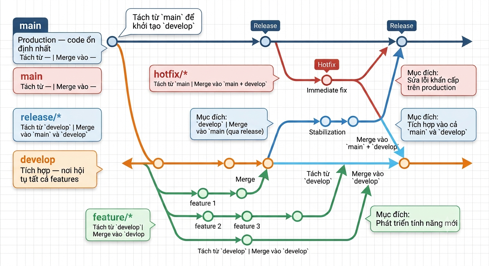
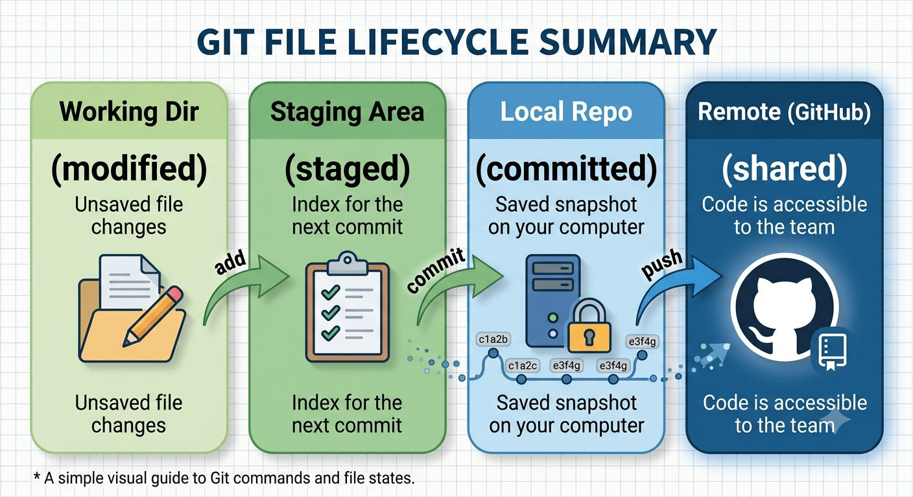

# Lab 5: Quản lý Mã nguồn với Git Flow & Code Review trên GitHub

> **Hướng dẫn chi tiết từng bước — Thời lượng: 90 phút**
> **Hình thức: Nhóm 2 người (Dev A + Dev B)**

---

## Mục tiêu

Sau lab này, bạn sẽ:

1.  Khởi tạo Git repo, kết nối GitHub, làm việc với remote
2.  Thành thạo: `git add` → `git commit` → `git push` → `git pull`
3.  Áp dụng Git Flow: `main`, `develop`, `feature/*`, `hotfix/*`
4.  Tạo Pull Request và thực hiện Code Review trên GitHub
5.  Giải quyết merge conflict khi 2 người cùng sửa 1 file
6.  Sử dụng `.gitignore` và viết `README.md` chuyên nghiệp

---

## Yêu cầu Hệ thống

| Thành phần | Yêu cầu | Ghi chú |
|------------|---------|---------|
| OS | Windows 10+/macOS/Linux | |
| **Git** | ≥ 2.40 | [Tải tại đây](https://git-scm.com/downloads) |
| **VS Code** | Bản mới nhất | Hoặc trình soạn thảo code bất kỳ |
| **GitHub Account** | Có | [Đăng ký tại đây](https://github.com/) |
| Internet | Có | Để push/pull với GitHub |

---

## KIẾN THỨC NỀN — Nhắc lại trước Lab

### Git Flow — Chiến lược Phân nhánh

<p align="center">
  
</p>

| Nhánh | Mục đích | Tách từ | Merge vào |
|-------|----------|---------|-----------|
| `main` | Production — code ổn định nhất | — | — |
| `develop` | Tích hợp — nơi hội tụ tất cả features | `main` | `main` (qua release) |
| `feature/*` | Phát triển tính năng mới | `develop` | `develop` |
| `release/*` | Chuẩn bị phát hành | `develop` | `main` + `develop` |
| `hotfix/*` | Sửa lỗi khẩn cấp trên production | `main` | `main` + `develop` |

### GitHub Flow (Đơn giản hơn — dùng trong lab này)
<p align="center">
  
</p>

1. Tạo branch từ `main`: `git checkout -b feature/xxx`
2. Code + commit trên branch
3. Push branch lên GitHub: `git push origin feature/xxx`
4. Tạo Pull Request (PR) trên GitHub
5. Team review code → Approve → Merge vào `main`
6. Xóa branch sau khi merge

### Các Lệnh Git Cốt lõi

| Lệnh | Chức năng | Ví dụ |
|------|-----------|-------|
| `git init` | Khởi tạo repo Git mới | `git init` |
| `git clone <url>` | Sao chép repo từ xa | `git clone https://github.com/user/repo.git` |
| `git status` | Xem trạng thái working tree | `git status` |
| `git add <file>` | Đưa file vào staging area | `git add .` |
| `git commit -m "msg"` | Lưu thay đổi vào lịch sử | `git commit -m "Add login feature"` |
| `git push origin <branch>` | Đẩy code lên GitHub | `git push origin main` |
| `git pull origin <branch>` | Kéo code mới nhất từ GitHub | `git pull origin main` |
| `git branch` | Liệt kê/tạo nhánh | `git branch feature/login` |
| `git checkout <branch>` | Chuyển sang nhánh | `git checkout feature/login` |
| `git merge <branch>` | Gộp nhánh vào nhánh hiện tại | `git merge feature/login` |
| `git log --oneline` | Xem lịch sử commit | `git log --oneline -5` |

### Vòng đời File trong Git

<p align="center">
  
</p>

---

## BƯỚC 1: Cài đặt & Cấu hình Git + GitHub (10 phút)

### 1.1 Kiểm tra Git

```bash
git --version
```

**Kết quả mong đợi:** `git version 2.40.x` hoặc cao hơn.

### 1.2 Cấu hình Git (BẮT BUỘC!)

```bash
# Thay YOUR_NAME và YOUR_EMAIL bằng thông tin của bạn
git config --global user.name "Nguyen Van A"
git config --global user.email "nguyenvana@example.com"

# Cấu hình tên nhánh mặc định là main
git config --global init.defaultBranch main

# Cấu hình editor mặc định là VS Code
git config --global core.editor "code --wait"

# Kiểm tra cấu hình
git config --list
```

### 1.3 Tạo GitHub Personal Access Token (PAT) - SINH VIÊN TÙY CHỌN

> Từ 2021, GitHub không cho phép đăng nhập bằng password khi push code. Phải dùng **Personal Access Token** hoặc **SSH Key**.

1. Vào GitHub → Settings → Developer settings → Personal access tokens → **Tokens (classic - nếu muốn áp dụng cho tất cả các kho trong tài khoản GitHub) / Fine-grained tokens (nếu muốn áp dụng chỉ cho kho)** 
2. Generate new token → **Generate new token (classic)**
3. Note: `Lab5-DevOps`
4. Expiration: `30 days`
5. Tích chọn: `repo` (Tại mục Repository access, chọn kho muốn truy cập), `workflow`, `read:org`
6. Generate token → **COPY & LƯU LẠI NGAY!** (chỉ hiện 1 lần)

> Token này thay thế password khi push code. Ví dụ: `ghp_xxxxxxxxxxxxxxxxxxxx`

✅ **CHECKPOINT 1:** `git --version` OK + `git config --list` thấy user.name, user.email + đã có GitHub Token?

---

## BƯỚC 2: Khởi tạo Repository & Kết nối GitHub (10 phút)

> **👤 DEV A làm bước này. Dev B quan sát.**

### 2.1 Tạo Repository trên GitHub

1. Vào GitHub → **New repository**
2. Repository name: `devops-lab5-student-manager`
3. Description: `Lab 5 — DevOps Course: Git Flow & Code Review`
4. Public
5. **KHÔNG** tích "Add a README file" (ta sẽ tự tạo)
6. **KHÔNG** tích ".gitignore" (ta sẽ tự tạo)
7. Create repository

### 2.2 Tạo Project Local & Kết nối GitHub

```bash
# Tạo thư mục dự án
mkdir devops-lab5-student-manager
cd devops-lab5-student-manager

# Khởi tạo Git repo
git init

# Tạo file README.md ban đầu
echo "# Student Manager" > README.md
echo "" >> README.md
echo "Ứng dụng quản lý sinh viên — DevOps Lab 5" >> README.md

# Tạo .gitignore cho Python project
echo "__pycache__/" > .gitignore
echo "*.pyc" >> .gitignore
echo ".env" >> .gitignore
echo ".vscode/" >> .gitignore
echo "*.log" >> .gitignore

# Commit đầu tiên
git add README.md .gitignore
git commit -m "Initial commit: README + .gitignore"

# Kết nối với GitHub remote
git remote add origin https://github.com/<YOUR_USERNAME>/devops-lab5-student-manager.git

# Đẩy lên GitHub
git push -u origin main
```

> 🔑 Khi push, nhập **username** (GitHub username) + **password** (Personal Access Token — KHÔNG phải mật khẩu GitHub!)

### 2.3 Dev B Clone Repository

> **👤 DEV B làm bước này.**

```bash
# Clone repo về máy
git clone https://github.com/<DEV_A_USERNAME>/devops-lab5-student-manager.git
cd devops-lab5-student-manager

# Kiểm tra remote
git remote -v
# origin  https://github.com/<USER>/devops-lab5-student-manager.git (fetch)
# origin  https://github.com/<USER>/devops-lab5-student-manager.git (push)
```

### 2.4 Thêm Collaborator (Dev A thực hiện bước này)

1. Vào repo trên GitHub → **Settings** → **Collaborators** → **Add people**
2. Nhập username của Dev B → **Add**
3. Dev B nhận email invitation → **Accept**

✅ **CHECKPOINT 2:** Cả 2 người đều clone được repo? `git remote -v` thấy origin?

---

## BƯỚC 3: Git Cơ bản — add → commit → push → pull (15 phút)

> **👤 DEV A làm trước. Dev B quan sát → sau đó làm theo.**

### 3.1 Tạo File Source Code Đầu tiên

```bash
# Tạo cấu trúc thư mục
mkdir src
cd src
```

Tạo file `src/student.py`:

```python
"""
Student Manager — DevOps Lab 5
Module: Student Model
"""

class Student:
    """Lớp đại diện cho một sinh viên."""

    def __init__(self, student_id: str, name: str, age: int, grade: str):
        self.student_id = student_id
        self.name = name
        self.age = age
        self.grade = grade

    def __str__(self) -> str:
        return f"Student(id={self.student_id}, name='{self.name}', age={self.age}, grade='{self.grade}')"

    def to_dict(self) -> dict:
        """Chuyển đối tượng Student thành dictionary."""
        return {
            "student_id": self.student_id,
            "name": self.name,
            "age": self.age,
            "grade": self.grade,
        }


# --- Test nhanh ---
if __name__ == "__main__":
    s1 = Student("SV001", "Nguyen Van A", 20, "K20")
    print(s1)
    print(s1.to_dict())
```

### 3.2 Quy trình add → commit → push

```bash
# cd về thử mục root:
cd ..

# Xem trạng thái — file nào đã thay đổi?
git status
# (src/student.py sẽ hiện màu đỏ = untracked)

# Đưa file vào staging area
git add src/student.py

# Kiểm tra lại — file đã chuyển sang màu xanh = staged
git status

# Commit — lưu vào lịch sử Git
git commit -m "feat: add Student model class"

# Đẩy lên GitHub
git push origin main
```

### 3.3 Dev B Pull Code Mới

> **👤 DEV B làm bước này.**

```bash
# Kéo code mới nhất từ GitHub về
git pull origin main

# Kiểm tra — đã có src/student.py
ls src/
```

### 3.4 Dev B Tạo File và Push

Tạo file `src/main.py`:

```python
"""
Student Manager — DevOps Lab 5
Module: Main Application
"""
from student import Student


def main():
    """Hàm chính của ứng dụng."""
    print("=" * 50)
    print("STUDENT MANAGER — DevOps Lab 5")
    print("=" * 50)

    # Tạo danh sách sinh viên mẫu
    students = [
        Student("SV001", "Nguyen Van A", 20, "K20"),
        Student("SV002", "Tran Thi B", 21, "K20"),
        Student("SV003", "Le Van C", 19, "K21"),
    ]

    # Hiển thị danh sách
    for student in students:
        print(f"  {student}")

    print(f"\nTotal: {len(students)} students")


if __name__ == "__main__":
    main()
```

```bash
git add src/main.py
git commit -m "feat: add main application entry point"
git push origin main
```

### 3.5 Dev A Pull & Chạy thử

```bash
git pull origin main
python src/main.py
```

**Kết quả mong đợi:**
```
==================================================
STUDENT MANAGER — DevOps Lab 5
==================================================
  Student(id=SV001, name='Nguyen Van A', age=20, grade='K20')
  Student(id=SV002, name='Tran Thi B', age=21, grade='K20')
  Student(id=SV003, name='Le Van C', age=19, grade='K21')

Total: 3 students
```

✅ **CHECKPOINT 3:** Cả 2 người đã push & pull thành công? `git log --oneline` thấy ≥ 2 commits?

---

## BƯỚC 4: Git Flow — Tạo & Quản lý Nhánh (15 phút)

### 4.1 Thiết lập Git Flow

> **👤 DEV A làm trước.**

```bash
# Tạo nhánh develop từ main
git checkout -b develop
git push origin develop

# Dev B: lấy nhánh develop về
git fetch origin
git checkout develop
```

### 4.2 Dev A: Phát triển Feature "add-student"

```bash
# Tạo feature branch từ develop
git checkout -b feature/add-student
```

Thêm function `add_student()` vào cuối file `src/main.py`:

```python
def add_student(students: list, student_id: str, name: str, age: int, grade: str) -> list:
    """Thêm sinh viên mới vào danh sách.

    Args:
        students: Danh sách sinh viên hiện tại
        student_id: Mã sinh viên
        name: Họ tên
        age: Tuổi
        grade: Khóa

    Returns:
        Danh sách sinh viên đã được cập nhật
    """
    # Kiểm tra trùng mã sinh viên
    for s in students:
        if s.student_id == student_id:
            print(f"❌ Mã sinh viên {student_id} đã tồn tại!")
            return students

    new_student = Student(student_id, name, age, grade)
    students.append(new_student)
    print(f"Đã thêm sinh viên: {new_student}")
    return students
```

Cập nhật `main()` để gọi `add_student()`:

```python
def main():
    print("=" * 50)
    print("STUDENT MANAGER — DevOps Lab 5")
    print("=" * 50)

    students = [
        Student("SV001", "Nguyen Van A", 20, "K20"),
        Student("SV002", "Tran Thi B", 21, "K20"),
        Student("SV003", "Le Van C", 19, "K21"),
    ]

    # Thêm sinh viên mới
    students = add_student(students, "SV004", "Pham Thi D", 22, "K19")

    for student in students:
        print(f"  {student}")

    print(f"\nTotal: {len(students)} students")
```

Commit và push feature branch:

```bash
git add src/main.py
git commit -m "feat: add add_student function to main module"

# Push feature branch lên GitHub
git push origin feature/add-student
```

### 4.3 Dev B: Phát triển Feature "search-student"

> **👤 DEV B làm — đồng thời với Dev A.**

```bash
# Đảm bảo đang ở nhánh develop và có code mới nhất
git checkout develop
git pull origin develop

# Tạo feature branch
git checkout -b feature/search-student
```

Thêm function `search_student()` vào cuối file `src/main.py`:

```python
def search_student(students: list, keyword: str) -> list:
    """Tìm kiếm sinh viên theo tên hoặc mã.

    Args:
        students: Danh sách sinh viên
        keyword: Từ khóa tìm kiếm

    Returns:
        Danh sách sinh viên khớp với từ khóa
    """
    results = []
    keyword_lower = keyword.lower()

    for s in students:
        if keyword_lower in s.name.lower() or keyword_lower in s.student_id.lower():
            results.append(s)

    if results:
        print(f"🔍 Tìm thấy {len(results)} sinh viên với từ khóa '{keyword}':")
        for s in results:
            print(f"  {s}")
    else:
        print(f"❌ Không tìm thấy sinh viên nào với từ khóa '{keyword}'")

    return results
```

Cập nhật `main()` để gọi `search_student()`:

```python
def main():
    print("=" * 50)
    print("STUDENT MANAGER — DevOps Lab 5")
    print("=" * 50)

    students = [
        Student("SV001", "Nguyen Van A", 20, "K20"),
        Student("SV002", "Tran Thi B", 21, "K20"),
        Student("SV003", "Le Van C", 19, "K21"),
    ]

    # Thêm sinh viên mới
    students = add_student(students, "SV004", "Pham Thi D", 22, "K19")

    # Hiển thị danh sách
    for student in students:
        print(f"  {student}")
    print(f"\nTotal: {len(students)} students")

    # Tìm kiếm sinh viên
    print("\n--- Tìm kiếm ---")
    search_student(students, "Van")
```

Commit và push:

```bash
git add src/main.py
git commit -m "feat: add search_student function with keyword search"
git push origin feature/search-student
```

✅ **CHECKPOINT 4:** Cả 2 feature branches đã được push lên GitHub? Kiểm tra: GitHub → repo → branches.

---

## BƯỚC 5: Pull Request & Code Review (20 phút)

### 5.1 Dev A Tạo Pull Request cho Feature "add-student"

1. Vào repo trên GitHub → **Pull requests** → **New pull request**
2. Base: `develop` ← Compare: `feature/add-student`
3. Title: `feat: Add student function`
4. Description:
```
## Mô tả
Thêm function `add_student()` cho phép thêm sinh viên mới vào danh sách, có kiểm tra trùng mã.

## Thay đổi
- Thêm `add_student()` trong `src/main.py`
- Cập nhật `main()` để gọi `add_student()`

## Cách kiểm tra
```bash
python src/main.py
```
Kết quả: hiển thị 4 sinh viên (thêm SV004)
```
5. **Create pull request**

### 5.2 Dev B Review Code của Dev A

1. Vào Pull Request #1
2. Tab **Files changed** → xem diff
3. Để lại comment:
   - ✅ `add_student()` function — logic tốt, có kiểm tra trùng
   - 💬 Gợi ý: "Nên đổi tên `students` parameter thành `student_list` cho rõ nghĩa hơn"
4. **Review changes** → **Approve** → Submit review

### 5.3 Dev A Merge Pull Request

1. Đọc review từ Dev B
2. Sửa nếu cần → push commit mới
3. **Merge pull request** → **Confirm merge**
4. **Delete branch** (feature/add-student) — đã hoàn thành nhiệm vụ

### 5.4 Dev B Tạo Pull Request cho Feature "search-student"

Làm tương tự:
1. Base: `develop` ← Compare: `feature/search-student`
2. Title: `feat: Search student by name or ID`
3. Description tương tự
4. Dev A review → Approve → Dev B merge

### 5.5 Đồng bộ Sau khi Merge

```bash
# Cả 2 người:
git checkout develop
git pull origin develop

# Xóa feature branch local (đã merge)
git branch -d feature/add-student    # Dev A
git branch -d feature/search-student # Dev B
```

✅ **CHECKPOINT 5:** Cả 2 PR đã được merge vào develop? GitHub hiển thị "Merged"?

---

## BƯỚC 6: Giải quyết Merge Conflict (10 phút)

> **Kịch bản:** Cả Dev A và Dev B cùng sửa cùng 1 dòng trong `README.md`.

### 6.1 Tạo Conflict

**Dev A — sửa README.md trên branch `feature/update-readme-a`:**

```bash
git checkout develop
git checkout -b feature/update-readme-a
```

Sửa dòng 3 trong `README.md`:
```markdown
# Student Manager

Ứng dụng quản lý sinh viên — DevOps Lab 5
**Version 1.0.0** — Phát triển bởi Nhóm A
```

```bash
git add README.md
git commit -m "docs: update README version info - Team A"
git push origin feature/update-readme-a
```

**Dev B — đồng thời sửa README.md trên branch `feature/update-readme-b`:**

```bash
git checkout develop
git checkout -b feature/update-readme-b
```

Sửa dòng 3 trong `README.md`:
```markdown
# Student Manager

Ứng dụng quản lý sinh viên — DevOps Lab 5
**Version 1.0.0** — Phát triển bởi Nhóm B
```

```bash
git add README.md
git commit -m "docs: update README version info - Team B"
git push origin feature/update-readme-b
```

### 6.2 Merge Branch A (Không Conflict)

1. Dev A tạo PR: `feature/update-readme-a` → `develop`
2. Dev B review + approve
3. Merge → **Thành công!** (chưa có conflict vì branch B chưa merge)

### 6.3 Merge Branch B (CÓ CONFLICT!)

1. Dev B tạo PR: `feature/update-readme-b` → `develop`
2. GitHub hiển thị: ⚠️ **"This branch has conflicts that must be resolved"**

### 6.4 Giải quyết Conflict

```bash
# Dev B kéo code develop mới nhất về
git checkout develop
git pull origin develop

# Merge feature/update-readme-b vào develop (local)
git merge feature/update-readme-b
```

Git báo conflict:
```
Auto-merging README.md
CONFLICT (content): Merge conflict in README.md
Automatic merge failed; fix conflicts and then commit the result.
```

Mở `README.md` trong VS Code:

```markdown
# Student Manager

Ứng dụng quản lý sinh viên — DevOps Lab 5
<<<<<<< HEAD
**Version 1.0.0** — Phát triển bởi Nhóm A
=======
**Version 1.0.0** — Phát triển bởi Nhóm B
>>>>>>> feature/update-readme-b
```

**Giải thích:**
- `<<<<<<< HEAD` → code hiện tại trên develop (của Nhóm A)
- `=======` → ranh giới giữa 2 phiên bản
- `>>>>>>> feature/update-readme-b` → code từ branch của Dev B

**Cách sửa:** Giữ lại cả 2 ý hoặc chọn 1:

```markdown
# Student Manager

Ứng dụng quản lý sinh viên — DevOps Lab 5
**Version 1.0.0** — Phát triển bởi Nhóm A & Nhóm B
```

```bash
# Đánh dấu conflict đã được giải quyết
git add README.md

# Hoàn tất merge
git commit -m "merge: resolve README conflict — combine Team A & B"

# Push lên GitHub
git push origin develop
```

✅ **CHECKPOINT 6:** Conflict đã được giải quyết? `git status` sạch, README.md hiển thị cả 2 team?

---

## BƯỚC 7: Tổng kết & Dọn dẹp (10 phút)

### 7.1 Merge Develop vào Main

```bash
git checkout main
git pull origin main
git merge develop
git push origin main
```

### 7.2 Kiểm tra Lịch sử

```bash
git log --oneline --graph --all
```

**Kết quả mong đợi (dạng đồ thị):**
```
*   abc1234 (HEAD -> main, origin/main) Merge branch 'develop' into main
|\
| *   def5678 (origin/develop, develop) Merge: resolve README conflict
| |\
| | * ghi9012 (origin/feature/update-readme-b) docs: update README - Team B
| * | jkl3456 Merge pull request #1 from feature/add-student
| |\|
| | * mno7890 feat: add add_student function
| |/
| *   pqr1234 Merge pull request #2 from feature/search-student
| |\
| | * stu5678 feat: add search_student function
| |/
| * vwx9012 feat: add main application entry point
| * yza3456 feat: add Student model class
|/
* bcd6789 Initial commit: README + .gitignore
```

### 7.3 Dọn dẹp Branches Đã Merge

```bash
# Xóa branches local
git branch -d feature/add-student feature/search-student feature/update-readme-a feature/update-readme-b 2>/dev/null

# Xóa branches trên GitHub
git push origin --delete feature/add-student feature/search-student feature/update-readme-a feature/update-readme-b 2>/dev/null

# Kiểm tra — chỉ còn main + develop
git branch -a
```

### 7.4 Viết README.md Hoàn chỉnh

Cập nhật `README.md` lần cuối:

```markdown
# Student Manager

Ứng dụng quản lý sinh viên — DevOps Lab 5

**Version 1.0.0** — Phát triển bởi Nhóm A & Nhóm B

## Tính năng
- Quản lý thông tin sinh viên (Student Model)
- Thêm sinh viên mới (add_student)
- Tìm kiếm sinh viên theo tên hoặc mã (search_student)

## Cài đặt & Chạy

```bash
git clone https://github.com/<USER>/devops-lab5-student-manager.git
cd devops-lab5-student-manager
python src/main.py
```

## Công nghệ
- Python 3.x
- Git & GitHub (Git Flow)

## Tác giả
- Nhóm A & Nhóm B — DevOps Course, Bài 5
```

```bash
git add README.md
git commit -m "docs: complete README with project info"
git push origin main
```

✅ **CHECKPOINT 7:** `git log --oneline` thấy toàn bộ lịch sử? README.md đầy đủ thông tin?

---

## TROUBLESHOOTING — Xử lý Sự cố

| # | Lỗi | Nguyên nhân | Cách khắc phục |
|---|------|------------|----------------|
| 1 | `fatal: not a git repository` | Đang đứng ngoài thư mục repo | `cd devops-lab5-student-manager` |
| 2 | `remote: Permission denied` | Token sai hoặc hết hạn | Tạo lại Personal Access Token mới |
| 3 | `fatal: refusing to merge unrelated histories` | 2 repo không cùng gốc | `git pull origin main --allow-unrelated-histories` |
| 4 | `error: failed to push some refs` | Remote có code mới hơn local | `git pull origin <branch>` trước khi push |
| 5 | `You are in 'detached HEAD' state` | Đang đứng ở 1 commit thay vì branch | `git checkout main` để quay lại |
| 6 | `merge conflict` trong file binary | Conflict file .exe, .zip... | Dùng `git checkout --ours/--theirs <file>` hoặc xóa file đó |
| 7 | Quên chưa pull, push bị reject | Local out of date | `git pull --rebase origin main` → `git push` |
| 8 | `src/student.py` không chạy được | Sai Python path | Chạy từ thư mục gốc: `python src/main.py` |

---

## BÀI TẬP MỞ RỘNG (Optional)
1. **.gitignore:** Dùng .gitignore để bảo mật dữ liệu (các file private)
1. **Git Hooks:** Tạo pre-commit hook kiểm tra Python syntax trước khi commit
2. **Conventional Commits:** Áp dụng chuẩn commit message: `feat:`, `fix:`, `docs:`, `refactor:`, `test:`
3. **Protected Branches:** Cấu hình branch protection rule trên GitHub: không ai được push trực tiếp vào `main`, bắt buộc PR + 1 review

---

## TIÊU CHÍ CHẤM ĐIỂM (Rubric)

| # | Tiêu chí | Điểm tối đa | Cách đánh giá |
|---|----------|:----------:|--------------|
| 1 | **Cấu hình Git** — user.name, user.email, token | 10% | `git config --list` đầy đủ |
| 2 | **Repo & Remote** — git init, remote add, clone | 10% | `git remote -v` thấy origin |
| 3 | **Git Cơ bản** — add, commit, push, pull | 20% | `git log` thấy ≥ 3 commits |
| 4 | **Git Flow** — develop, feature/* branches | 20% | `git branch -a` thấy cấu trúc nhánh |
| 5 | **Pull Request & Review** — tạo PR, review, merge | 20% | GitHub PR tab hiển thị 2 PR merged |
| 6 | **Merge Conflict** — tạo conflict + giải quyết | 10% | Conflict đã resolve, code nhất quán |
| 7 | **Sản phẩm** — code chạy được + README đầy đủ | 10% | `python src/main.py` hoạt động |
| **TỔNG** | | **100%** | |

### Cách Nộp bài

Cả 2 thành viên nộp chung 1 file ZIP:
```
Lab5_NhomX_HoTenA_HoTenB.zip
├── README.md                       ← Đã chỉnh sửa
├── .gitignore
└── screenshots/
    ├── 01-git-log.png               ← git log --oneline --graph --all
    ├── 02-git-branch.png            ← git branch -a
    ├── 03-pr-add-student.png        ← PR #1 trên GitHub
    ├── 04-pr-search-student.png     ← PR #2 trên GitHub
    ├── 05-code-review.png           ← Code Review comment
    ├── 06-merge-conflict.png        ← Conflict trong VS Code
    ├── 07-conflict-resolved.png     ← Sau khi resolve
    └── 08-final-output.png          ← python src/main.py output
```

Upload lên LMS trước deadline.

---

## Tài liệu Tham khảo

- [Git Official Documentation](https://git-scm.com/doc)
- [GitHub Flow Guide](https://docs.github.com/en/get-started/quickstart/github-flow)
- [Git Flow Cheatsheet](https://danielkummer.github.io/git-flow-cheatsheet/)
- [Conventional Commits](https://www.conventionalcommits.org/)
- [GitHub Pull Request Guide](https://docs.github.com/en/pull-requests)
- [Git Merge Conflicts Guide](https://docs.github.com/en/pull-requests/collaborating-with-pull-requests/addressing-merge-conflicts)

---

> 🎯 **Lab này tương ứng với:** CDR 5.2 — Vận dụng nguyên lý quản lý mã nguồn dự án với Git, GitHub (Mức Bloom: Vận dụng)
>
> 📅 **Cập nhật:** 2026-07-03 | **Đã test với:** Git 2.40+ + GitHub
