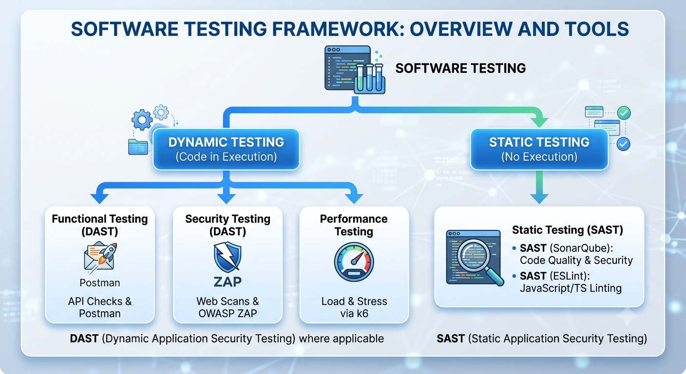
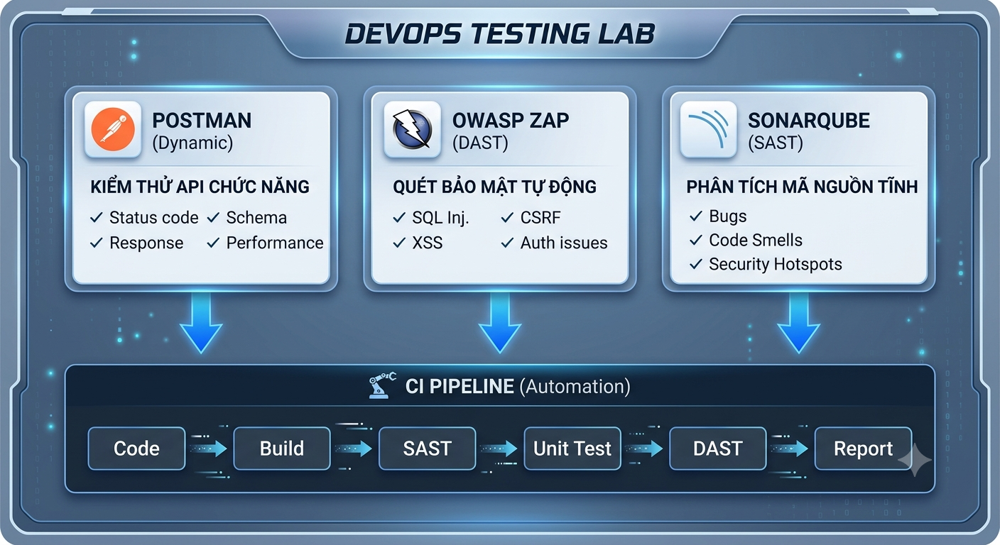

# Lab 6: Kiểm thử & Phân tích Mã nguồn Tĩnh trong DevOps

> **Hướng dẫn chi tiết từng bước — Thời lượng: 90 phút**

---

## Mục tiêu

Sau lab này, bạn sẽ:

1. Viết và chạy API tests với **Postman + Newman CLI**
2. Quét lỗ hổng bảo mật web với **OWASP ZAP** (Dynamic Application Security Testing)
3. Phân tích mã nguồn tĩnh với **SonarQube** (Static Application Security Testing)
4. Phân biệt: Functional Test vs DAST vs SAST — khi nào dùng cái nào?
5. Tích hợp kiểm thử tự động vào CI pipeline

---

## Yêu cầu Hệ thống

| Thành phần | Yêu cầu | Ghi chú |
|------------|---------|---------|
| OS | Windows 10+/macOS/Linux | |
| RAM | ≥ 8GB | SonarQube cần ~2GB |
| Disk | ≥ 5GB trống | Docker images |
| **Node.js** | ≥ 18.x | [Tải tại đây](https://nodejs.org/) |
| **Docker Desktop** | ≥ 24.x | Cho SonarQube |
| **Postman** | Bản mới nhất | [Tải tại đây](https://www.postman.com/downloads/) |
| **OWASP ZAP** | ≥ 2.15 | [Tải tại đây](https://www.zaproxy.org/download/) |
| **Git** | ≥ 2.x | |

---

## KIẾN THỨC NỀN — 3 Loại Kiểm thử trong DevOps

### Dynamic vs Static Testing

<p align="center">
  
</p>

```
                    SOFTWARE TESTING
                    ┌───────────────┐
                    │               │
                    ▼               ▼
            ┌──────────────┐ ┌──────────────┐
            │   DYNAMIC    │ │   STATIC     │
            │  (Chạy code) │ │ (Không chạy) │
            └──────┬───────┘ └──────┬───────┘
                   │               │
        ┌──────────┼──────────┐    │
        ▼          ▼          ▼    ▼
   ┌─────────┐┌─────────┐┌──────┐ ┌──────────┐
   │Functional││Security ││Perf. │ │SAST      │
   │(Postman) ││(ZAP)    ││(k6)  │ │(SonarQube│
   │          ││         ││      │ │ ESLint)   │
   └─────────┘└─────────┘└──────┘ └──────────┘
      DAST        DAST                SAST
```

| Loại | Viết tắt | Công cụ | Chạy code? | Phát hiện |
|------|----------|---------|:----------:|-----------|
| **Functional Test** | — | Postman, Newman | ✅ Có | API sai logic, sai response |
| **Dynamic Security** | DAST | OWASP ZAP, Burp Suite | ✅ Có | XSS, SQL Injection, CSRF |
| **Static Analysis** | SAST | SonarQube, ESLint | ❌ Không | Bugs, Code Smells, Security Hotspots |

---

## BƯỚC 1: Chuẩn bị Môi trường + Sample API (10 phút)

### 1.1 Cài đặt Công cụ

```bash
# Kiểm tra Node.js
node --version   # ≥ 18.x
npm --version    # ≥ 9.x

# Cài Newman CLI (Postman command-line runner)
npm install -g newman

# Kiểm tra
newman --version

# Kiểm tra Docker
docker --version
```

### 1.2 Tạo Sample API (Node.js + Express)

Tạo thư mục dự án:

```bash
mkdir lab6-devops-testing
cd lab6-devops-testing
npm init -y
npm install express cors
```

Tạo file `server.js`:

```javascript
const express = require('express');
const cors = require('cors');
const app = express();
const PORT = 3000;

app.use(cors());
app.use(express.json());

// ============================================
// In-memory database (giả lập)
// ============================================
let students = [
  { id: "SV001", name: "Nguyen Van A", age: 20, grade: "K20" },
  { id: "SV002", name: "Tran Thi B",   age: 21, grade: "K20" },
  { id: "SV003", name: "Le Van C",     age: 19, grade: "K21" },
];

// ============================================
// API Endpoints
// ============================================

// GET /api/students — Lấy danh sách sinh viên
app.get('/api/students', (req, res) => {
  res.json({ success: true, data: students, total: students.length });
});

// GET /api/students/:id — Lấy 1 sinh viên
app.get('/api/students/:id', (req, res) => {
  const student = students.find(s => s.id === req.params.id);
  if (!student) {
    return res.status(404).json({ success: false, message: 'Student not found' });
  }
  res.json({ success: true, data: student });
});

// POST /api/students — Thêm sinh viên mới
app.post('/api/students', (req, res) => {
  const { id, name, age, grade } = req.body;

  // ⚠️ Lỗi bảo mật #1: Không validate input (dễ bị XSS/SQL Injection)
  if (!id || !name) {
    return res.status(400).json({ success: false, message: 'Missing required fields' });
  }

  // ⚠️ Lỗi bảo mật #2: Không sanitize input
  const newStudent = { id, name, age: age || 0, grade: grade || '' };
  students.push(newStudent);

  res.status(201).json({ success: true, data: newStudent });
});

// PUT /api/students/:id — Cập nhật sinh viên
app.put('/api/students/:id', (req, res) => {
  const index = students.findIndex(s => s.id === req.params.id);
  if (index === -1) {
    return res.status(404).json({ success: false, message: 'Student not found' });
  }

  // ⚠️ Lỗi bảo mật #3: Cho phép cập nhật tất cả fields (mass assignment)
  students[index] = { ...students[index], ...req.body };
  res.json({ success: true, data: students[index] });
});

// DELETE /api/students/:id — Xóa sinh viên
app.delete('/api/students/:id', (req, res) => {
  const index = students.findIndex(s => s.id === req.params.id);
  if (index === -1) {
    return res.status(404).json({ success: false, message: 'Student not found' });
  }
  students.splice(index, 1);
  res.json({ success: true, message: 'Student deleted' });
});

// ⚠️ Lỗi bảo mật #4: Endpoint debug lộ thông tin
app.get('/api/debug', (req, res) => {
  res.json({
    environment: process.env,
    memory: process.memoryUsage(),
    uptime: process.uptime(),
  });
});

// GET /api/search?q= — Tìm kiếm (CÓ LỖI SQL Injection mô phỏng)
app.get('/api/search', (req, res) => {
  const q = req.query.q || '';
  // ⚠️ Lỗi bảo mật #5: Phản hồi trực tiếp input không sanitize (Reflected XSS)
  const results = students.filter(s =>
    s.name.toLowerCase().includes(q.toLowerCase())
  );

  if (results.length === 0) {
    return res.send(`<p>Không tìm thấy sinh viên với từ khóa: <b>${q}</b></p>`);
  }

  res.json({ success: true, data: results, keyword: q });
});

// Start server
app.listen(PORT, () => {
  console.log(`🚀 Student API running at http://localhost:${PORT}`);
  console.log(`📋 Endpoints:`);
  console.log(`   GET    /api/students`);
  console.log(`   GET    /api/students/:id`);
  console.log(`   POST   /api/students`);
  console.log(`   PUT    /api/students/:id`);
  console.log(`   DELETE /api/students/:id`);
  console.log(`   GET    /api/search?q=`);
  console.log(`   GET    /api/debug ⚠️ (lộ thông tin)`);
});
```

### 1.3 Chạy Sample API

```bash
node server.js
```

✅ **CHECKPOINT 1:** API chạy ở http://localhost:3000? Test nhanh:
```bash
curl http://localhost:3000/api/students
```

---

## BƯỚC 2: Kiểm thử API với Postman + Newman CLI (20 phút)

### 2.1 Tạo Postman Collection

Mở Postman → **New Collection** → Name: `Student API Tests`

Tạo các request sau:

#### Request 1: GET All Students
- Method: `GET`
- URL: `http://localhost:3000/api/students`
- **Tests tab:**
```javascript
// Test status code
pm.test("Status code is 200", function () {
    pm.response.to.have.status(200);
});

// Test response structure
pm.test("Response has success field", function () {
    var jsonData = pm.response.json();
    pm.expect(jsonData.success).to.be.true;
});

// Test data is array
pm.test("Data is an array", function () {
    var jsonData = pm.response.json();
    pm.expect(jsonData.data).to.be.an('array');
});

// Test at least 3 students
pm.test("Has at least 3 students", function () {
    var jsonData = pm.response.json();
    pm.expect(jsonData.data.length).to.be.at.least(3);
});

// Test response time
pm.test("Response time < 200ms", function () {
    pm.expect(pm.response.responseTime).to.be.below(200);
});
```

#### Request 2: GET Student by ID
- Method: `GET`
- URL: `http://localhost:3000/api/students/SV001`
- **Tests tab:**
```javascript
pm.test("Status code is 200", () => {
    pm.response.to.have.status(200);
});

pm.test("Returns correct student", () => {
    var jsonData = pm.response.json();
    pm.expect(jsonData.data.name).to.equal("Nguyen Van A");
});
```

#### Request 3: POST Create Student
- Method: `POST`
- URL: `http://localhost:3000/api/students`
- Body → raw → JSON:
```json
{
    "id": "SV004",
    "name": "Pham Thi D",
    "age": 22,
    "grade": "K19"
}
```
- **Tests tab:**
```javascript
pm.test("Status code is 201", () => {
    pm.response.to.have.status(201);
});

pm.test("Returns created student", () => {
    var jsonData = pm.response.json();
    pm.expect(jsonData.data.name).to.equal("Pham Thi D");
});
```

#### Request 4: GET Student Not Found (404)
- Method: `GET`
- URL: `http://localhost:3000/api/students/SV999`
- **Tests tab:**
```javascript
pm.test("Status code is 404", () => {
    pm.response.to.have.status(404);
});

pm.test("Returns error message", () => {
    var jsonData = pm.response.json();
    pm.expect(jsonData.success).to.be.false;
});
```

#### Request 5: POST Missing Fields (Validation)
- Method: `POST`
- URL: `http://localhost:3000/api/students`
- Body → raw → JSON:
```json
{
    "name": "Test"
}
```
- **Tests tab:**
```javascript
pm.test("Status code is 400", () => {
    pm.response.to.have.status(400);
});
```

### 2.2 Export Collection

Postman → Collection `...` → **Export** → v2.1 → Lưu file `Student-API-Tests.json` vào thư mục `lab6-devops-testing/`.

### 2.3 Chạy Tests bằng Newman CLI

```bash
newman run Student-API-Tests.json --reporters cli,json --reporter-json-export newman-report.json
```

**Kết quả mong đợi:**
```
Student API Tests

❏ GET All Students
  └─ Status code is 200
  └─ Response has success field
  └─ Data is an array
  └─ Has at least 3 students
  └─ Response time < 200ms
✓ GET Student by ID
✓ POST Create Student
✓ GET Student Not Found (404)
✓ POST Missing Fields (Validation)

┌────────────────────────┬──────────┬───────────┐
│                        │ executed │   failed  │
├────────────────────────┼──────────┼───────────┤
│              iterations│        1 │         0 │
├────────────────────────┼──────────┼───────────┤
│                requests│        5 │         0 │
├────────────────────────┼──────────┼───────────┤
│            test-scripts│        5 │         0 │
├────────────────────────┼──────────┼───────────┤
│      prerequest-scripts│        0 │         0 │
├────────────────────────┼──────────┼───────────┤
│              assertions│       12 │         0 │
├────────────────────────┴──────────┴───────────┤
│ total run duration: 1.2s                     │
└──────────────────────────────────────────────┘
```

✅ **CHECKPOINT 2:** Newman chạy 5/5 requests pass, 12 assertions pass?

---

## BƯỚC 3: Kiểm thử Bảo mật với OWASP ZAP (20 phút)

### 3.1 Khởi động OWASP ZAP

- Windows: Mở ZAP từ Start Menu
- macOS: `open /Applications/OWASP\ ZAP.app`
- Linux: `zap.sh`

Chọn: **"No, I do not want to persist this session"** → Start

### 3.2 Cấu hình ZAP làm Proxy

ZAP mặc định chạy proxy ở `localhost:8080`.

Cấu hình Postman dùng ZAP proxy để bắt request:
- Postman → Settings → Proxy → **Use the system proxy**
- Hoặc cấu hình trực tiếp: HTTP proxy = `localhost:8080`

### 3.3 Automated Scan với ZAP

#### Cách 1: ZAP Desktop UI

1. Vào **Quick Start** → **Automated Scan**
2. URL to attack: `http://localhost:3000`
3. Chọn **"Use traditional spider"**
4. Nhấn **Attack**

ZAP sẽ:
- Spider: crawl tất cả các endpoint
- Active Scan: gửi payload tấn công để tìm lỗ hổng

#### Cách 2: ZAP API (Command Line — dùng trong CI/CD)

```bash
# Dùng ZAP API để scan tự động
curl "http://localhost:8080/JSON/spider/action/scan/?url=http://localhost:3000&maxChildren=10"

# Kiểm tra tiến độ spider
curl "http://localhost:8080/JSON/spider/view/status/"

# Bắt đầu Active Scan
curl "http://localhost:8080/JSON/ascan/action/scan/?url=http://localhost:3000"

# Kiểm tra tiến độ scan
curl "http://localhost:8080/JSON/ascan/view/status/"

# Xuất báo cáo
curl "http://localhost:8080/OTHER/core/other/htmlreport/" > zap-report.html
```

### 3.4 Phân tích Kết quả ZAP

Vào tab **Alerts** → xem các lỗ hổng được phát hiện:

| Mức độ | Loại lỗ hổng | Endpoint bị ảnh hưởng |
|:------:|-------------|----------------------|
| 🔴 High | Cross Site Scripting (Reflected) | `/api/search?q=<script>` |
| 🟠 Medium | X-Frame-Options Header Not Set | Tất cả endpoints |
| 🟠 Medium | CSP Header Not Set | Tất cả endpoints |
| 🟡 Low | Server Leaks Information | `/api/debug` |
| 🟡 Low | Cookie No HttpOnly Flag | — |

**Giải thích lỗ hổng tìm thấy:**

1. **Reflected XSS** (`/api/search`): Input từ query string bị phản hồi trực tiếp không escape → attacker có thể inject `<script>alert('hacked')</script>`
2. **Information Disclosure** (`/api/debug`): Endpoint debug lộ biến môi trường, memory usage → lộ cấu hình hệ thống
3. **Missing Security Headers**: Thiếu X-Frame-Options, CSP → dễ bị clickjacking

### 3.5 Xuất Báo cáo ZAP

- **Report** → **Generate HTML Report** → Lưu `zap-report.html`
- Hoặc: **Import** vào file JSON để tích hợp CI

✅ **CHECKPOINT 3:** ZAP tìm thấy ≥ 5 alerts? Có ít nhất 1 lỗi High (XSS)?

---

## BƯỚC 4: Phân tích Mã nguồn Tĩnh với SonarQube (20 phút)

### 4.1 Khởi động SonarQube bằng Docker

```bash
docker run -d --name lab6-sonarqube \
  -p 9000:9000 \
  -e SONAR_ES_BOOTSTRAP_CHECKS_DISABLE=true \
  sonarqube:lts-community
```

Đợi 1-2 phút cho SonarQube khởi động. Mở http://localhost:9000:
- Login: `admin` / `admin`
- Đổi password: `sonar123`

### 4.2 Tạo Project trong SonarQube

1. **Create a local project**
2. Project key: `devops-lab6`
3. Display name: `DevOps Lab 6 — Student API`
4. **Use global setting** → **Create**
5. Chọn **Locally** → Generate token: `lab6-token` → **Continue**
6. Chọn **Other (for JS/TS)** → Copy lệnh sonar-scanner

### 4.3 Cài đặt và Chạy SonarScanner

#### Cách 1: Dùng npm (đơn giản nhất)

```bash
# Cài sonar-scanner qua npm
npm install -g sonarqube-scanner

# Tạo file cấu hình sonar-project.properties
```

Tạo `sonar-project.properties` trong thư mục `lab6-devops-testing/`:

```properties
# Required metadata
sonar.projectKey=devops-lab6
sonar.projectName=DevOps Lab 6 — Student API
sonar.projectVersion=1.0.0

# Source code location
sonar.sources=.
sonar.exclusions=node_modules/**,newman-report.json,zap-report.html

# Language
sonar.language=js

# Encoding
sonar.sourceEncoding=UTF-8

# SonarQube server
sonar.host.url=http://localhost:9000
sonar.login=admin
sonar.password=sonar123
```

Chạy phân tích:

```bash
sonar-scanner
```

#### Cách 2: Dùng Docker (không cần cài đặt)

```bash
docker run --rm \
  -v "$(pwd):/usr/src" \
  -e SONAR_HOST_URL="http://host.docker.internal:9000" \
  -e SONAR_LOGIN="admin" \
  -e SONAR_PASSWORD="sonar123" \
  sonarsource/sonar-scanner-cli \
  -Dsonar.projectKey=devops-lab6 \
  -Dsonar.projectName="DevOps Lab 6 — Student API" \
  -Dsonar.sources=. \
  -Dsonar.exclusions=node_modules/**
```

### 4.4 Phân tích Kết quả SonarQube

Vào http://localhost:9000 → Projects → `devops-lab6`:

| Tab | Nội dung | Kết quả mong đợi trên server.js |
|-----|----------|-------------------------------|
| **Bugs** | Lỗi logic | ⚠️ Có thể có: biến `students` dùng `let` nhưng không reassign |
| **Code Smells** | Code khó bảo trì | 🟡 Dòng quá dài, function `server.js` quá lớn, magic numbers |
| **Security Hotspots** | Vấn đề bảo mật tiềm ẩn | 🔴 Debug endpoint lộ thông tin, CORS allow all origins |
| **Duplications** | Code trùng lặp | 0% (code ngắn) |
| **Coverage** | Độ bao phủ test | 0% (chưa có unit test — sẽ bổ sung sau) |

**Phân tích kết quả:** SonarQube KHÔNG chạy code → nó phân tích CÚ PHÁP để tìm pattern xấu. Đây là SAST (Static Analysis), khác với ZAP (DAST — chạy app thật để tìm lỗ hổng).

✅ **CHECKPOINT 4:** SonarQube hiển thị project với Bugs, Code Smells, Security Hotspots?

---

## BƯỚC 5: Tự động hóa — Tích hợp vào CI Pipeline (10 phút)

### 5.1 Tạo Script CI Test Tổng hợp

Tạo file `ci-test.sh`:

```bash
#!/bin/bash
# ===========================================
# CI Test Script — Lab 6 DevOps
# Tích hợp: SAST + Unit Test + API Test + DAST
# ===========================================
set -e

echo "========================================="
echo "  DEVOPS LAB 6 — CI TESTING PIPELINE"
echo "========================================="
echo ""

# --- Stage 1: SAST — Static Code Analysis ---
echo "[1/4] 🔍 SAST — SonarQube Static Analysis..."
sonar-scanner -Dsonar.projectKey=devops-lab6 \
  -Dsonar.sources=. \
  -Dsonar.exclusions=node_modules/** \
  -Dsonar.host.url=http://localhost:9000 \
  -Dsonar.login=admin \
  -Dsonar.password=sonar123 \
  && echo "✅ SAST passed" || echo "⚠️  SAST completed with warnings"

# --- Stage 2: Start API Server ---
echo "[2/4] 🚀 Starting API server..."
node server.js &
SERVER_PID=$!
sleep 3

# Verify server is running
if ! curl -s http://localhost:3000/api/students > /dev/null; then
    echo "❌ Server failed to start!"
    exit 1
fi
echo "✅ Server running (PID: $SERVER_PID)"

# --- Stage 3: API Functional Test ---
echo "[3/4] 🧪 API Functional Test — Newman..."
newman run Student-API-Tests.json \
  --reporters cli,json \
  --reporter-json-export newman-report.json \
  --color on

NEWMAN_EXIT=$?
if [ $NEWMAN_EXIT -eq 0 ]; then
    echo "✅ All API tests passed!"
else
    echo "❌ API tests failed! Check newman-report.json"
fi

# --- Stage 4: DAST — ZAP Security Scan ---
echo "[4/4] 🔐 DAST — OWASP ZAP Security Scan..."

# Spider scan
echo "  Spider crawling..."
curl -s "http://localhost:8080/JSON/spider/action/scan/?url=http://localhost:3000" > /dev/null
sleep 10

# Active scan
echo "  Active scanning..."
curl -s "http://localhost:8080/JSON/ascan/action/scan/?url=http://localhost:3000" > /dev/null
sleep 15

# Generate report
echo "  Generating report..."
curl -s "http://localhost:8080/OTHER/core/other/htmlreport/" > zap-report.html

# Count alerts
ALERTS=$(curl -s "http://localhost:8080/JSON/core/view/alertsSummary/?baseurl=http://localhost:3000" | python3 -c "import sys,json; d=json.load(sys.stdin); print(sum(d.get('alertsSummary',{}).values()))" 2>/dev/null || echo "?")
echo "✅ ZAP scan complete — $ALERTS alerts found (see zap-report.html)"

# --- Cleanup ---
kill $SERVER_PID 2>/dev/null
echo ""
echo "========================================="
echo "  PIPELINE COMPLETE!"
echo "========================================="
echo ""
echo "Reports:"
echo "  📊 SAST:     http://localhost:9000/dashboard?id=devops-lab6"
echo "  📊 API Test: newman-report.json"
echo "  📊 DAST:     zap-report.html"
```

Chạy script:

```bash
chmod +x ci-test.sh
./ci-test.sh
```

### 5.2 Pipeline Visualization

<p align="center">
  
</p>

```
CI TESTING PIPELINE
═══════════════════════════════════════════════════════════

  Code Push
     │
     ▼
┌──────────┐    ┌──────────┐    ┌──────────┐    ┌──────────┐
│  SAST    │───▶│ START    │───▶│ API TEST │───▶│  DAST    │
│SonarQube │    │ Server   │    │ Newman   │    │ ZAP Scan │
│(tĩnh)    │    │          │    │(động)    │    │(bảo mật) │
└──────────┘    └──────────┘    └──────────┘    └──────────┘
    ~30s           ~3s             ~2s             ~30s

  Total: ~65 giây → Reports tự động sinh ra
```

✅ **CHECKPOINT 5:** CI script chạy thành công cả 4 stages?

---

## BƯỚC 6: So sánh 3 Loại Kiểm thử — Báo cáo (10 phút)

### 6.1 Bảng So sánh

Điền kết quả từ lab của bạn vào bảng:

| Tiêu chí | Postman/Newman | OWASP ZAP | SonarQube |
|----------|:---:|:---:|:---:|
| **Loại** | Functional Test | DAST (Security) | SAST (Static) |
| **Chạy ứng dụng?** | ✅ Có | ✅ Có | ❌ Không |
| **Phát hiện gì?** | API sai logic, sai status code | XSS, SQL Injection, thiếu security headers | Bugs, Code Smells, Security Hotspots |
| **Cần source code?** | ❌ Không (chỉ cần API) | ❌ Không (chỉ cần URL) | ✅ Có |
| **Giai đoạn CI** | Sau deploy | Sau deploy | Trước build |
| **Thời gian chạy** | ~2s | ~30s | ~30s |
| **Tự động hóa được?** | ✅ Newman CLI | ✅ ZAP API | ✅ SonarScanner |
| **Số issues tìm thấy** | (điền) | (điền) | (điền) |

### 6.2 Kết luận DevOps

```
SAST (SonarQube) → chạy SỚM (trước build) → phát hiện lỗi code pattern
Unit Test        → chạy sau build → phát hiện lỗi logic đơn vị
API Test (Newman)→ chạy sau deploy → phát hiện lỗi API contract
DAST (ZAP)       → chạy sau deploy → phát hiện lỗ hổng bảo mật runtime

CẢ 4 LOẠI ĐỀU CẦN THIẾT — không loại nào thay thế được loại nào!
```

✅ **CHECKPOINT 6:** Đã điền đầy đủ bảng so sánh?

---

## TROUBLESHOOTING

| # | Lỗi | Nguyên nhân | Cách khắc phục |
|---|------|------------|----------------|
| 1 | `newman: command not found` | Chưa cài Newman | `npm install -g newman` |
| 2 | `ECONNREFUSED 127.0.0.1:3000` | Server chưa chạy | `node server.js` trong 1 terminal riêng |
| 3 | ZAP không bắt được request | Proxy chưa đúng | Kiểm tra Postman proxy setting → localhost:8080 |
| 4 | SonarQube `Connection refused` | Container chưa sẵn sàng | Đợi 1-2 phút, kiểm tra `docker logs lab6-sonarqube` |
| 5 | `sonar-scanner: command not found` | Chưa cài sonar-scanner | `npm install -g sonarqube-scanner` |
| 6 | ZAP báo "API key required" | ZAP bật API key | ZAP → Tools → Options → API → Disable API key |
| 7 | `EADDRINUSE: address already in use :::3000` | Port 3000 bị chiếm | Đổi `PORT = 3001` trong server.js |
| 8 | SonarQube out of memory | Docker thiếu RAM | Tăng Docker memory lên 4GB+ |

---

## BÀI TẬP MỞ RỘNG (Optional)

### 🟢 Cơ bản
1. **Thêm Postman environment variables:** Dùng `{{base_url}}` thay vì hardcode `localhost:3000`

### 🟡 Trung bình
2. **Viết thêm Unit Tests với Jest:** Thêm file `server.test.js` với Jest + Supertest → chạy `npm test` trước Newman
3. **Cấu hình ZAP Context:** Tạo ZAP Context chỉ scan `/api/*`, bỏ qua static files

### 🔴 Nâng cao
4. **Tích hợp vào Jenkins Pipeline:** Tạo Jenkinsfile chạy tuần tự: SonarQube → npm test → Newman → ZAP scan
5. **Quality Gate:** Cấu hình SonarQube Quality Gate: nếu có Bugs mới → FAIL pipeline
6. **ZAP Baseline Scan:** So sánh kết quả scan giữa 2 lần chạy → chỉ alert những lỗi MỚI

---

## TIÊU CHÍ CHẤM ĐIỂM (Rubric)

| # | Tiêu chí | Điểm | Cách đánh giá |
|---|----------|:----:|--------------|
| 1 | **Sample API** — server.js chạy được, đủ endpoints | 15% | `curl localhost:3000/api/students` → JSON |
| 2 | **Postman Tests** — collection 5 requests + assertions | 25% | Newman chạy: 5/5 pass, ≥ 10 assertions |
| 3 | **ZAP Scan** — automated scan hoàn thành | 25% | Có zap-report.html, ≥ 3 alerts tìm thấy |
| 4 | **SonarQube** — project được phân tích | 20% | Dashboard hiển thị Bugs + Code Smells |
| 5 | **CI Script** — ci-test.sh chạy tự động | 10% | Cả 4 stages chạy tuần tự |
| 6 | **Bảng So sánh** — phân tích đúng 3 loại test | 5% | Điền đủ bảng so sánh |
| **TỔNG** | | **100%** | |

### Cách Nộp bài

```
Lab6_HoTen_MSSV.zip
├── server.js                        ← Sample API
├── Student-API-Tests.json           ← Postman collection
├── sonar-project.properties        ← SonarQube config
├── newman-report.json              ← Newman test report
├── zap-report.html                 ← ZAP security report
├── ci-test.sh                      ← CI test script
├── screenshots/
│   ├── 01-newman-pass.png           ← Newman all pass
│   ├── 02-zap-alerts.png            ← ZAP alerts tab
│   ├── 03-sonarqube-dashboard.png   ← SonarQube dashboard
│   ├── 04-sonarqube-issues.png      ← SonarQube issues list
│   └── 05-comparison-table.png      ← Bảng so sánh
└── ho_ten_mssv.txt
```

---

> 🎯 **Lab này tương ứng với:** CDR 6.2 — Vận dụng nguyên lý kiểm thử trong DevOps (Mức Bloom: Vận dụng)
>
> 📅 **Cập nhật:** 2026-07-03 | **Đã test với:** Newman 6.x + ZAP 2.15 + SonarQube 9.9 LTS
