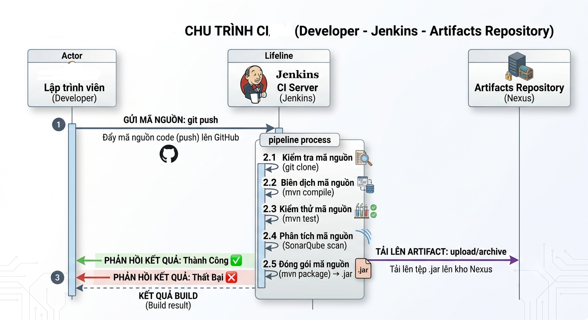
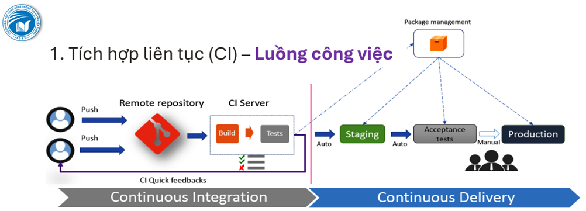

# Lab 7: Triển khai CI Pipeline với Jenkins, Nexus & SonarQube

> **Hướng dẫn chi tiết từng bước — Thời lượng: 90 phút**

---

## Mục tiêu

Sau lab này, bạn sẽ:

1. Dựng Jenkins + Nexus + SonarQube bằng Docker Compose
2. Viết Jenkinsfile Declarative Pipeline: Checkout → Build → Test → Scan → Archive → Publish
3. Cấu hình Jenkins Pipeline Job kết nối với GitHub
4. Tích hợp SonarQube phân tích mã nguồn tĩnh tự động
5. Đẩy artifact (.jar) lên Nexus Repository
6. Kích hoạt pipeline tự động qua GitHub Webhook

---

## Yêu cầu Hệ thống

| Thành phần | Yêu cầu | Ghi chú |
|------------|---------|---------|
| OS | Windows 10+/macOS/Linux | |
| RAM | ≥ 8GB (khuyến nghị 16GB) | Jenkins + Nexus + SonarQube cần ~4GB |
| Disk | ≥ 10GB trống | Docker images ~3GB |
| **Docker Desktop** | ≥ 24.x | [Tải tại đây](https://www.docker.com/products/docker-desktop/) |
| **Docker Compose** | ≥ v2.x | Đi kèm Docker Desktop |
| **Git** | ≥ 2.x | [Tải tại đây](https://git-scm.com/downloads) |
| **JDK** | ≥ 17 | Cho sample Java app (đi kèm Maven wrapper) |
| **GitHub Account** | Có | Để tạo repository và cấu hình webhook |

---

## KIẾN THỨC NỀN — Nhắc lại

### CI Pipeline là gì?
<p align="center">
  
</p>


<p align="center">
  
</p>
### Jenkinsfile — Declarative Pipeline Syntax

```groovy
pipeline {
    agent any                    // Chạy trên bất kỳ node nào

    tools {
        maven 'M3'               // Tên Maven trong Global Tool Configuration
    }

    environment {
        NEXUS_URL = 'http://localhost:8081/repository/maven-releases/'
    }

    stages {
        stage('Checkout') {      // ← Mỗi stage là 1 giai đoạn
            steps {              // ← Các bước trong stage
                checkout scm     // ← Lấy code từ Git
            }
        }

        stage('Build') {
            steps {
                sh 'mvn clean compile'
            }
        }

        stage('Test') {
            steps {
                sh 'mvn test'
            }
        }
    }

    post {
        always {                 // ← Luôn chạy (dù pass hay fail)
            junit 'target/surefire-reports/*.xml'
        }
        success {                // ← Chỉ chạy khi pass
            echo 'BUILD SUCCESS!'
        }
        failure {                // ← Chỉ chạy khi fail
            echo 'BUILD FAILED!'
        }
    }
}
```

### Các Lệnh Maven Cơ bản

| Lệnh | Chức năng |
|------|-----------|
| `mvn clean` | Xóa thư mục `target/` |
| `mvn compile` | Biên dịch source code |
| `mvn test` | Chạy unit tests |
| `mvn package` | Đóng gói thành .jar/.war |
| `mvn clean install` | Clean + Compile + Test + Package + Install vào local repo |

---

## BƯỚC 1: Chuẩn bị Môi trường (10 phút)

### 1.1 Kiểm tra Docker

```bash
docker --version
docker compose version
```

**Kết quả mong đợi:**
```
Docker version 27.x.x
Docker Compose version v2.x.x
```

Nếu chưa cài Docker Desktop: tải từ https://www.docker.com/products/docker-desktop/

### 1.2 Kiểm tra Git

```bash
git --version
```

### 1.3 Kiểm tra Java (JDK 17+)

```bash
java --version
```

Nếu chưa có JDK: tải từ https://adoptium.net/ hoặc dùng Maven wrapper (đã bao gồm trong sample project).

### 1.4 Tăng Memory cho Docker (QUAN TRỌNG!)

Jenkins + Nexus + SonarQube cần ít nhất 4GB RAM:

- **Windows/macOS:** Docker Desktop → Settings → Resources → Memory → 6GB+
- **Linux:** Không cần (dùng trực tiếp host memory)

✅ **CHECKPOINT 1:** Docker, Git, Java đã sẵn sàng?

---

## BƯỚC 2: Dựng Jenkins + Nexus + SonarQube với Docker Compose (15 phút)

### 2.1 Tạo file docker-compose.yml

Tạo thư mục lab và file:

```bash
mkdir lab7-jenkins-ci
cd lab7-jenkins-ci

# Tạo file docker-compose.yml
```

Viết nội dung sau vào `docker-compose.yml`:

```yaml
# version: '3.8' -> Bỏ đi, không cần nếu SV dùng phiên bản mới: phiên bản Docker Compose V2

services:
  # ===== Jenkins CI Server =====
  jenkins:
    image: jenkins/jenkins:lts-jdk21
    container_name: lab7-jenkins
    ports:
      - "8080:8080"      # Web UI
      - "50000:50000"    # Agent connection
    volumes:
      - jenkins_home:/var/jenkins_home
      - /var/run/docker.sock:/var/run/docker.sock  # Cho phép Jenkins dùng Docker
    restart: unless-stopped
    networks:
      - ci-network

  # ===== Nexus Repository =====
  nexus:
    image: sonatype/nexus3:latest
    container_name: lab7-nexus
    ports:
      - "8081:8081"      # Web UI
      - "8082:8082"      # Docker registry
    volumes:
      - nexus_data:/nexus-data
    environment:
      - INSTALL4J_ADD_VM_PARAMS=-Xms512m -Xmx512m -XX:MaxDirectMemorySize=512m
    restart: unless-stopped
    networks:
      - ci-network

  # ===== SonarQube Code Analysis =====
  sonarqube:
    image: sonarqube:lts-community
    container_name: lab7-sonarqube
    ports:
      - "9000:9000"      # Web UI
    volumes:
      - sonarqube_data:/opt/sonarqube/data
      - sonarqube_logs:/opt/sonarqube/logs
      - sonarqube_extensions:/opt/sonarqube/extensions
    environment:
      - SONAR_ES_BOOTSTRAP_CHECKS_DISABLE=true
    restart: unless-stopped
    networks:
      - ci-network

volumes:
  jenkins_home:
  nexus_data:
  sonarqube_data:
  sonarqube_logs:
  sonarqube_extensions:

networks:
  ci-network:
    driver: bridge
```

### 2.2 Khởi động Stack

```bash
docker compose up -d
```

**Kết quả mong đợi:**
```
[+] Running 3/3
 ✔ Container lab7-jenkins    Started
 ✔ Container lab7-nexus      Started
 ✔ Container lab7-sonarqube  Started
```

### 2.3 Lấy Initial Admin Password của Jenkins

```bash
# Đợi Jenkins khởi động (~30-60 giây)
docker exec lab7-jenkins cat /var/jenkins_home/secrets/initialAdminPassword
```

Ghi lại mật khẩu này! (ví dụ: `a1b2c3d4e5f6g7h8i9j0k`)

### 2.4 Lấy Initial Admin Password của Nexus

```bash
docker exec lab7-nexus cat /nexus-data/admin.password
```

Ghi lại mật khẩu này!

### 2.5 Kiểm tra các Service đã chạy

| Service | URL | Status |
|---------|-----|--------|
| Jenkins | http://localhost:8080 | 🟢 Running |
| Nexus | http://localhost:8081 | 🟢 Running |
| SonarQube | http://localhost:9000 | 🟢 Running |

✅ **CHECKPOINT 2:** Cả 3 service đều truy cập được qua browser?

### 2.6 Cấu hình Jenkins Ban đầu

1. Mở http://localhost:8080
2. Nhập Initial Admin Password (từ bước 2.3)
3. Chọn **"Install suggested plugins"**
4. Đợi cài đặt plugins (~5 phút)
5. Tạo Admin User: `admin` / `admin123`
6. Jenkins URL: giữ mặc định `http://localhost:8080`
7. Nhấn **"Start using Jenkins"**

### 2.7 Cài đặt thêm Plugins cho Jenkins

Vào **Manage Jenkins → Plugins → Available plugins**, cài đặt:
- **Pipeline: Stage View** (xem pipeline trực quan)
- **SonarQube Scanner**
- **Nexus Platform Plugin**
- **Blue Ocean** (UI pipeline đẹp hơn - optional)

Cách cài: Tích chọn → **Install without restart**

### 2.8 Cấu hình Maven trong Jenkins

Vào **Manage Jenkins → Tools → JDK installations**:
- Add JDK → Name: `JDK21` → JAVA_HOME: `/opt/java/openjdk`

Vào **Maven installations**:
- Add Maven → Name: `M3` → Tích "Install automatically" → Version: `3.9.x`

### 2.9 Cấu hình Nexus Repository

1. Mở http://localhost:8081 → Sign in (user: `admin`, pass: từ bước 2.4)
2. Làm theo wizard đổi mật khẩu mới: `nexus123`
3. Enable anonymous access: Cho phép
4. Vào **Settings → Repositories → Create repository**
5. Chọn **maven2 (hosted)** → Name: `maven-releases` → Create

✅ **CHECKPOINT 3:** Jenkins đã cài plugins, Maven đã cấu hình, Nexus repo đã tạo?

---

## BƯỚC 3: Tạo Sample Java Project với Maven (10 phút)

### 3.1 Tạo cấu trúc dự án

```bash
# Trong thư mục lab7-jenkins-ci
mkdir sample-java-app
cd sample-java-app
```

Tạo cấu trúc Maven chuẩn:

```bash
mkdir -p src/main/java/com/devops/lab7
mkdir -p src/test/java/com/devops/lab7
```

### 3.2 Viết pom.xml
* Tạo file pom.xml:
```bash
New-Item pom.xml -ItemType File
```

Mở file pom.xlm:
```bash
code pom.xml 
```

* Nội dung file POM.xlm

```xml
<?xml version="1.0" encoding="UTF-8"?>
<project xmlns="http://maven.apache.org/POM/4.0.0"
         xmlns:xsi="http://www.w3.org/2001/XMLSchema-instance"
         xsi:schemaLocation="http://maven.apache.org/POM/4.0.0
         http://maven.apache.org/xsd/maven-4.0.0.xsd">
    <modelVersion>4.0.0</modelVersion>

    <groupId>com.devops.lab7</groupId>
    <artifactId>ci-demo</artifactId>
    <version>1.0.0-SNAPSHOT</version>
    <packaging>jar</packaging>

    <name>DevOps Lab 7 - CI Pipeline Demo</name>
    <description>Sample Maven project for Jenkins CI Pipeline Lab</description>

    <properties>
        <maven.compiler.source>17</maven.compiler.source>
        <maven.compiler.target>17</maven.compiler.target>
        <project.build.sourceEncoding>UTF-8</project.build.sourceEncoding>
        <junit.version>5.10.2</junit.version>
    </properties>

    <dependencies>
        <!-- JUnit 5 for Unit Testing -->
        <dependency>
            <groupId>org.junit.jupiter</groupId>
            <artifactId>junit-jupiter-api</artifactId>
            <version>${junit.version}</version>
            <scope>test</scope>
        </dependency>
        <dependency>
            <groupId>org.junit.jupiter</groupId>
            <artifactId>junit-jupiter-engine</artifactId>
            <version>${junit.version}</version>
            <scope>test</scope>
        </dependency>
    </dependencies>

    <build>
        <plugins>
            <plugin>
                <groupId>org.apache.maven.plugins</groupId>
                <artifactId>maven-surefire-plugin</artifactId>
                <version>3.2.5</version>
            </plugin>
            <plugin>
                <groupId>org.apache.maven.plugins</groupId>
                <artifactId>maven-jar-plugin</artifactId>
                <version>3.3.0</version>
            </plugin>
        </plugins>
    </build>
</project>
```

### 3.3 Viết Source Code

**`src/main/java/com/devops/lab7/Calculator.java`:**

```java
package com.devops.lab7;

/**
 * Simple Calculator class for CI Pipeline Demo
 * Lab 7 — DevOps Course
 */
public class Calculator {

    public int add(int a, int b) {
        return a + b;
    }

    public int subtract(int a, int b) {
        return a - b;
    }

    public int multiply(int a, int b) {
        return a * b;
    }

    public double divide(int a, int b) {
        if (b == 0) {
            throw new IllegalArgumentException("Cannot divide by zero");
        }
        return (double) a / b;
    }

    public boolean isPositive(int number) {
        return number > 0;
    }
}
```

### 3.4 Viết Unit Tests

**`src/test/java/com/devops/lab7/CalculatorTest.java`:**

```java
package com.devops.lab7;

import org.junit.jupiter.api.Test;
import org.junit.jupiter.api.BeforeEach;
import static org.junit.jupiter.api.Assertions.*;

/**
 * Unit Tests for Calculator — runs in CI Pipeline
 */
class CalculatorTest {

    private Calculator calc;

    @BeforeEach
    void setUp() {
        calc = new Calculator();
    }

    @Test
    void testAdd() {
        assertEquals(5, calc.add(2, 3));
        assertEquals(0, calc.add(-1, 1));
        assertEquals(-5, calc.add(-2, -3));
    }

    @Test
    void testSubtract() {
        assertEquals(1, calc.subtract(3, 2));
        assertEquals(-2, calc.subtract(1, 3));
    }

    @Test
    void testMultiply() {
        assertEquals(6, calc.multiply(2, 3));
        assertEquals(0, calc.multiply(5, 0));
        assertEquals(-10, calc.multiply(-2, 5));
    }

    @Test
    void testDivide() {
        assertEquals(2.0, calc.divide(6, 3));
        assertEquals(1.5, calc.divide(3, 2));
    }

    @Test
    void testDivideByZero() {
        assertThrows(IllegalArgumentException.class, () -> calc.divide(5, 0));
    }

    @Test
    void testIsPositive() {
        assertTrue(calc.isPositive(5));
        assertFalse(calc.isPositive(-1));
        assertFalse(calc.isPositive(0));
    }
}
```

### 3.5 Test Dự án Local

```bash
# Trong thư mục sample-java-app/
mvn clean test
```

**Kết quả mong đợi:**
```
[INFO] -------------------------------------------------------
[INFO]  T E S T S
[INFO] -------------------------------------------------------
[INFO] Running com.devops.lab7.CalculatorTest
[INFO] Tests run: 6, Failures: 0, Errors: 0, Skipped: 0
[INFO]
[INFO] BUILD SUCCESS
```

✅ **CHECKPOINT 4:** `mvn clean test` chạy thành công? Tests: 6/6 pass?

### 3.6 Push lên GitHub
Tạo kho: "devops-lab7-ci-demo" trên GitHub

Thực thi các lệnh:

```bash

cd ..
# Trong thư mục lab7-jenkins-ci/
git init
git add .
git commit -m "Initial commit: Sample Java app for Lab 7 CI Pipeline"

# Tạo repo trên GitHub (VD: devops-lab7-ci-demo)
# (KHÔNG tạo README, .gitignore sẵn — chọn repo trống)
git remote add origin https://github.com/<YOUR_USERNAME>/devops-lab7-ci-demo.git
git branch -M main
git push -u origin main
```

✅ **CHECKPOINT 5:** Code đã lên GitHub? Kiểm tra: `https://github.com/<USER>/devops-lab7-ci-demo`

---

## BƯỚC 4: Viết Jenkinsfile — Trái tim của CI Pipeline (15 phút)

### 4.1 Jenkinsfile Cơ bản

Quay lại thư mục `lab7-jenkins-ci/`, tạo file `Jenkinsfile`:

```groovy
pipeline {
    agent any

    tools {
        maven 'M3'
    }

    environment {
        // Nexus configuration
        NEXUS_URL = 'http://lab7-nexus:8081'
        NEXUS_REPO = 'maven-releases'
    }

    stages {
        stage('Checkout') {
            steps {
                echo '=== STEP 1: CHECKOUT ==='
                checkout scm
            }
        }

        stage('Build') {
            steps {
                echo '=== STEP 2: BUILD ==='
                dir('sample-java-app') {
                    sh 'mvn clean compile'
                }
            }
        }

        stage('Test') {
            steps {
                echo '=== STEP 3: TEST ==='
                dir('sample-java-app') {
                    sh 'mvn test'
                }
            }
            post {
                success {
                    dir('sample-java-app') {
                        junit 'target/surefire-reports/*.xml'
                    }
                }
            }
        }

        stage('Package') {
            steps {
                echo '=== STEP 4: PACKAGE ==='
                dir('sample-java-app') {
                    sh 'mvn package -DskipTests'
                    archiveArtifacts artifacts: 'target/*.jar', fingerprint: true
                }
            }
        }
    }

    post {
        success {
            echo '✅ PIPELINE SUCCESS — All stages passed!'
        }
        failure {
            echo '❌ PIPELINE FAILED — Check logs above!'
        }
    }
}
```

### 4.2 Jenkinsfile Nâng cao (+ SonarQube + Nexus)

```groovy
pipeline {
    agent any

    tools {
        maven 'M3'
    }

    environment {
        NEXUS_URL      = 'http://lab7-nexus:8081'
        NEXUS_REPO     = 'maven-releases'
        SONAR_HOST_URL = 'http://lab7-sonarqube:9000'
    }

    stages {
        stage('Checkout') {
            steps {
                echo '📦 STEP 1/6: CHECKOUT — Lấy code từ GitHub...'
                checkout scm
            }
        }

        stage('Build') {
            steps {
                echo '🔨 STEP 2/6: BUILD — Biên dịch với Maven...'
                sh 'mvn clean compile'
            }
        }

        stage('Test') {
            steps {
                echo '🧪 STEP 3/6: TEST — Chạy Unit Tests với JUnit 5...'
                sh 'mvn test'
            }
            post {
                success {
                    junit 'target/surefire-reports/*.xml'
                }
            }
        }

        stage('SonarQube Analysis') {
            steps {
                echo '🔍 STEP 4/6: SCAN — Phân tích mã nguồn tĩnh với SonarQube...'
                withSonarQubeEnv('SonarQube') {
                    sh 'mvn sonar:sonar -Dsonar.projectKey=devops-lab7 -Dsonar.projectName="DevOps Lab 7 CI Demo"'
                }
            }
        }

        stage('Package') {
            steps {
                echo '📦 STEP 5/6: PACKAGE — Đóng gói .jar...'
                sh 'mvn package -DskipTests'
                archiveArtifacts artifacts: 'target/*.jar', fingerprint: true
            }
        }

        stage('Publish to Nexus') {
            steps {
                echo '📤 STEP 6/6: PUBLISH — Đẩy artifact lên Nexus...'
                sh '''
                    mvn deploy:deploy-file \
                        -DgroupId=com.devops.lab7 \
                        -DartifactId=ci-demo \
                        -Dversion=1.0.0 \
                        -Dpackaging=jar \
                        -Dfile=target/ci-demo-1.0.0-SNAPSHOT.jar \
                        -Durl=http://lab7-nexus:8081/repository/maven-releases/ \
                        -DrepositoryId=nexus
                '''
            }
        }
    }

    post {
        success {
            echo '🎉 PIPELINE SUCCESS — CI Pipeline hoàn thành!'
            echo "Artifact đã được publish lên Nexus: ${NEXUS_URL}"
        }
        failure {
            echo '💥 PIPELINE FAILED — Kiểm tra logs để debug!'
        }
        always {
            echo "Pipeline finished at: ${currentBuild.duration}ms"
            cleanWs()   // Dọn workspace sau khi build
        }
    }
}
```

### 4.3 Push Jenkinsfile lên GitHub

```bash
# Trong thư mục: sample-java-app/
cd sample-java-app
cp ../Jenkinsfile .
git add Jenkinsfile
git commit -m "Add Jenkinsfile for CI pipeline"
git push
```

✅ **CHECKPOINT 6:** Jenkinsfile đã có trong repository GitHub?

---

## BƯỚC 5: Cấu hình Jenkins Pipeline Job (15 phút)

### 5.1 Tạo Pipeline Job

1. Vào Jenkins Dashboard → **New Item**
2. Name: `DevOps-Lab7-CI-Pipeline`
3. Chọn **Pipeline** → OK

### 5.2 Cấu hình Pipeline

Scroll xuống phần **Pipeline**:

**Definition:** `Pipeline script from SCM`

**SCM:** `Git`

**Repository URL:** `https://github.com/<YOUR_USERNAME>/devops-lab7-ci-demo.git`

**Branch:** `main`

**Script Path:** `Jenkinsfile`

Nhấn **Save**.

### 5.3 (Tùy chọn) Cấu hình SonarQube Server trong Jenkins

Vào **Manage Jenkins → Configure System → SonarQube servers**:

- Name: `SonarQube`
- Server URL: `http://lab7-sonarqube:9000`
- Server authentication token: (tạo token từ SonarQube: User → My Account → Security → Generate Token)

### 5.4 (Tùy chọn) Cấu hình GitHub Webhook để Auto-trigger

1. Vào repo GitHub → **Settings → Webhooks → Add webhook**
2. Payload URL: `http://localhost:8080/github-webhook/`
   - (Nếu Jenkins chạy local, cần ngrok để public URL)
3. Content type: `application/json`
4. Events: **Just the push event**

Trong Jenkins, cấu hình Pipeline → **Build Triggers** → Tích **GitHub hook trigger for GITScm polling**

✅ **CHECKPOINT 7:** Pipeline Job đã cấu hình đầy đủ?

---

## BƯỚC 6: Chạy Pipeline & Kiểm tra Kết quả (15 phút)

### 6.1 Chạy Pipeline

Vào Jenkins → `DevOps-Lab7-CI-Pipeline` → **Build Now**

### 6.2 Theo dõi Pipeline

Vào build đang chạy → **Console Output** hoặc **Pipeline Steps** (giao diện đồ họa):

```
Started by user admin
[Pipeline] Start of Pipeline
[Pipeline] node
Running on Jenkins in /var/jenkins_home/workspace/DevOps-Lab7-CI-Pipeline
[Pipeline] {
[Pipeline] stage
[Pipeline] { (Checkout)
[Pipeline] checkout
...
[Pipeline] { (Build)
[Pipeline] sh
+ mvn clean compile
...
[INFO] BUILD SUCCESS
[Pipeline] }
[Pipeline] { (Test)
[Pipeline] sh
+ mvn test
...
Tests run: 6, Failures: 0, Errors: 0, Skipped: 0
[Pipeline] junit
Recording test results
[Pipeline] }
...
[Pipeline] { (Package)
[Pipeline] archiveArtifacts
Archiving artifacts
[Pipeline] }
[Pipeline] }
[Pipeline] End of Pipeline
Finished: SUCCESS
```

### 6.3 Kiểm tra Artifacts

Vào build → **Artifacts** → tải file `.jar` để kiểm tra.

### 6.4 Kiểm tra Nexus

1. Vào http://localhost:8081 → Browse
2. Vào `maven-releases` → kiểm tra artifact đã được upload
3. Đường dẫn: `com/devops/lab7/ci-demo/1.0.0/ci-demo-1.0.0.jar`

### 6.5 Kiểm tra SonarQube (nếu đã cấu hình)

1. Vào http://localhost:9000
2. Projects → `devops-lab7`
3. Xem: Bugs, Vulnerabilities, Code Smells, Coverage

### 6.6 Xem Pipeline Stage View

Trong Jenkins, vào job → **Stage View** để xem biểu đồ pipeline:

```
Checkout  ──▶  Build  ──▶  Test  ──▶  SonarQube  ──▶  Package  ──▶  Nexus
   ✅           ✅         ✅         ✅            ✅          ✅
  (12s)       (25s)      (18s)      (45s)        (8s)        (5s)
```

✅ **CHECKPOINT 8:** Pipeline chạy SUCCESS? Tất cả stages màu xanh?

---

## BƯỚC 7: Dọn dẹp (10 phút)

### 7.1 Dừng Containers

```bash
# Trong thư mục lab7-jenkins-ci/
docker compose down
```

### 7.2 Xóa Volumes (nếu không cần giữ data)

```bash
docker compose down -v
```

⚠️ **Cảnh báo:** Lệnh này xóa tất cả dữ liệu! Chỉ chạy khi bạn thực sự muốn dọn sạch.

### 7.3 Kiểm tra đã dọn sạch

```bash
docker ps -a | grep lab7
# (Kết quả: rỗng — không còn container lab7 nào)
```

✅ **CHECKPOINT 9:** Containers đã dừng và dọn sạch?

---

## TROUBLESHOOTING — Xử lý Sự cố

| # | Lỗi | Nguyên nhân | Cách khắc phục |
|---|------|------------|----------------|
| 1 | `Cannot connect to Docker daemon` | Docker chưa chạy | Mở Docker Desktop, đợi "Engine running" |
| 2 | Jenkins: `Port 8080 already in use` | Port 8080 bị chiếm | Đổi port trong docker-compose.yml hoặc tắt ứng dụng đang dùng port |
| 3 | `mvn: command not found` | Maven chưa cấu hình trong Jenkins | Manage Jenkins → Tools → Maven → Add Maven |
| 4 | `Permission denied: docker.sock` | Jenkins container không có quyền Docker | Thêm `user: root` vào jenkins service trong docker-compose |
| 5 | Nexus: `Unable to connect to repository` | Container name không đúng | Dùng `lab7-nexus` thay vì `localhost` trong Jenkinsfile |
| 6 | Out of Memory Error | Docker không đủ RAM | Tăng memory Docker Desktop lên 6GB+ |
| 7 | SonarQube: `Connection refused` | SonarQube chưa khởi động xong | Đợi 1-2 phút, kiểm tra log: `docker logs lab7-sonarqube` |
| 8 | `JAVA_HOME is not set` | JDK chưa cấu hình trong Jenkins | Manage Jenkins → Tools → JDK → Add JDK17 |
| 9 | GitHub: `Authentication failed` | Token không đúng | Dùng Personal Access Token thay vì password |
| 10 | Pipeline stuck at `Build Now` | Không có agent/nodes available | Kiểm tra: Manage Jenkins → Nodes → Built-in Node → Configure → # of executors ≥ 1 |

---

## BÀI TẬP MỞ RỘNG (Optional)

### 🟢 Mức Cơ bản
1. **Thêm stage kiểm thử API với Postman/Newman:**
```groovy
stage('API Test') {
    steps {
        sh 'newman run postman/collection.json --reporters cli,junit'
    }
    post {
        success {
            junit 'newman/*.xml'
        }
    }
}
```

### 🟡 Mức Trung bình
2. **Parallel Stages:** Thay vì chạy tuần tự, chạy Test + SonarQube song song:
```groovy
stage('Validation') {
    parallel {
        stage('Unit Test') { steps { sh 'mvn test' } }
        stage('Static Analysis') { steps { sh 'mvn sonar:sonar' } }
    }
}
```

### 🔴 Mức Nâng cao
3. **Multi-branch Pipeline:** Tự động phát hiện và build mọi branch có Jenkinsfile
4. **Email Notification:** Gửi email thông báo build failure qua `emailext` plugin
5. **Docker Build & Push:** Build Docker image và push lên Docker Hub/Nexus Docker Registry

---

## TIÊU CHÍ CHẤM ĐIỂM (Rubric)

| # | Tiêu chí | Điểm tối đa | Cách đánh giá |
|---|----------|:----------:|--------------|
| 1 | **Docker Stack** — Jenkins + Nexus + SonarQube chạy OK | 15% | `docker ps` thấy 3 containers running |
| 2 | **Sample Project** — Java/Maven project có unit tests | 10% | `mvn test` → 6/6 tests pass |
| 3 | **Jenkinsfile** — Pipeline chuẩn Declarative, ≥ 4 stages | 20% | Code trong Jenkinsfile đúng cú pháp |
| 4 | **Pipeline Job** — Job cấu hình đúng, kết nối GitHub | 15% | Build Now chạy được, checkout code thành công |
| 5 | **Build + Test** — Stages Build và Test pass | 15% | Maven compile + test thành công |
| 6 | **Package + Archive** — Đóng gói .jar, archive artifacts | 10% | Artifact hiển thị trong Jenkins |
| 7 | **Publish Nexus** — Artifact được upload lên Nexus | 10% | Kiểm tra Nexus: có file .jar |
| 8 | **Dọn dẹp** — Docker containers dừng đúng cách | 5% | `docker compose down` sạch |
| **TỔNG** | | **100%** | |

### Cách Nộp bài

```
Lab7_HoTen_MSSV.zip
├── docker-compose.yml
├── Jenkinsfile
├── sample-java-app/
│   ├── pom.xml
│   └── src/...
├── screenshots/
│   ├── 01-docker-ps.png               ← docker ps output
│   ├── 02-jenkins-dashboard.png        ← Jenkins dashboard
│   ├── 03-pipeline-stage-view.png      ← Pipeline Stage View (all green)
│   ├── 04-console-output.png           ← Console Output: BUILD SUCCESS
│   ├── 05-test-results.png             ← Test Results: 6/6 pass
│   ├── 06-artifacts.png                ← Artifacts tab
│   ├── 07-nexus-artifact.png           ← Nexus: artifact uploaded
│   └── 08-sonarqube-dashboard.png      ← SonarQube project (optional)
└── ho_ten_mssv.txt
```

Upload lên LMS trước deadline.

---

## Tài liệu Tham khảo

- [Jenkins Pipeline Documentation](https://www.jenkins.io/doc/book/pipeline/)
- [Jenkinsfile Syntax (Declarative Pipeline)](https://www.jenkins.io/doc/book/pipeline/syntax/)
- [Nexus Repository OSS](https://help.sonatype.com/en/sonatype-nexus-repository.html)
- [SonarQube Documentation](https://docs.sonarsource.com/sonarqube/latest/)
- [Docker Compose Reference](https://docs.docker.com/compose/compose-file/)
- [Maven Surefire Plugin](https://maven.apache.org/surefire/maven-surefire-plugin/)

---

> 🎯 **Lab này tương ứng với:** CDR 7.2 — Vận dụng triển khai CI với Jenkins kết hợp Nexus (Mức Bloom: Vận dụng)
>
> 📅 **Cập nhật:** 2026-07-03 | **Đã test với:** Jenkins LTS 2.479+, Nexus 3.70+, SonarQube 9.9 LTS
