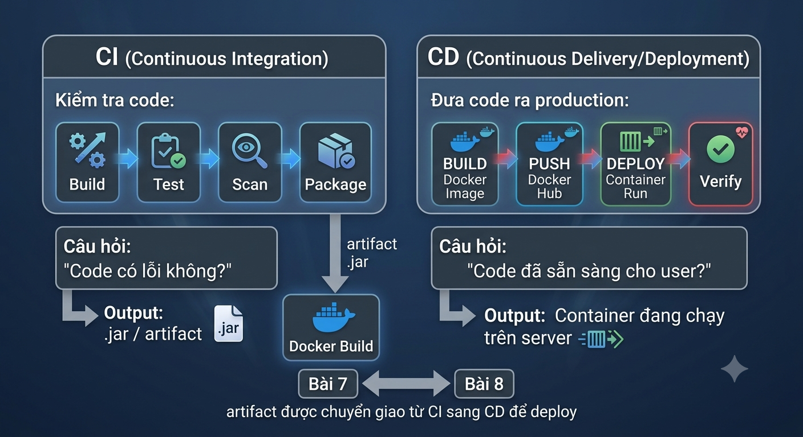
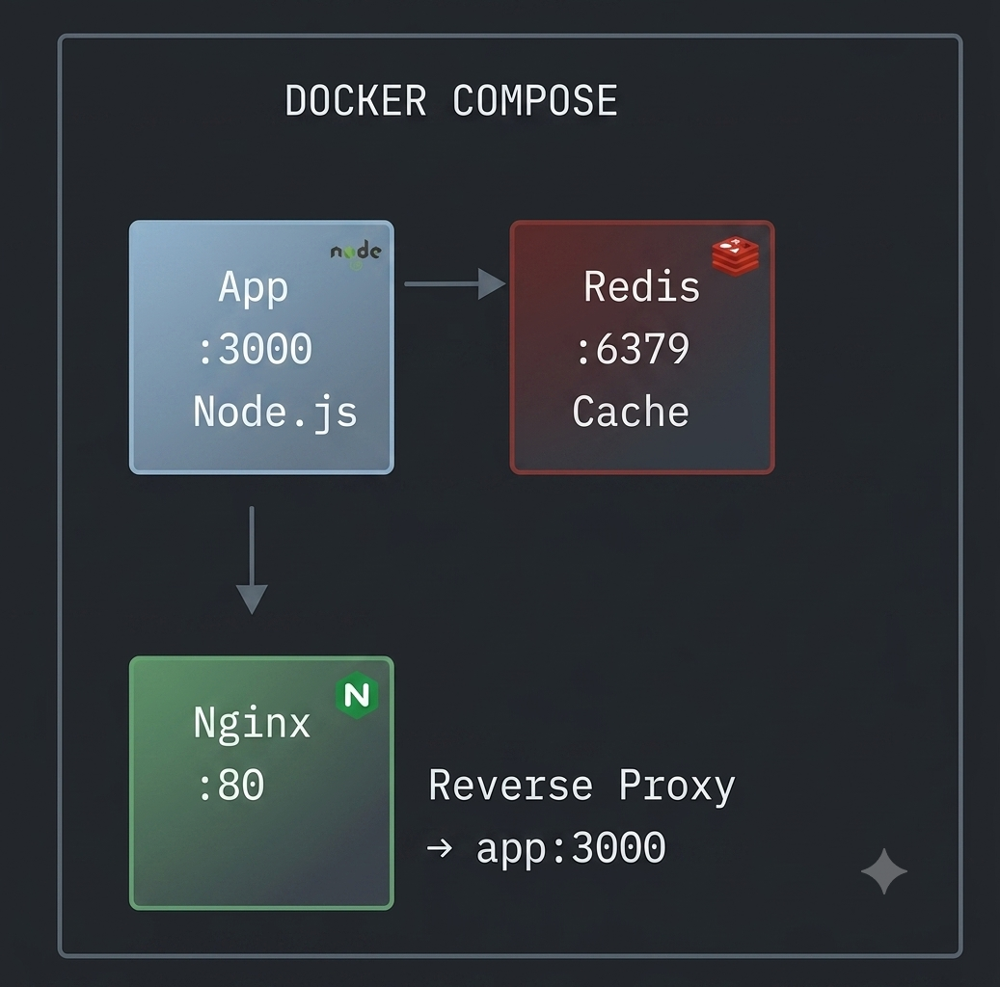
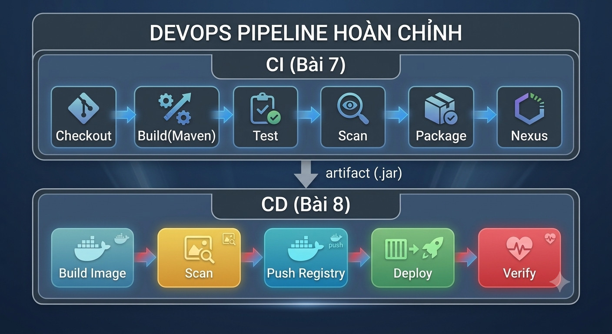

# Lab 8: Phát hành Liên tục (CD) — Docker & Jenkins CD Pipeline

> **Hướng dẫn chi tiết — 90 phút | Bài 8 — Phát hành Liên tục**

---

## Mục tiêu

Sau lab này, bạn sẽ:

1. Viết **Dockerfile**, build & tối ưu **Docker image** (multi-stage build)
2. Dùng **Docker Compose** chạy ứng dụng nhiều container
3. **Push image** lên Docker Hub registry
4. Tạo **Jenkins CD Pipeline**: Build Image → Push → Deploy Container
5. Kết nối **CI (Bài 7) + CD (Bài 8)** thành pipeline hoàn chỉnh

---

## Yêu cầu Hệ thống

| Thành phần | Yêu cầu | Ghi chú |
|------------|---------|---------|
| **Docker Desktop** | ≥ 24.x | Đã cài ở Lab 2/7 |
| **Docker Hub** | Tài khoản miễn phí | [Đăng ký](https://hub.docker.com/) |
| **Jenkins** | Từ Lab 7 (port 8080) | Có thể dùng lại containers Lab 7 |
| **Git** | ≥ 2.40 | |
| **Node.js** | ≥ 18 | |

---

## KIẾN THỨC NỀN — CI vs CD

<p align="center">
  
</p>
---

## BƯỚC 1: Docker Image — Build & Tối ưu (20 phút)

### 1.1 Tạo Sample App

```bash
mkdir lab8-cd-pipeline && cd lab8-cd-pipeline
mkdir app
```

Tạo `app/package.json`:

```json
{
  "name": "devops-lab8-app",
  "version": "2.0.0",
  "description": "DevOps Lab 8 — CD Pipeline Demo",
  "main": "server.js",
  "scripts": { "start": "node server.js" },
  "dependencies": { "express": "^4.21.0" }
}
```

Tạo `app/server.js`:

```javascript
const express = require('express');
const app = express();
const PORT = process.env.PORT || 3000;

app.get('/', (req, res) => {
  res.json({
    message: '🚀 DevOps Lab 8 — CD Pipeline',
    version: '2.0.0',
    env: process.env.NODE_ENV || 'development',
    timestamp: new Date().toISOString(),
    host: require('os').hostname(),
  });
});

app.get('/health', (req, res) => {
  res.json({ status: 'OK', uptime: process.uptime() });
});

app.listen(PORT, () => console.log(`App running on :${PORT}`));
```

### 1.2 Viết Dockerfile Cơ bản

Tạo `Dockerfile`:

```dockerfile
# ===== Stage 1: BUILD =====
FROM node:18-alpine AS builder
WORKDIR /app
COPY app/package.json .
RUN npm install --production

# ===== Stage 2: PRODUCTION =====
FROM node:18-alpine
WORKDIR /app

# Copy dependencies từ stage build
COPY --from=builder /app/node_modules ./node_modules
COPY app/ .

# Non-root user (bảo mật)
RUN addgroup -g 1001 -S appgroup && adduser -S appuser -u 1001 -G appgroup
USER appuser

EXPOSE 3000
HEALTHCHECK --interval=30s --timeout=3s --start-period=5s --retries=3 \
  CMD wget --no-verbose --tries=1 --spider http://localhost:3000/health || exit 1

CMD ["node", "server.js"]
```

> 💡 **Multi-stage build** giúp image nhẹ hơn: stage 1 cài npm, stage 2 chỉ copy những gì cần.

### 1.3 Build & Kiểm tra Image

```bash
# Build image
docker build -t devops-lab8-app:1.0 .

# Xem kích thước image
docker images devops-lab8-app

# Chạy container
docker run -d -p 3000:3000 --name lab8-app devops-lab8-app:1.0

# Test
curl http://localhost:3000/
curl http://localhost:3000/health

# Xem logs
docker logs lab8-app
```

### 1.4 So sánh: Có vs Không Multi-stage Build

```bash
# Build image KHÔNG multi-stage (để so sánh)
docker build -t devops-lab8-app:fat -f - . << 'EOF'
FROM node:18-alpine
WORKDIR /app
COPY app/ .
RUN npm install
EXPOSE 3000
CMD ["node","server.js"]
EOF

# So sánh kích thước
docker images devops-lab8-app
# devops-lab8-app   1.0    ~80MB   (multi-stage — tối ưu)
# devops-lab8-app   fat    ~200MB  (không tối ưu)
```

✅ **CHECKPOINT 1:** 2 image đã build? `curl localhost:3000/` trả JSON?

---

## BƯỚC 2: Docker Compose — Multi-container App (15 phút)

### 2.1 Kiến trúc

<p align="center">
  
</p>

Đây là kiến trúc của một ứng dụng web đa dịch vụ được đóng gói và quản lý bằng **Docker Compose**.

**1. Docker Compose**

* Công cụ giúp định nghĩa và vận hành ứng dụng gồm nhiều container Docker cùng một lúc chỉ với một tệp cấu hình (`docker-compose.yml`).
* Cả 3 dịch vụ (**App**, **Redis**, **Nginx**) đều chạy trong cùng một mạng nội bộ do Docker Compose quản lý, cho phép chúng giao tiếp với nhau bằng tên dịch vụ.

**2. Chi tiết các thành phần (Services)**

* **Nginx (Port :80 - Reverse Proxy)**
  **Vai trò:** Là cổng đón tiếp (gateway) chính cho tất cả lưu lượng truy cập từ người dùng bên ngoài đi vào hệ thống qua cổng HTTP tiêu chuẩn (`80`).
  **Chức năng:** Đóng vai trò **Reverse Proxy**, tiếp nhận yêu cầu từ người dùng rồi điều hướng (`--> app:3000`) tới ứng dụng Node.js bên trong. Việc này giúp bảo vệ ứng dụng chính, tăng cường bảo mật và dễ dàng mở rộng (load balancing) sau này.


* **App (Port :3000 - Node.js)**
  **Vai trò:** Là dịch vụ xử lý logic chính (Backend Application) được viết bằng Node.js.
  **Chức năng:** Lắng nghe và xử lý các yêu cầu được chuyển tiếp từ Nginx tại cổng `3000`. Khi cần truy xuất dữ liệu nhanh hoặc lưu phiên làm việc (session), nó sẽ kết nối trực tiếp sang dịch vụ Redis.


* **Redis (Port :6379 - Cache)**
  **Vai trò:** Hệ quản trị cơ sở dữ liệu lưu trên RAM (In-memory Data Store).
  **Chức năng:** Dùng làm bộ nhớ tạm (**Cache**) giúp ứng dụng Node.js truy xuất dữ liệu nhanh chóng tại cổng `6379`, giảm tải cho cơ sở dữ liệu chính và tăng tốc độ phản hồi của hệ thống.

=> **Tổng kết luồng dữ liệu:**

```
Client $\xrightarrow{\text{Request}}$ Nginx (:80) $\xrightarrow{\text{Forward}}$ App (:3000) $\xleftrightarrow{\text{Query/Cache}}$ Redis (:6379)
```

### 2.2 Viết docker-compose.yml

Tạo `docker-compose.yml`:

```yaml
version: '3.8'

services:
  # Node.js Application
  app:
    build:
      context: .
      dockerfile: Dockerfile
    image: devops-lab8-app:latest
    container_name: lab8-app
    ports:
      - "3000:3000"
    environment:
      - NODE_ENV=production
      - REDIS_HOST=redis
    depends_on:
      redis:
        condition: service_started
    restart: unless-stopped
    networks:
      - app-network

  # Redis Cache
  redis:
    image: redis:7-alpine
    container_name: lab8-redis
    ports:
      - "6379:6379"
    volumes:
      - redis-data:/data
    restart: unless-stopped
    networks:
      - app-network

  # Nginx Reverse Proxy
  nginx:
    image: nginx:alpine
    container_name: lab8-nginx
    ports:
      - "80:80"
    volumes:
      - ./nginx.conf:/etc/nginx/conf.d/default.conf:ro
    depends_on:
      - app
    restart: unless-stopped
    networks:
      - app-network

volumes:
  redis-data:

networks:
  app-network:
    driver: bridge
```

Tạo `nginx.conf`:

```nginx
server {
    listen 80;

    location / {
        proxy_pass http://app:3000;
        proxy_set_header Host $host;
        proxy_set_header X-Real-IP $remote_addr;
        proxy_set_header X-Forwarded-For $proxy_add_x_forwarded_for;
    }

    location /health {
        proxy_pass http://app:3000/health;
    }
}
```

### 2.3 Chạy Docker Compose

```bash
# Dừng container riêng lẻ trước đó
docker stop lab8-app 2>/dev/null && docker rm lab8-app 2>/dev/null || true

# Khởi động stack
docker compose up -d

# Kiểm tra tất cả services
docker compose ps
docker compose logs app

# Test qua Nginx proxy
curl http://localhost/
curl http://localhost/health
```

✅ **CHECKPOINT 2:** 3 containers đang chạy? `curl localhost/` qua Nginx hoạt động?

---

## BƯỚC 3: Push Image lên Docker Hub (10 phút)

### 3.1 Đăng nhập Docker Hub

```bash
# Đăng nhập (nhập username + password/token)
docker login

# Kiểm tra đã login
docker info | grep Username
```

> ⚠️ Nếu dùng Docker Hub lần đầu: vào [hub.docker.com](https://hub.docker.com/) → Settings → Security → **Create Access Token** → dùng token thay cho password.

### 3.2 Tag & Push Image

```bash
# Thay YOUR_DOCKER_USERNAME bằng username của bạn
export DOCKER_USER="YOUR_DOCKER_USERNAME"

# Tag image với Docker Hub username
docker tag devops-lab8-app:1.0 $DOCKER_USER/devops-lab8-app:1.0
docker tag devops-lab8-app:1.0 $DOCKER_USER/devops-lab8-app:latest

# Push lên Docker Hub
docker push $DOCKER_USER/devops-lab8-app:1.0
docker push $DOCKER_USER/devops-lab8-app:latest
```

### 3.3 Verify trên Docker Hub

1. Vào https://hub.docker.com/r/YOUR_USERNAME/devops-lab8-app
2. Xem: Tags (1.0, latest), size, pull command

### 3.4 Pull từ máy khác (Test)

```bash
# Giả lập pull như 1 server khác
docker pull $DOCKER_USER/devops-lab8-app:1.0

# Chạy image vừa pull
docker run -d -p 3001:3000 --name lab8-test-pull $DOCKER_USER/devops-lab8-app:1.0
curl http://localhost:3001/
docker stop lab8-test-pull && docker rm lab8-test-pull
```

✅ **CHECKPOINT 3:** Image đã lên Docker Hub? Pull về chạy được?

---

## BƯỚC 4: Jenkins CD Pipeline — Tự động Deploy (25 phút)

> **Kết nối với Lab 7:** Dùng lại Jenkins đã cài từ Lab 7. Nếu chưa có, chạy nhanh:
> `docker run -d -p 8080:8080 -p 50000:50000 -v /var/run/docker.sock:/var/run/docker.sock --name jenkins jenkins/jenkins:lts-jdk17`

### 4.1 Tạo Jenkinsfile CD Pipeline

Tạo `Jenkinsfile`:

```groovy
pipeline {
    agent any

    environment {
        DOCKER_USER     = 'YOUR_DOCKER_USERNAME'   // ← ĐỔI thành username của bạn
        DOCKER_IMAGE    = "${DOCKER_USER}/devops-lab8-app"
        DOCKER_TAG      = "${env.BUILD_NUMBER}"
        CONTAINER_NAME  = 'lab8-cd-production'
        APP_PORT        = '3000'
    }

    stages {
        stage('Checkout') {
            steps {
                echo '📦 CD STEP 1/6: CHECKOUT'
                checkout scm
            }
        }

        stage('Docker Build') {
            steps {
                echo '🐳 CD STEP 2/6: BUILD IMAGE'
                sh '''
                    docker build \
                        -t ${DOCKER_IMAGE}:${DOCKER_TAG} \
                        -t ${DOCKER_IMAGE}:latest \
                        .
                '''
            }
        }

        stage('Docker Scan') {
            steps {
                echo '🔍 CD STEP 3/6: SCAN IMAGE'
                sh '''
                    docker scout quickview ${DOCKER_IMAGE}:${DOCKER_TAG} || echo "⚠️  Scout not available — skip"
                '''
            }
        }

        stage('Push to Registry') {
            steps {
                echo '📤 CD STEP 4/6: PUSH TO DOCKER HUB'
                sh '''
                    docker push ${DOCKER_IMAGE}:${DOCKER_TAG}
                    docker push ${DOCKER_IMAGE}:latest
                '''
            }
        }

        stage('Deploy Container') {
            steps {
                echo '🚀 CD STEP 5/6: DEPLOY CONTAINER'
                sh '''
                    # Stop & remove container cũ nếu có
                    docker stop ${CONTAINER_NAME} 2>/dev/null || true
                    docker rm ${CONTAINER_NAME} 2>/dev/null || true

                    # Deploy container mới
                    docker run -d \
                        --name ${CONTAINER_NAME} \
                        -p ${APP_PORT}:3000 \
                        --restart unless-stopped \
                        ${DOCKER_IMAGE}:${DOCKER_TAG}
                '''
            }
        }

        stage('Verify Deploy') {
            steps {
                echo '✅ CD STEP 6/6: VERIFY'
                sh '''
                    sleep 3
                    curl -f http://localhost:${APP_PORT}/health || exit 1
                    echo ""
                    curl http://localhost:${APP_PORT}/
                '''
            }
        }
    }

    post {
        success {
            echo "🎉 CD PIPELINE SUCCESS — Deployed ${DOCKER_IMAGE}:${DOCKER_TAG}"
        }
        failure {
            echo "💥 CD PIPELINE FAILED — Check logs!"
        }
        always {
            cleanWs()
        }
    }
}
```

### 4.2 Cấu hình Jenkins Credentials cho Docker Hub

1. Jenkins → **Manage Jenkins** → **Credentials** → **Global**
2. **Add Credentials** → Kind: **Username with password**
3. Username: `YOUR_DOCKER_USERNAME`
4. Password: Docker Hub Access Token
5. ID: `docker-hub-credentials`

### 4.3 Cấu hình Jenkins Docker Permissions

```bash
# Jenkins container cần quyền truy cập Docker socket
docker exec -u root jenkins chmod 666 /var/run/docker.sock

# Kiểm tra
docker exec jenkins docker ps
```

### 4.4 Chạy CD Pipeline

1. Jenkins → **New Item** → `DevOps-Lab8-CD-Pipeline` → Pipeline
2. Pipeline → Definition: **Pipeline script from SCM**
3. SCM: Git → URL: `https://github.com/YOUR_USERNAME/lab8-cd-pipeline.git`
4. Script Path: `Jenkinsfile`
5. Save → **Build Now**

### 4.5 Xem CD Pipeline Chạy

```
Checkout ──▶ Docker Build ──▶ Scan ──▶ Push ──▶ Deploy ──▶ Verify
   ✅           ✅             ✅       ✅        ✅          ✅
  (3s)        (45s)          (5s)    (30s)     (5s)        (3s)

Total Pipeline: ~90 giây
```

✅ **CHECKPOINT 4:** Jenkins CD pipeline 6 stages đều xanh? `curl localhost:3000/` hoạt động?

---

## BƯỚC 5: CI + CD — Pipeline Hoàn chỉnh (10 phút)

### 5.1 Kết nối Bài 7 (CI) → Bài 8 (CD)

<p align="center">
  
</p>


### 5.2 Bảng So sánh CI vs CD

| Tiêu chí | CI (Bài 7) | CD (Bài 8) |
|----------|-----------|-----------|
| **Mục đích** | Kiểm tra code có lỗi không | Đưa code đến tay người dùng |
| **Output** | File .jar / artifact | Container đang chạy |
| **Công cụ** | Maven, SonarQube, Nexus | Docker, Docker Hub, K8s |
| **Câu hỏi trả lời** | "An toàn để merge?" | "Sẵn sàng production?" |
| **Tần suất** | Mỗi commit | Mỗi lần CI pass |
| **Thất bại nghĩa là** | Code có bug | Deployment bị lỗi |

### 5.3 Viết CI+CD Combined Pipeline (Bonus)

```groovy
// Jenkinsfile kết hợp CI + CD
pipeline {
    agent any
    stages {
        // ===== CI STAGES (Bài 7) =====
        stage('CI: Build')   { steps { sh 'mvn clean compile' } }
        stage('CI: Test')    { steps { sh 'mvn test' } }
        stage('CI: Package') { steps { sh 'mvn package' } }

        // ===== CD STAGES (Bài 8) =====
        stage('CD: Docker Build') { steps { sh 'docker build -t app:${BUILD_NUMBER} .' } }
        stage('CD: Push')         { steps { sh 'docker push app:${BUILD_NUMBER}' } }
        stage('CD: Deploy')       { steps { sh 'docker run -d -p 3000:3000 --name app app:${BUILD_NUMBER}' } }
    }
}
```

✅ **CHECKPOINT 5:** Đã hiểu sự khác biệt CI vs CD? Điền bảng so sánh?

---

## BƯỚC 6: Dọn dẹp (10 phút)

```bash
# Dừng Docker Compose stack
docker compose down

# Xóa containers riêng lẻ
docker stop lab8-app lab8-cd-production 2>/dev/null || true
docker rm lab8-app lab8-cd-production 2>/dev/null || true

# Xóa images local (tùy chọn)
docker rmi devops-lab8-app:1.0 devops-lab8-app:latest 2>/dev/null || true
```

✅ **CHECKPOINT 6:** `docker ps` không còn containers lab8?

---

## TROUBLESHOOTING

| # | Lỗi | Cách khắc phục |
|---|------|---------------|
| 1 | `docker build` lỗi "permission denied" | Linux: `sudo usermod -aG docker $USER` + logout/login |
| 2 | `docker push` bị "denied: requested access" | Chưa `docker login` hoặc token sai |
| 3 | Jenkins không chạy được `docker` command | `docker exec -u root jenkins chmod 666 /var/run/docker.sock` |
| 4 | Container deploy lỗi "port already allocated" | Port 3000 bị chiếm → đổi `APP_PORT` trong Jenkinsfile |
| 5 | `docker scout` không tìm thấy | Bỏ qua — đây là optional step |
| 6 | Nginx 502 Bad Gateway | App container chưa sẵn sàng → đợi 5s hoặc check depends_on với healthcheck |
| 7 | Multi-stage build không giảm size | Kiểm tra đã dùng `--production` khi `npm install` chưa |

---

## BÀI TẬP MỞ RỘNG

### 🟢 Cơ bản
1. **Thêm tag version tự động:** Dùng `git describe --tags` làm Docker tag thay vì BUILD_NUMBER
2. **Health check nâng cao:** Thêm `HEALTHCHECK` trong Dockerfile để Docker biết container healthy

### 🟡 Trung bình
3. **Blue-Green Deployment:** Chạy 2 container (blue + green), switch traffic bằng Nginx
4. **Docker Registry riêng:** Thay Docker Hub bằng Nexus Docker Registry (đã có ở Lab 7)

### 🔴 Nâng cao
5. **CD ra Kubernetes:** Thay `docker run` bằng `kubectl apply` (kết hợp Lab 9)
6. **GitOps với ArgoCD:** Deploy tự động từ Git repo (không cần Jenkins)

---

## TIÊU CHÍ CHẤM ĐIỂM

| # | Tiêu chí | Điểm |
|---|----------|:----:|
| 1 | Docker image build thành công (multi-stage) | 20% |
| 2 | Docker Compose 3 services chạy OK | 20% |
| 3 | Push image lên Docker Hub | 15% |
| 4 | Jenkins CD pipeline 6 stages PASS | 25% |
| 5 | CI vs CD — hiểu sự khác biệt | 10% |
| 6 | Dọn dẹp sạch | 10% |
| **TỔNG** | | **100%** |

### Cách Nộp bài

```
Lab8_HoTen_MSSV.zip
├── Dockerfile
├── docker-compose.yml
├── nginx.conf
├── Jenkinsfile
├── app/
│   ├── server.js
│   └── package.json
├── screenshots/
│   ├── 01-docker-build.png          ← docker build output
│   ├── 02-docker-images-size.png    ← So sánh image size
│   ├── 03-compose-ps.png            ← docker compose ps
│   ├── 04-docker-hub.png            ← Docker Hub screenshot
│   ├── 05-jenkins-cd-pipeline.png   ← Jenkins Stage View (6 stages xanh)
│   ├── 06-verify-deploy.png         ← curl localhost:3000
│   └── 07-ci-vs-cd-table.png        ← Bảng so sánh CI vs CD
└── ho_ten_mssv.txt
```

---

> 🎯 **Lab này tương ứng với:** CDR 8.2 + CDR 8.3 — Đóng gói Docker image + Triển khai CD với Jenkins
>
> 📅 **Cập nhật:** 2026-07-03
>
> 📋 **Lab gốc vẫn giữ:** `1_Lectures/Bài 8_OK/Bài 8_CI_CD_Part2_Lab.pdf` (Docker cơ bản)
