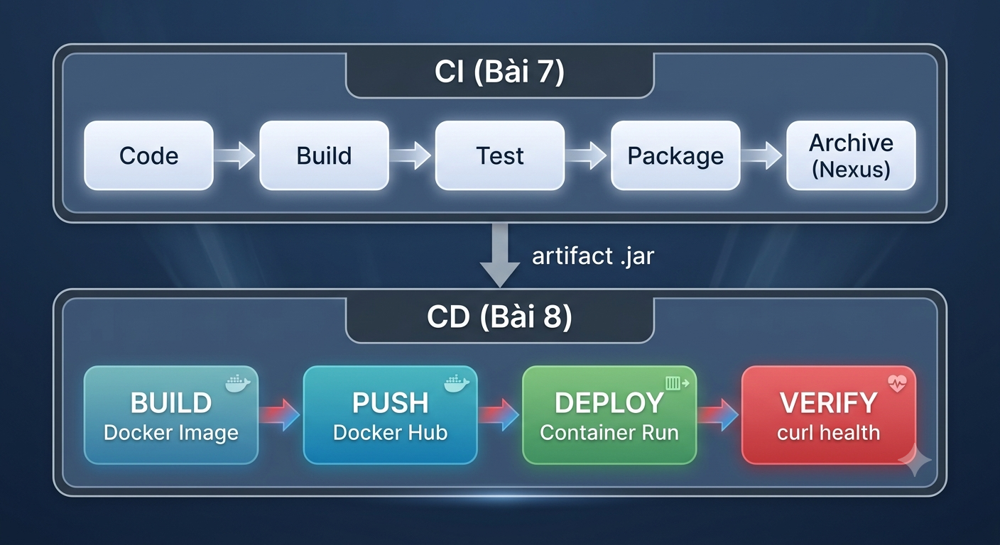

# Lab 8: Phát hành Liên tục (CD) — Docker & Jenkins CD Pipeline

## Thông tin chung
- **Bài học 8:** Phát hành Liên tục (Continuous Delivery/Deployment)
- **CDR:** 8.2 (Đóng gói Docker image) + 8.3 (Triển khai CD với Jenkins)
- **Mức Bloom:** Vận dụng (Apply)
- **Thời lượng:** 90 phút
- **Hình thức:** Cá nhân

## Mục tiêu
Sau lab này, sinh viên có thể:
1. Viết Dockerfile, build & tối ưu Docker image (multi-stage build)
2. Sử dụng Docker Compose để chạy multi-container app
3. Push Docker image lên Docker Hub registry
4. Tạo Jenkins **CD Pipeline**: Build Image → Push Registry → Deploy Container
5. Hiểu sự khác biệt CI (Bài 7) vs CD (Bài 8) — kết nối 2 pipeline

## Kiến thức tiên quyết
- Đã học Bài 7 (CI), Bài 8 (CD), Bài 2 (Docker cơ bản)
- Đã cài: Docker Desktop, Docker Hub account, Git

## Kiến trúc CI/CD — Kết nối Bài 7 → Bài 8

  

## Nội dung Lab
| Step | Nội dung | Công cụ | Thời gian |
|------|----------|---------|-----------|
| 1 | Docker Image — Build & Tối ưu | Docker, Dockerfile | 20 phút |
| 2 | Docker Compose — Multi-container App | Docker Compose | 15 phút |
| 3 | Push Image lên Docker Hub | Docker Hub | 10 phút |
| 4 | CD Pipeline — Jenkins tự động Deploy | Jenkins, Docker | 25 phút |
| 5 | CI + CD — Pipeline Hoàn chỉnh | Jenkins | 10 phút |
| 6 | Dọn dẹp | — | 10 phút |
