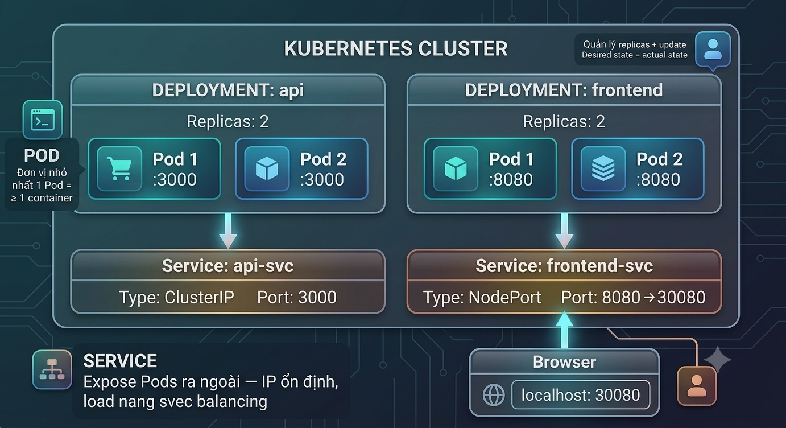

# Lab 9: Kubernetes & Triển khai Microservices — Ôn tập Tổng hợp

> **Hướng dẫn chi tiết — 120 phút | Bài 9 — Quản lý Container & Ôn tập**
> **Đây là LAB CUỐI CÙNG của khóa học! 🎉**

---

## Mục tiêu

Sau lab này, bạn sẽ:

1. Cài đặt & sử dụng **Minikube** — Kubernetes cluster local
2. Triển khai **Pod, Deployment, Service** — 3 resource K8s cơ bản nhất
3. Deploy ứng dụng **microservices** (2 services) lên K8s
4. **Scale, Update, Rollback** — quản lý vòng đời ứng dụng
5. **Ôn tập tổng hợp** toàn bộ DevOps pipeline từ Bài 1→9

---

## Yêu cầu

| Thành phần | Yêu cầu | Ghi chú |
|------------|---------|---------|
| OS | Windows 10+/macOS/Linux | |
| RAM | ≥ 8GB (khuyến nghị 16GB) | Minikube cần ~2GB |
| Disk | ≥ 20GB trống | |
| **Docker Desktop** | ≥ 24.x | HOẶC dùng Minikube |
| **Minikube** | Latest | [Tải tại đây](https://minikube.sigs.k8s.io/docs/start/) |
| **kubectl** | ≥ 1.28 | Đi kèm Minikube hoặc cài riêng |

---

## KIẾN THỨC NỀN — Kubernetes trong 5 phút

### K8s là gì?

> Kubernetes (K8s) = **Container Orchestrator** — quản lý hàng trăm/thousands Docker containers tự động.

### 3 Resources Cơ bản nhất

<p align="center">
  
</p>

```
┌─────────────────────────────────────────────────────────┐
│ POD                         DEPLOYMENT                  │
│ ┌──────────────┐           ┌──────────────────────┐     │
│ │  Container   │           │  ReplicaSet          │     │
│ │  ┌────────┐  │           │  ┌────┐ ┌────┐ ┌────┐│     │
│ │  │my-app  │  │           │  │Pod │ │Pod │ │Pod ││     │
│ │  │:3000   │  │           │  │ 1  │ │ 2  │ │ 3  ││     │
│ │  └────────┘  │           │  └────┘ └────┘ └────┘│     │
│ └──────────────┘           └──────────────────────┘     │
│ Đơn vị nhỏ nhất            Quản lý replicas + update    │
│ 1 Pod = ≥ 1 container      Desired state = actual state │
└─────────────────────────────────────────────────────────┘

SERVICE
┌──────────────────────┐
│  ClusterIP/NodePort  │
│  ┌────────────────┐  │
│  │ Load Balancer  │──┼──▶ Pod 1, Pod 2, Pod 3
│  └────────────────┘  │
└──────────────────────┘
Expose Pods ra ngoài — IP ổn định, load balancing
```

### Các Lệnh kubectl Cốt lõi

| Lệnh | Chức năng |
|------|-----------|
| `kubectl get pods` | Liệt kê Pods |
| `kubectl get deployments` | Liệt kê Deployments |
| `kubectl get services` | Liệt kê Services |
| `kubectl describe pod <name>` | Chi tiết 1 Pod |
| `kubectl logs <pod-name>` | Xem log |
| `kubectl apply -f file.yaml` | Tạo/Cập nhật resource |
| `kubectl delete -f file.yaml` | Xóa resource |
| `kubectl scale deploy <name> --replicas=N` | Scale |
| `kubectl rollout restart deploy <name>` | Restart deployment |

---

## BƯỚC 1: Cài đặt Minikube + kubectl (15 phút)

### 1.1 Cài đặt Minikube

#### Windows
```powershell
# Tải và cài Minikube
winget install minikube

# HOẶC dùng Chocolatey
choco install minikube
```

#### macOS
```bash
brew install minikube
```

#### Linux
```bash
curl -LO https://storage.googleapis.com/minikube/releases/latest/minikube-linux-amd64
sudo install minikube-linux-amd64 /usr/local/bin/minikube
```

### 1.2 Khởi động Minikube

```bash
# Khởi động cluster (dùng Docker driver)
minikube start --driver=docker --memory=4096 --cpus=2

# Kiểm tra trạng thái
minikube status
```

**Kết quả mong đợi:**
```
minikube
type: Control Plane
host: Running
kubelet: Running
apiserver: Running
kubeconfig: Configured
```

### 1.3 Kiểm tra kubectl

```bash
kubectl version --client
kubectl cluster-info
kubectl get nodes
```

**Kết quả mong đợi:**
```
NAME       STATUS   ROLES           AGE   VERSION
minikube   Ready    control-plane   1m    v1.28.x
```

✅ **CHECKPOINT 1:** `kubectl get nodes` thấy `minikube` với STATUS = **Ready**?

---

## BƯỚC 2: Pod & Deployment — Chạy App Đầu tiên (20 phút)

### 2.1 Tạo Pod Đầu tiên (Imperative)

```bash
# Chạy 1 pod Nginx đơn giản
kubectl run my-first-pod --image=nginx:alpine --port=80

# Kiểm tra
kubectl get pods
kubectl get pods -o wide   # Xem thêm IP, node

# Xem log
kubectl logs my-first-pod

# Xóa pod (để chuẩn bị dùng Deployment)
kubectl delete pod my-first-pod
```

### 2.2 Tạo Deployment (Declarative — chuẩn DevOps)

Tạo file `deployment-nginx.yaml`:

```yaml
apiVersion: apps/v1
kind: Deployment
metadata:
  name: nginx-deployment
  labels:
    app: nginx
    lab: devops-lab9
spec:
  replicas: 3                    # 3 bản sao
  selector:
    matchLabels:
      app: nginx
  template:                      # Pod template
    metadata:
      labels:
        app: nginx
    spec:
      containers:
      - name: nginx
        image: nginx:alpine
        ports:
        - containerPort: 80
        resources:
          requests:
            memory: "64Mi"
            cpu: "100m"
          limits:
            memory: "128Mi"
            cpu: "200m"
```

```bash
# Áp dụng
kubectl apply -f deployment-nginx.yaml

# Kiểm tra Deployment
kubectl get deployments
kubectl get pods           # Phải có 3 pods

# Xem chi tiết
kubectl describe deployment nginx-deployment
```

**Kết quả mong đợi:**
```
NAME               READY   UP-TO-DATE   AVAILABLE   AGE
nginx-deployment   3/3     3            3           10s

NAME                                READY   STATUS    RESTARTS   AGE
nginx-deployment-xxxxx-abcde        1/1     Running   0          10s
nginx-deployment-xxxxx-fghij        1/1     Running   0          10s
nginx-deployment-xxxxx-klmno        1/1     Running   0          10s
```

### 2.3 Kiểm tra Self-healing

```bash
# Xóa 1 pod — Deployment sẽ tự tạo lại!
kubectl delete pod <tên-1-pod>

# Xem ngay — pod mới được tạo
kubectl get pods -w    # -w = watch (Ctrl+C để thoát)
```

> 💡 **Đây là sức mạnh của K8s:** Pod chết → tự động tạo lại → đảm bảo luôn đúng 3 replicas!

✅ **CHECKPOINT 2:** Deployment chạy 3/3 pods? Xóa 1 pod → pod mới tự tạo?

---

## BƯỚC 3: Service & Networking — Expose Ứng dụng (15 phút)

### 3.1 Tạo Service (ClusterIP — internal)

Tạo file `service-nginx.yaml`:

```yaml
apiVersion: v1
kind: Service
metadata:
  name: nginx-service
  labels:
    lab: devops-lab9
spec:
  selector:
    app: nginx              # Trỏ đến pods có label app=nginx
  ports:
  - protocol: TCP
    port: 80                # Port của Service
    targetPort: 80          # Port của Container
  type: ClusterIP           # Chỉ truy cập trong cluster
```

```bash
kubectl apply -f service-nginx.yaml
kubectl get services
```

### 3.2 Tạo Service (NodePort — external access)

Cập nhật `service-nginx.yaml` thành NodePort:

```yaml
apiVersion: v1
kind: Service
metadata:
  name: nginx-service-np
spec:
  selector:
    app: nginx
  ports:
  - protocol: TCP
    port: 80
    targetPort: 80
    nodePort: 30080        # Port truy cập từ bên ngoài (30000-32767)
  type: NodePort
```

```bash
kubectl apply -f service-nginx.yaml

# Truy cập từ browser
minikube service nginx-service-np --url
# Hoặc: http://localhost:30080 (với Minikube tunnel/Docker driver)

# Test
curl http://localhost:30080
```

> Trên Minikube với Docker driver, dùng: `minikube service nginx-service-np`

### 3.3 So sánh Service Types

| Type | Truy cập từ | Dùng khi |
|------|:---------:|----------|
| **ClusterIP** | Chỉ trong cluster | Internal communication giữa services |
| **NodePort** | Bên ngoài (nodeIP:port) | Dev/test, debug |
| **LoadBalancer** | Bên ngoài (external IP) | Production (cần cloud provider) |

✅ **CHECKPOINT 3:** Service tạo OK? `minikube service nginx-service-np` mở được browser?

---

## BƯỚC 4: Microservices Deployment — API + Frontend (25 phút)

### 4.1 Kiến trúc

```
┌─────────────────────────────────────────────────────┐
│                  K8S CLUSTER                         │
│                                                      │
│  ┌─────────────────┐    ┌─────────────────┐         │
│  │ student-api     │◀───│ student-frontend│         │
│  │ (Node.js)       │    │ (Nginx+HTML)    │         │
│  │ Port: 3000      │    │ Port: 80        │         │
│  │ Replicas: 2     │    │ Replicas: 2     │         │
│  └────────┬────────┘    └────────┬────────┘         │
│           │                      │                   │
│           ▼                      ▼                   │
│  ┌─────────────────┐    ┌─────────────────┐         │
│  │ Service:        │    │ Service:        │         │
│  │ api-svc         │    │ frontend-svc    │         │
│  │ ClusterIP:3000  │    │ NodePort:30081  │         │
│  └─────────────────┘    └─────────────────┘         │
│                                    │                 │
└────────────────────────────────────┼─────────────────┘
                                     │
                              ┌──────▼──────┐
                              │  Browser    │
                              │ localhost:  │
                              │   30081     │
                              └─────────────┘
```

### 4.2 Tạo Student API Microservice

Tạo file `student-api.yaml`:

```yaml
apiVersion: apps/v1
kind: Deployment
metadata:
  name: student-api
spec:
  replicas: 2
  selector:
    matchLabels:
      app: student-api
  template:
    metadata:
      labels:
        app: student-api
    spec:
      containers:
      - name: api
        image: node:18-alpine
        command: ["node", "-e"]
        args:
        - |
          const http = require('http');
          const students = [
            {id:"SV001",name:"Nguyen Van A",grade:"K20"},
            {id:"SV002",name:"Tran Thi B",grade:"K20"},
            {id:"SV003",name:"Le Van C",grade:"K21"}
          ];
          const server = http.createServer((req,res)=>{
            res.writeHead(200,{'Content-Type':'application/json','Access-Control-Allow-Origin':'*'});
            if(req.url==='/api/students') return res.end(JSON.stringify({success:true,data:students}));
            if(req.url==='/api/health') return res.end(JSON.stringify({status:'OK',service:'student-api'}));
            res.writeHead(404);res.end(JSON.stringify({error:'Not found'}));
          });
          server.listen(3000,()=>console.log('API running on :3000'));
        ports:
        - containerPort: 3000
---
apiVersion: v1
kind: Service
metadata:
  name: api-svc
spec:
  selector:
    app: student-api
  ports:
  - port: 3000
    targetPort: 3000
  type: ClusterIP
```

### 4.3 Tạo Frontend Microservice

Tạo file `student-frontend.yaml`:

```yaml
apiVersion: apps/v1
kind: Deployment
metadata:
  name: student-frontend
spec:
  replicas: 2
  selector:
    matchLabels:
      app: student-frontend
  template:
    metadata:
      labels:
        app: student-frontend
    spec:
      containers:
      - name: frontend
        image: nginx:alpine
        command: ["sh", "-c"]
        args:
        - |
          cat > /usr/share/nginx/html/index.html << 'HTMLEOF'
          <!DOCTYPE html>
          <html><head><title>DevOps Lab 9 — K8s Microservices</title>
          <style>
          *{margin:0;padding:0;box-sizing:border-box}
          body{font-family:system-ui;background:linear-gradient(135deg,#667eea,#764ba2);min-height:100vh;padding:20px}
          .container{max-width:900px;margin:0 auto;background:#fff;border-radius:16px;padding:40px;box-shadow:0 20px 60px rgba(0,0,0,.3)}
          h1{color:#667eea;text-align:center;margin-bottom:8px}
          h2{color:#764ba2;text-align:center;font-weight:normal;font-size:16px;margin-bottom:30px}
          table{width:100%;border-collapse:collapse}
          th{background:#667eea;color:#fff;padding:12px;text-align:left}
          td{padding:10px 12px;border-bottom:1px solid #eee}
          tr:hover{background:#f8f9fa}
          .status{text-align:center;margin-top:30px;padding:12px;background:#e8f5e9;border-radius:8px;color:#2e7d32}
          .refresh{display:block;margin:20px auto;padding:10px 30px;background:#667eea;color:#fff;border:none;border-radius:8px;font-size:16px;cursor:pointer}
          </style></head>
          <body>
          <div class="container">
          <h1>🚀 DevOps Lab 9</h1>
          <h2>Kubernetes Microservices — Student Manager</h2>
          <table id="students"><thead><tr><th>ID</th><th>Name</th><th>Grade</th></tr></thead><tbody><tr><td colspan="3">Loading...</td></tr></tbody></table>
          <p class="status" id="status">🔄 Connecting to API...</p>
          <button class="refresh" onclick="loadData()">🔄 Refresh Data</button>
          </div>
          <script>
          async function loadData(){
          document.getElementById('status').textContent='🔄 Loading...';
          try{
          const res=await fetch('http://api-svc:3000/api/students');
          const d=await res.json();
          document.getElementById('students').querySelector('tbody').innerHTML=d.data.map(s=>`<tr><td>${s.id}</td><td>${s.name}</td><td>${s.grade}</td></tr>`).join('');
          document.getElementById('status').innerHTML='✅ Connected to API | Students: '+d.data.length+' | <b>K8s Microservices WORKING!</b>';
          }catch(e){
          document.getElementById('status').innerHTML='❌ Cannot connect to API: '+e.message;
          }
          }
          loadData();
          </script></body></html>
          HTMLEOF
          nginx -g 'daemon off;'
        ports:
        - containerPort: 80
---
apiVersion: v1
kind: Service
metadata:
  name: frontend-svc
spec:
  selector:
    app: student-frontend
  ports:
  - port: 80
    targetPort: 80
    nodePort: 30081
  type: NodePort
```

> 🔑 Frontend gọi API qua `http://api-svc:3000` — đây là **K8s Service Discovery**: dùng tên Service thay vì IP!

### 4.4 Triển khai Microservices

```bash
# Deploy cả 2 services
kubectl apply -f student-api.yaml
kubectl apply -f student-frontend.yaml

# Kiểm tra tất cả resources
kubectl get pods,deployments,services

# Mở frontend
minikube service frontend-svc
```

**Kết quả mong đợi:** Browser hiển thị bảng 3 sinh viên, status "✅ Connected to API — K8s Microservices WORKING!"

✅ **CHECKPOINT 4:** Frontend gọi được API qua `api-svc:3000`? Bảng hiển thị 3 sinh viên?

---

## BƯỚC 5: Scale, Update & Rollback (15 phút)

### 5.1 Scale — Tăng/Giảm Số lượng Pods

```bash
# Scale API lên 5 replicas
kubectl scale deployment student-api --replicas=5

# Xem pods được tạo thêm
kubectl get pods -l app=student-api -w

# Scale xuống 2
kubectl scale deployment student-api --replicas=2
```

### 5.2 Update — Cập nhật Ứng dụng (Rolling Update)

```bash
# Cập nhật image (demo: đổi logic API)
kubectl set image deployment/student-api api=node:20-alpine

# Xem quá trình rolling update
kubectl rollout status deployment/student-api

# Xem lịch sử update
kubectl rollout history deployment/student-api
```

**Rolling Update hoạt động thế nào?**
```
Pod cũ (v1)    Pod cũ (v1)    Pod cũ (v1)
    ❌              ✅              ✅
Pod mới (v2)   Pod cũ (v1)    Pod cũ (v1)
    ✅              ❌              ✅
Pod mới (v2)   Pod mới (v2)   Pod cũ (v1)
    ✅              ✅              ❌
Pod mới (v2)   Pod mới (v2)   Pod mới (v2)
    ✅              ✅              ✅

→ Không có downtime! Từng pod được thay thế tuần tự
```

### 5.3 Rollback — Quay lại Phiên bản Cũ

```bash
# Rollback về phiên bản trước
kubectl rollout undo deployment/student-api

# Rollback về 1 revision cụ thể
kubectl rollout undo deployment/student-api --to-revision=1
```

✅ **CHECKPOINT 5:** Scale được? Rolling update không downtime? Rollback hoạt động?

---

## BƯỚC 6: Debug & Monitoring (10 phút)

### 6.1 Debug Pod

```bash
# Xem log của 1 pod cụ thể
POD_NAME=$(kubectl get pods -l app=student-api -o jsonpath='{.items[0].metadata.name}')
kubectl logs $POD_NAME

# Xem log real-time (tail -f)
kubectl logs -f $POD_NAME

# Exec vào container
kubectl exec -it $POD_NAME -- sh

# Xem events
kubectl get events --sort-by=.metadata.creationTimestamp | tail -10
```

### 6.2 Dashboard (Optional)

```bash
# Mở Kubernetes Dashboard
minikube dashboard
```

### 6.3 Kiểm tra Resource Usage

```bash
# Xem resource usage của pods
kubectl top pods
kubectl top nodes
```

✅ **CHECKPOINT 6:** Log xem được? Dashboard mở được?

---

## BƯỚC 7: ÔN TẬP TỔNG HỢP — DevOps Pipeline Hoàn chỉnh (20 phút)

> 🎯 Đây là phần ôn tập — kết nối tất cả 9 bài học thành 1 bức tranh!

### 7.1 Vẽ DevOps Pipeline HOÀN CHỈNH

Dựa trên tất cả lab đã làm, vẽ pipeline end-to-end:

```
┌────────────────────────────────────────────────────────────────────────────┐
│                     DEVOPS PIPELINE — KHÓA HỌC 9 BÀI                        │
│                                                                            │
│  PLAN       CODE        BUILD       TEST         DEPLOY       OPERATE     │
│  ────       ────        ─────       ────         ──────       ───────     │
│  Bài 1      Bài 5       Bài 7      Bài 6        Bài 3,4,8    Bài 9       │
│                                                                            │
│  ┌──────┐  ┌──────┐  ┌────────┐  ┌──────────┐  ┌─────────┐  ┌──────────┐ │
│  │GitHub│  │ Git  │  │Jenkins │  │ SonarQube│  │Terraform│  │Kubernetes│ │
│  │Proj. │──▶│ VS   │──▶│CI      │──▶│(SAST)    │──▶│+AWS     │──▶│(K8s)     │ │
│  │      │  │ Code │  │Pipeline│  ├──────────┤  │(Bài 3)  │  │(Bài 9)   │ │
│  └──────┘  │      │  │(Bài 7) │  │ Postman  │  ├─────────┤  │          │ │
│            │ GitHub│  │        │  │(API Test)│  │ Ansible │  │          │ │
│  Bài 2     │(Bài 5)│  │  Maven │  │(Bài 6)   │  │(Bài 4)  │  │          │ │
│  ┌──────┐  └──────┘  │  Build │  ├──────────┤  ├─────────┤  │          │ │
│  │CALMS │            │  .jar  │  │ OWASP ZAP│  │ Docker  │  │          │ │
│  │Auto- │            │        │  │(DAST)    │  │(Bài 8)  │  │          │ │
│  │mation│            │  Nexus │  │(Bài 6)   │  │  Image  │  │          │ │
│  │Lean  │            │  Repo  │  │          │  │  Build  │  │          │ │
│  └──────┘            └────────┘  └──────────┘  └─────────┘  └──────────┘ │
│                                                                            │
│  ┌─────────────────────────────────────────────────────────────────────┐  │
│  │                        MONITORING & FEEDBACK                         │  │
│  │  Prometheus + Grafana → Logs → Metrics → Alerts → Back to PLAN      │  │
│  └─────────────────────────────────────────────────────────────────────┘  │
└────────────────────────────────────────────────────────────────────────────┘
```

### 7.2 Điền Bảng Tổng kết 9 Bài

| Bài | Chủ đề | Công cụ chính | Lab đã làm | Kỹ năng đạt được |
|:---:|--------|-------------|:---:|------------------|
| 1 | Tổng quan DevOps | GitHub Actions, Pages | ✅ | CI/CD pipeline đầu tiên |
| 2 | Nguyên tắc CALMS | VS Code, Git, Docker | ✅ | Automation + Lean |
| 3 | IaC | Terraform, AWS | ✅ | Provision infrastructure bằng code |
| 4 | Config Management | Ansible | ✅ | Quản lý cấu hình server |
| 5 | Version Control | Git, GitHub | ✅ | Git Flow + Code Review |
| 6 | Testing | Postman, ZAP, SonarQube | ✅ | SAST + DAST + Functional |
| 7 | CI | Jenkins, Nexus, Maven | ✅ | CI Pipeline tự động |
| 8 | CD | Docker, Jenkins | ✅* | Container hóa + CD |
| 9 | Container Orchestration | Kubernetes, Minikube | ✅ | K8s + Microservices |

### 7.3 Câu hỏi Ôn tập

1. **Terraform khác Ansible như thế nào? Khi nào dùng cái nào?**
   → Terraform = Provision (tạo server). Ansible = Configure (cài đặt server). Cả 2 bổ trợ.

2. **CI và CD khác nhau thế nào?**
   → CI = tự động build + test khi có commit. CD = tự động deploy lên production sau khi CI pass.

3. **SAST và DAST khác nhau?**
   → SAST (SonarQube) = phân tích code KHÔNG chạy. DAST (ZAP) = tấn công app ĐANG CHẠY.

4. **Tại sao cần Kubernetes khi đã có Docker?**
   → Docker chạy 1 container trên 1 máy. K8s quản lý hàng trăm containers trên nhiều máy, tự động scale, self-healing.

5. **DevOps pipeline của bạn có những giai đoạn nào?**
   → Plan → Code → Build → Test → Deploy → Operate → Monitor (quay lại Plan).

✅ **CHECKPOINT 7:** Đã vẽ pipeline + điền bảng tổng kết + trả lời 5 câu hỏi?

---

## TROUBLESHOOTING

| # | Lỗi | Cách khắc phục |
|---|------|---------------|
| 1 | `minikube start` bị lỗi | Đảm bảo Docker Desktop đang chạy. Thử `minikube delete && minikube start` |
| 2 | `kubectl get nodes` = NotReady | Đợi 1-2 phút. Kiểm tra `minikube status` |
| 3 | Pod stuck ở `ContainerCreating` | Kiểm tra `kubectl describe pod <name>`. Có thể thiếu memory |
| 4 | `minikube service` không mở browser | Dùng `minikube service <name> --url` rồi copy URL |
| 5 | Frontend không kết nối được API | Kiểm tra Service name đúng `api-svc`. Test: `kubectl exec <frontend-pod> -- wget -qO- http://api-svc:3000/api/health` |
| 6 | `ImagePullBackOff` | Kiểm tra kết nối internet. Pull image thủ công: `docker pull nginx:alpine` |
| 7 | Minikube hết memory | Tăng memory: `minikube start --memory=6144` hoặc xóa bớt pods không dùng |

---

## BÀI TẬP MỞ RỘNG

### 🟢 Cơ bản
1. **Thêm Ingress:** Dùng `kubectl create ingress` để route `/api` → api-svc, `/` → frontend-svc
2. **ConfigMap:** Tách cấu hình API URL thành ConfigMap thay vì hardcode

### 🟡 Trung bình
3. **Helm Chart:** Đóng gói toàn bộ app thành Helm chart để cài đặt 1 lệnh `helm install`
4. **Horizontal Pod Autoscaler:** Cấu hình HPA auto-scale dựa trên CPU usage

### 🔴 Nâng cao
5. **Istio Service Mesh:** Cài Istio để có traffic splitting, circuit breaking, observability
6. **GitOps với ArgoCD:** Deploy app lên K8s qua GitOps (code trong Git → ArgoCD → K8s)

---

## TIÊU CHÍ CHẤM ĐIỂM

| # | Tiêu chí | Điểm |
|---|----------|:----:|
| 1 | Minikube + kubectl hoạt động | 15% |
| 2 | Deployment (3 replicas) + self-healing | 15% |
| 3 | Service expose được (NodePort) | 10% |
| 4 | Microservices (API + Frontend) hoạt động | 25% |
| 5 | Scale + Update + Rollback | 15% |
| 6 | Debug (log, exec, describe) | 10% |
| 7 | Ôn tập tổng hợp (pipeline + bảng + câu hỏi) | 10% |
| **TỔNG** | | **100%** |

### Cách Nộp bài

```
Lab9_HoTen_MSSV.zip
├── deployment-nginx.yaml
├── student-api.yaml
├── student-frontend.yaml
├── screenshots/
│   ├── 01-minikube-ready.png         ← kubectl get nodes
│   ├── 02-deployment-pods.png        ← 3 nginx pods running
│   ├── 03-self-healing.png           ← Delete pod → new pod created
│   ├── 04-microservices-all.png      ← kubectl get all
│   ├── 05-frontend-browser.png       ← Browser showing student list
│   ├── 06-scale-update.png           ← Scale + rolling update
│   └── 07-devops-pipeline.png        ← Full pipeline diagram
└── ho_ten_mssv.txt
```

---

> 🎯 **Lab này tương ứng với:** CDR 9.1 + CDR 9.2 + Tổng ôn CDR 1-8
> 🎉 **ĐÂY LÀ LAB CUỐI CÙNG — CHÚC MỪNG ĐÃ HOÀN THÀNH KHÓA DEVOPS!**
> 📅 **Cập nhật:** 2026-07-03
