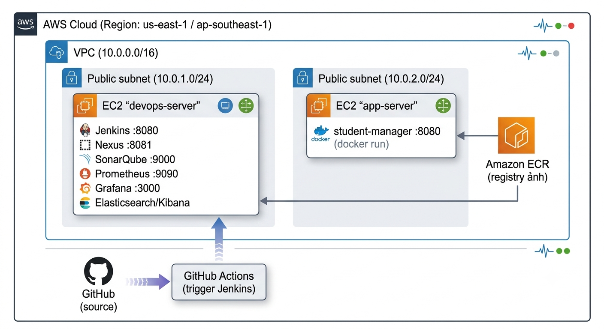

# ☁️ CAPSTONE MỞ RỘNG — Triển khai Jenkins DevOps Pipeline trên AWS EC2 thật

> **Mục đích:** Phần chính chạy trên Docker Desktop (máy local). Phần mở rộng này đưa **toàn bộ** pipeline lên **AWS thật** để sinh viên thực hành *vận hành & bảo trì hạ tầng trên cloud*. Hoàn thành phần này là minh chứng rõ nhất cho kỹ năng vận hành/bảo trì của môn học.

---

## 1. Kiến trúc mục tiêu

<p align="center">
  
</p> 

```
                          
**Nguyên tắc triển khai:**
- **Registry:** thay Docker Hub bằng **Amazon ECR** (riêng tư, cùng VPC, nhanh hơn).
- **Compute:** 1 EC2 chứa toàn bộ tool DevOps (Cách 1) hoặc tách riêng app-server (Cách 2).
- **IaC:** dùng **Terraform** (Bài 3) để dựng hạ tầng có thể lặp lại & xoá sạch.

---

## 2. Yêu cầu & Chi phí dự kiến

| Yêu cầu | Mục đích |
|---|---|
| AWS account + **IAM user** (Access key) | Gọi API bằng AWS CLI/Terraform |
| AWS CLI v2 | `aws configure` |
| Terraform ≥ 1.6 (tùy chọn) | IaC dựng hạ tầng |
| **Budget alert** (bắt buộc!) | Tránh phát sinh chi phí ngoài ý muốn |

**Chi phí tham khảo (Free Tier / t2/t3.micro–small):** EC2 `t3.large` ≈ 0.083 USD/giờ. Luôn **terminate instance + xoá EBS/ECR/SG** sau buổi thực hành.

> ⚠️ **Bắt buộc:** vào *Billing → Budgets* tạo budget 5 USD + cảnh báo email trước khi làm.

---

## 3. Cách 1 — Một EC2 duy nhất (đơn giản, để học)

### 3.1 Tạo Security Group (mở đúng port cần thiết)

| Port | Dịch vụ | Ghi chú |
|---|---|---|
| 22 | SSH | chỉ từ IP của bạn (không 0.0.0.0/0!) |
| 8080 | Jenkins | |
| 8081 | Nexus | |
| 9000 | SonarQube | |
| 9090 | Prometheus | |
| 3000 | Grafana | |
| 5601 | Kibana | |
| 9200 | Elasticsearch | chỉ nội bộ VPC |

### 3.2 Launch EC2 với user-data cài đặt tự động

- **AMI:** Ubuntu Server 22.04 LTS (HVM)
- **Instance type:** `t3.large` (2 vCPU / 8 GB — SonarQube cần RAM)
- **Storage:** 30 GB gp3
- **User data** (dán vào mục *Advanced details → User data*):

```bash
#!/bin/bash
set -e
# Cài Docker + Docker Compose
apt-get update -y
apt-get install -y ca-certificates curl git openjdk-17-jdk maven nodejs npm
install -m 0755 -d /etc/apt/keyrings
curl -fsSL https://download.docker.com/linux/ubuntu/gpg -o /etc/apt/keyrings/docker.asc
chmod a+r /etc/apt/keyrings/docker.asc
echo "deb [arch=$(dpkg --print-architecture) signed-by=/etc/apt/keyrings/docker.asc] https://download.docker.com/linux/ubuntu $(. /etc/os-release && echo "$VERSION_CODENAME") stable" > /etc/apt/sources.list.d/docker.list
apt-get update -y
apt-get install -y docker-ce docker-ce-cli containerd.io docker-compose-plugin
systemctl enable --now docker
usermod -aG docker ubuntu
npm install -g newman

# Đưa Jenkins vào nhóm docker để build image (bind docker.sock)
mkdir -p /opt/devops
echo "✅ EC2 sẵn sàng — SSH vào để tiếp tục."
```

```bash
# SSH vào instance rồi khởi động hạ tầng (đã có file docker-compose-infra.yml)
scp -i key.pem configs/docker-compose-infra.yml ubuntu@<PUBLIC_IP>:/opt/devops/
ssh -i key.pem ubuntu@<PUBLIC_IP>
cd /opt/devops
sudo docker compose -f docker-compose-infra.yml up -d
sudo docker exec capstone-jenkins cat /var/jenkins_home/secrets/initialAdminPassword
```

### 3.3 Cấu hình Jenkins & chạy pipeline

1. Mở `http://<PUBLIC_IP>:8080` → mở khoá → cài plugin gợi ý → tạo admin.
2. Manage Jenkins → Tools → thêm Maven `M3` + JDK `JDK17` (như local).
3. Tạo Pipeline job → **Pipeline script from SCM** → trỏ `https://github.com/PhamThuongBlog/student-manager.git`.
4. Build Now → pipeline 14 stage chạy ngay trên EC2.

> 🔁 **Trigger bằng GitHub Actions trên AWS:** Jenkins EC2 đã có **public IP** nên GitHub-hosted runner (`ubuntu-latest`) gọi tới được trực tiếp — **không cần self-hosted runner, không cần ngrok**. Sửa `.github/workflows/trigger-jenkins.yml`: đổi `runs-on: self-hosted` → `ubuntu-latest`, và đặt secret `JENKINS_URL = http://<PUBLIC_IP>:8080`. Cấu hình còn lại (token "Trigger builds remotely") giữ nguyên như phần local.

---

## 4. Cách 2 — Nhiều EC2 + Amazon ECR (sát production)

### 4.1 Tách hạ tầng thành 2 instance

| Instance | Chạy gì | type |
|---|---|---|
| `devops-server` | Jenkins + Nexus + SonarQube + Prometheus/Grafana + ELK | `t3.large` |
| `app-server` | `student-manager` container | `t3.small` |

Cả hai nằm chung **Security Group nội bộ** để `devops-server` gọi được app-server qua port 8080.

### 4.2 Dùng ECR thay Docker Hub (sửa Jenkinsfile)

Tạo repository ECR:

```bash
aws ecr create-repository --repository-name student-manager
# → <ACCOUNT_ID>.dkr.ecr.<region>.amazonaws.com/student-manager
```

Sửa `environment` và stage Docker Push trong `Jenkinsfile`:

```groovy
environment {
    // thay DOCKER_USER bằng ECR endpoint
    REGISTRY = '<ACCOUNT_ID>.dkr.ecr.<region>.amazonaws.com'
}

stage('9. DOCKER PUSH') {
    steps {
        sh '''
            aws ecr get-login-password --region <region> | docker login --username AWS --password-stdin ${REGISTRY}
            docker tag ${APP_NAME}:${BUILD_NUMBER} ${REGISTRY}/student-manager:${BUILD_NUMBER}
            docker push ${REGISTRY}/student-manager:${BUILD_NUMBER}
        '''
    }
}
```

> Gắn **IAM Role** `AmazonEC2ContainerRegistryPowerUser` cho `devops-server` để Jenkins push ECR **không cần access key**.

### 4.3 Deploy app trên app-server

```bash
ssh ubuntu@<APP_SERVER_IP>
aws ecr get-login-password --region <region> | docker login --username AWS --password-stdin <ACCOUNT_ID>.dkr.ecr.<region>.amazonaws.com
docker run -d --name student-manager -p 8080:8080 <ACCOUNT_ID>.dkr.ecr.<region>.amazonaws.com/student-manager:latest
curl http://localhost:8080/api/students/health   # → {"status":"UP"}
```

---

## 5. IaC với Terraform (vận dụng Bài 3)

File `main.tf` tối giản dựng 1 EC2 + Security Group:

```hcl
provider "aws" {
  region = "ap-southeast-1"   # hoặc us-east-1
}

resource "aws_security_group" "devops" {
  name = "devops-sg"
  ingress {
    from_port = 22; to_port = 22; protocol = "tcp"
    cidr_blocks = ["YOUR_IP/32"]          # chỉ IP của bạn
  }
  dynamic "ingress" {
    for_each = [8080, 8081, 9000, 9090, 3000, 5601]
    content {
      from_port = ingress.value; to_port = ingress.value; protocol = "tcp"
      cidr_blocks = ["0.0.0.0/0"]
    }
  }
  egress {
    from_port = 0; to_port = 0; protocol = "-1"
    cidr_blocks = ["0.0.0.0/0"]
  }
}

resource "aws_instance" "devops" {
  ami                    = "ami-0f6dcf0bc849c5d7a"   # Ubuntu 22.04 (ap-southeast-1)
  instance_type          = "t3.large"
  key_name               = "your-key"
  vpc_security_group_ids = [aws_security_group.devops.id]
  user_data              = file("user-data.sh")
  root_block_device { volume_size = 30; volume_type = "gp3" }
  tags = { Name = "devops-server" }
}

output "public_ip" { value = aws_instance.devops.public_ip }
```

```bash
terraform init && terraform apply -auto-approve
terraform output public_ip       # → IP để SSH
terraform destroy                # ← XOÁ SẠCH sau khi xong (quan trọng!)
```

---

## 6. Monitoring trên AWS

| Thành phần | Cách làm trên AWS |
|---|---|
| **CloudWatch** (native) | EC2 → CloudWatch Agent → metric CPU/RAM/disk; tạo **Alarm** (CPU > 80%) → SNS email. |
| **ELK** | Chạy Elasticsearch + Kibana trong `devops-server` (như local), log của app được ship lên qua filebeat/HTTP. |
| **Prometheus + Grafana** | Giữ nguyên `prometheus.yml` nhưng trỏ `targets: ['<APP_SERVER_IP>:8080']`; Grafana vẽ dashboard JVM/HTTP. |
| **Health check** | `curl /api/students/health` + Docker `HEALTHCHECK` như ở local. |

> **Bảo trì phòng ngừa:** cấu hình CloudWatch Alarm + SNS là ví dụ *preventive maintenance* — tự cảnh báo trước khi sự cố trở nên nghiêm trọng.

---

## 7. Bảo mật (góc nhìn vận hành)

- **IAM least privilege:** không dùng AdministratorAccess; chỉ cấp EC2/ECR cần thiết.
- **Security Group tối thiểu:** port 22 chỉ mở cho IP cá nhân; Elasticsearch (9200) **không** mở ra internet.
- **Không hardcode access key** vào user-data/Jenkinsfile → dùng **IAM Role** gắn cho instance.
- **Khoá private key (.pem)** cất an toàn, `chmod 400`.

---

## 8. Dọn dẹp — tránh phát sinh chi phí (BẮT BUỘC)

```bash
# 1. Xoá hạ tầng bằng Terraform (nếu dùng)
terraform destroy

# 2. Hoặc xoá thủ công bằng AWS CLI
aws ec2 terminate-instances --instance-ids i-xxxx
aws ec2 delete-security-group --group-id sg-xxxx
aws ecr delete-repository --repository-name student-manager --force
```

> ✅ **Kiểm tra cuối:** vào *EC2 → Instances* (0 running) và *ECR* (rỗng), vào *Billing* xác nhận chi phí = 0.

---

## 9. Tiêu chí chấm điểm phần mở rộng (cộng điểm)

| # | Tiêu chí | Điểm cộng |
|---|----------|:---:|
| 1 | Dựng được EC2 + pipeline 14 stage xanh trên cloud | +10 |
| 2 | Push image lên ECR (thay Docker Hub) | +5 |
| 3 | Dùng Terraform IaC (Bài 3) | +5 |
| 4 | CloudWatch Alarm / Grafana dashboard | +5 |
| 5 | Xoá sạch tài nguyên, không phát sinh chi phí | +5 |

> 🏆 Hoàn thành phần mở rộng = chứng minh trọn vẹn năng lực **Vận hành & Bảo trì phần mềm trên hạ tầng thật**.
