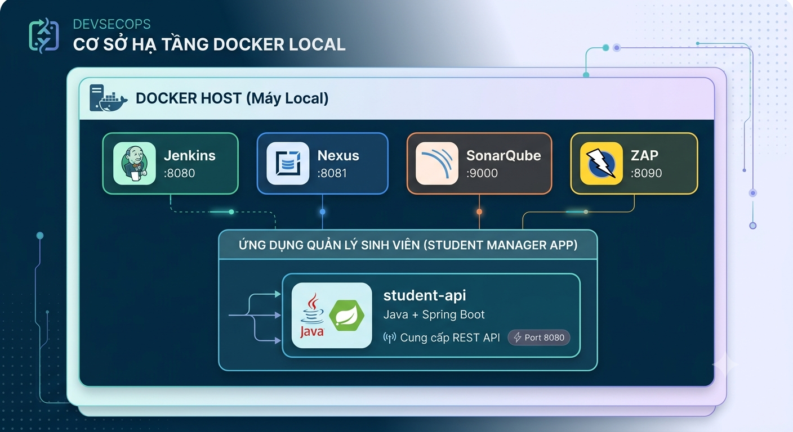
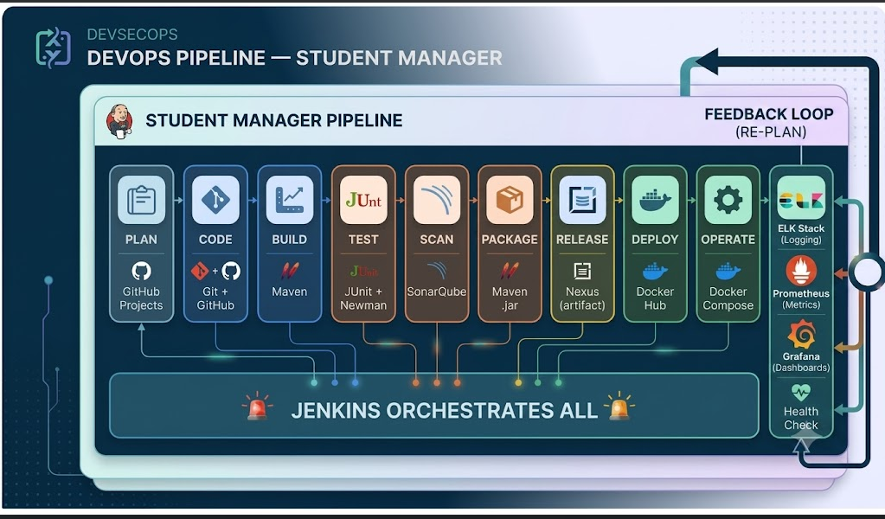

# 🏆 CAPSTONE PROJECT: DevOps End-to-End Pipeline

## Student Manager Application — Full DevOps Lifecycle

> **Thời lượng:** 180 phút (3 tiết) | **Hình thức:** Nhóm 2-3 người
> **Tích hợp:** Bài 1→9 | **Độ khó:** ⭐⭐⭐⭐⭐ (Tổng hợp)

---

## 📋 Mục lục
1. [Tổng quan Case Study](#1-tổng-quan)
2. [Kiến trúc Hệ thống & Pipeline](#2-kiến-trúc)
3. [Chuẩn bị Môi trường](#3-chuẩn-bị)
4. [GIAI ĐOẠN 1: PLAN & CODE](#4-plan--code)
5. [GIAI ĐOẠN 2: CI — Build, Test, Static Analysis](#5-ci-pipeline)
6. [GIAI ĐOẠN 3: RELEASE — Package & Publish](#6-release)
7. [GIAI ĐOẠN 4: CD — Docker Build & Deploy](#7-cd-pipeline)
8. [GIAI ĐOẠN 5: OPERATE — Security Test & Monitor](#8-operate)
9. [GIAI ĐOẠN 6: FEEDBACK — Từ Monitor về Plan](#9-feedback)
10. [Tổng kết & Nộp bài](#10-tổng-kết)

---

## 1. TỔNG QUAN CASE STUDY

### Bối cảnh

Bạn là **DevOps Engineer** trong team phát triển **Student Manager** — ứng dụng quản lý sinh viên. Nhiệm vụ: xây dựng **toàn bộ DevOps pipeline** để tự động hóa từ lúc viết code đến lúc ứng dụng chạy trên production.

### Ứng dụng

**Student Manager API** — REST API quản lý sinh viên:
- **Tech stack:** Java 17 + Spring Boot 3 + Maven
- **Endpoints:** CRUD students, search, health check
- **Database:** H2 (in-memory, không cần cài đặt)
- **Port:** 8080

### Công cụ DevOps sử dụng (ánh xạ bài học)

| Giai đoạn | Công cụ | Bài học |
|-----------|---------|:---:|
| **Plan** | GitHub Projects, Issues | Bài 1 |
| **Code** | Git, GitHub, Git Flow | Bài 5 |
| **Build** | Maven | Bài 7 |
| **Test** | JUnit 5, Postman/Newman | Bài 6, 7 |
| **Static Analysis** | SonarQube (SAST) | Bài 6, 7 |
| **Package** | Maven → .jar | Bài 7 |
| **Artifact Repo** | Nexus Repository | Bài 7 |
| **Container Build** | Docker, Dockerfile | Bài 8 |
| **Registry Push** | Docker Hub | Bài 8 |
| **Deploy** | Docker Compose | Bài 8 |
| **Security Test** | OWASP ZAP (DAST) | Bài 6 |
| **Orchestrator** | **Jenkins** (CI+CD pipeline) | Bài 7, 8 |
| **Monitor** | Health endpoints + logs | Bài 2, 9 |

---

## 2. KIẾN TRÚC HỆ THỐNG & PIPELINE

### Kiến trúc Triển khai

<p align="center">
  
</p>

### DevOps Pipeline End-to-End

<p align="center">
  
</p>

---

## 3. CHUẨN BỊ MÔI TRƯỜNG

### Yêu cầu

| Công cụ | Version | Kiểm tra |
|---------|---------|----------|
| Docker Desktop | ≥ 24.x | `docker --version` |
| Docker Compose | ≥ v2 | `docker compose version` |
| Git | ≥ 2.40 | `git --version` |
| JDK | ≥ 17 | `java --version` |
| Maven | ≥ 3.9 | `mvn --version` |
| Node.js | ≥ 18 | `node --version` |
| Postman | Latest | Desktop app |
| OWASP ZAP | ≥ 2.15 | Desktop app |
| GitHub Account | — | github.com |

### Khởi động Môi trường DevOps

```bash
# Tạo thư mục capstone
mkdir capstone-devops && cd capstone-devops
New-Item -ItemType Directory -Path configs, screenshots -Force
```
=> Lệnh trên tương đương với lệnh này (chạy trên Linux/ MacOS): 

```bash
mkdir -p configs screenshots
```

**Tạo `configs/docker-compose-infra.yml`** (Jenkins + Nexus + SonarQube):
Chạy lệnh:

```bash
New-Item -ItemType File -Path "configs\docker-compose-infra.yml" -Force
```

**Nội dung file:**

```yaml
version: '3.8'

services:
  jenkins:
    image: jenkins/jenkins:lts-jdk17
    container_name: capstone-jenkins
    ports:
      - "8080:8080"
      - "50000:50000"
    volumes:
      - jenkins_home:/var/jenkins_home
      - /var/run/docker.sock:/var/run/docker.sock
    networks:
      - devops-net

  nexus:
    image: sonatype/nexus3:latest
    container_name: capstone-nexus
    ports:
      - "8081:8081"
    volumes:
      - nexus_data:/nexus-data
    networks:
      - devops-net

  sonarqube:
    image: sonarqube:lts-community
    container_name: capstone-sonarqube
    ports:
      - "9000:9000"
    environment:
      SONAR_ES_BOOTSTRAP_CHECKS_DISABLE: "true"
    volumes:
      - sonar_data:/opt/sonarqube/data
    networks:
      - devops-net

volumes:
  jenkins_home:
  nexus_data:
  sonar_data:

networks:
  devops-net:
    driver: bridge
```

```bash
# Khởi động infrastructure
docker compose -f configs/docker-compose-infra.yml up -d

# Đợi ~2 phút, lấy passwords
docker exec capstone-jenkins cat /var/jenkins_home/secrets/initialAdminPassword
docker exec capstone-nexus cat /nexus-data/admin.password
```

✅ **Checkpoint 0:** 3 containers Up? Jenkins(:8080), Nexus(:8081), SonarQube(:9000) đều truy cập được?

---

## 4. GIAI ĐOẠN 1: PLAN & CODE

### 4.1 PLAN — Tạo GitHub Project Board

1. Vào GitHub → **Projects** → New project → Board
2. Name: `Student Manager DevOps`
3. Tạo các issues:
   - `[STU-01] Create Student model & repository`
   - `[STU-02] Create REST API endpoints`
   - `[STU-03] Add unit tests`
   - `[STU-04] Add health check endpoint`
   - `[STU-05] Setup CI/CD pipeline`
4. Gán issues cho thành viên, set status

### 4.2 CODE — Tạo Project Spring Boot

```bash
# Tạo Spring Boot project với Maven
mkdir student-manager && cd student-manager
```

**Tạo `pom.xml`**:

```xml
<?xml version="1.0" encoding="UTF-8"?>
<project xmlns="http://maven.apache.org/POM/4.0.0"
         xmlns:xsi="http://www.w3.org/2001/XMLSchema-instance"
         xsi:schemaLocation="http://maven.apache.org/POM/4.0.0
         http://maven.apache.org/xsd/maven-4.0.0.xsd">
    <modelVersion>4.0.0</modelVersion>

    <parent>
        <groupId>org.springframework.boot</groupId>
        <artifactId>spring-boot-starter-parent</artifactId>
        <version>3.3.0</version>
    </parent>

    <groupId>com.devops.capstone</groupId>
    <artifactId>student-manager</artifactId>
    <version>1.0.0-SNAPSHOT</version>
    <packaging>jar</packaging>
    <name>Student Manager — DevOps Capstone</name>

    <properties>
        <java.version>17</java.version>
    </properties>

    <dependencies>
        <dependency>
            <groupId>org.springframework.boot</groupId>
            <artifactId>spring-boot-starter-web</artifactId>
        </dependency>
        <dependency>
            <groupId>org.springframework.boot</groupId>
            <artifactId>spring-boot-starter-data-jpa</artifactId>
        </dependency>
        <dependency>
            <groupId>com.h2database</groupId>
            <artifactId>h2</artifactId>
            <scope>runtime</scope>
        </dependency>
        <dependency>
            <groupId>org.springframework.boot</groupId>
            <artifactId>spring-boot-starter-actuator</artifactId>
        </dependency>
        <dependency>
            <groupId>org.springframework.boot</groupId>
            <artifactId>spring-boot-starter-test</artifactId>
            <scope>test</scope>
        </dependency>
    </dependencies>

    <build>
        <plugins>
            <plugin>
                <groupId>org.springframework.boot</groupId>
                <artifactId>spring-boot-maven-plugin</artifactId>
            </plugin>
            <plugin>
                <groupId>org.jacoco</groupId>
                <artifactId>jacoco-maven-plugin</artifactId>
                <version>0.8.12</version>
                <executions>
                    <execution>
                        <goals><goal>prepare-agent</goal></goals>
                    </execution>
                    <execution>
                        <id>report</id>
                        <phase>test</phase>
                        <goals><goal>report</goal></goals>
                    </execution>
                </executions>
            </plugin>
        </plugins>
    </build>
</project>
```

**Tạo cấu trúc thư mục:**

```bash
New-Item -ItemType Directory -Path `
    "src/main/java/com/devops/capstone/model",
    "src/main/java/com/devops/capstone/repository",
    "src/main/java/com/devops/capstone/controller",
    "src/main/java/com/devops/capstone/config" `
    -Force
New-Item -ItemType Directory -Path ` "src/main/resources" ` -Force
New-Item -ItemType Directory -Path `
  "src/test/java/com/devops/capstone/controller",
  "src/test/java/com/devops/capstone/service" `
  -Force
```

**Note:** Nếu OS của máy là Linux/MacOS thì thực thi các lệnh tương đương sau:

```bash
mkdir -p src/main/java/com/devops/capstone/{model,repository,controller,config}
mkdir -p src/main/resources
mkdir -p src/test/java/com/devops/capstone/{controller,service}
```

### 4.3 Viết Code Ứng dụng

**`src/main/resources/application.properties`:**

```properties
server.port=8080
spring.application.name=student-manager
spring.datasource.url=jdbc:h2:mem:studentdb
spring.datasource.driverClassName=org.h2.Driver
spring.jpa.database-platform=org.hibernate.dialect.H2Dialect
spring.h2.console.enabled=true
management.endpoints.web.exposure.include=health,info,metrics
```

**`src/main/java/com/devops/capstone/model/Student.java`:**

Chạy lệnh tạo file:

```bash
New-Item -ItemType File -Path "src/main/java/com/devops/capstone/model/Student.java" -Force
```

**Nội dung file:**

```java
package com.devops.capstone.model;

import jakarta.persistence.*;

@Entity
@Table(name = "students")
public class Student {

    @Id
    @GeneratedValue(strategy = GenerationType.IDENTITY)
    private Long id;

    @Column(nullable = false)
    private String studentId;

    @Column(nullable = false)
    private String name;

    private Integer age;
    private String grade;

    public Student() {}

    public Student(String studentId, String name, Integer age, String grade) {
        this.studentId = studentId;
        this.name = name;
        this.age = age;
        this.grade = grade;
    }

    // Getters và Setters
    public Long getId() { return id; }
    public void setId(Long id) { this.id = id; }
    public String getStudentId() { return studentId; }
    public void setStudentId(String studentId) { this.studentId = studentId; }
    public String getName() { return name; }
    public void setName(String name) { this.name = name; }
    public Integer getAge() { return age; }
    public void setAge(Integer age) { this.age = age; }
    public String getGrade() { return grade; }
    public void setGrade(String grade) { this.grade = grade; }
}
```

**`src/main/java/com/devops/capstone/repository/StudentRepository.java`:**

```java
package com.devops.capstone.repository;

import com.devops.capstone.model.Student;
import org.springframework.data.jpa.repository.JpaRepository;
import java.util.List;

public interface StudentRepository extends JpaRepository<Student, Long> {
    List<Student> findByNameContainingIgnoreCase(String name);
    Student findByStudentId(String studentId);
}
```

**`src/main/java/com/devops/capstone/controller/StudentController.java`:**

```java
package com.devops.capstone.controller;

import com.devops.capstone.model.Student;
import com.devops.capstone.repository.StudentRepository;
import org.springframework.beans.factory.annotation.Autowired;
import org.springframework.http.HttpStatus;
import org.springframework.http.ResponseEntity;
import org.springframework.web.bind.annotation.*;

import java.util.*;

@RestController
@RequestMapping("/api/students")
public class StudentController {

    @Autowired
    private StudentRepository repository;

    // GET all students
    @GetMapping
    public ResponseEntity<Map<String, Object>> getAllStudents() {
        List<Student> students = repository.findAll();
        Map<String, Object> response = new LinkedHashMap<>();
        response.put("success", true);
        response.put("data", students);
        response.put("total", students.size());
        response.put("service", "student-manager");
        response.put("version", "1.0.0");
        return ResponseEntity.ok(response);
    }

    // GET student by ID
    @GetMapping("/{id}")
    public ResponseEntity<Map<String, Object>> getStudent(@PathVariable Long id) {
        Optional<Student> student = repository.findById(id);
        Map<String, Object> response = new LinkedHashMap<>();
        if (student.isPresent()) {
            response.put("success", true);
            response.put("data", student.get());
        } else {
            response.put("success", false);
            response.put("message", "Student not found");
            return ResponseEntity.status(HttpStatus.NOT_FOUND).body(response);
        }
        return ResponseEntity.ok(response);
    }

    // POST create student
    @PostMapping
    public ResponseEntity<Map<String, Object>> createStudent(@RequestBody Student student) {
        Map<String, Object> response = new LinkedHashMap<>();
        if (student.getName() == null || student.getStudentId() == null) {
            response.put("success", false);
            response.put("message", "Name and studentId are required");
            return ResponseEntity.badRequest().body(response);
        }
        Student saved = repository.save(student);
        response.put("success", true);
        response.put("data", saved);
        return ResponseEntity.status(HttpStatus.CREATED).body(response);
    }

    // DELETE student
    @DeleteMapping("/{id}")
    public ResponseEntity<Map<String, Object>> deleteStudent(@PathVariable Long id) {
        Map<String, Object> response = new LinkedHashMap<>();
        if (!repository.existsById(id)) {
            response.put("success", false);
            response.put("message", "Student not found");
            return ResponseEntity.status(HttpStatus.NOT_FOUND).body(response);
        }
        repository.deleteById(id);
        response.put("success", true);
        response.put("message", "Student deleted");
        return ResponseEntity.ok(response);
    }

    // GET search
    @GetMapping("/search")
    public ResponseEntity<Map<String, Object>> search(@RequestParam String q) {
        List<Student> results = repository.findByNameContainingIgnoreCase(q);
        Map<String, Object> response = new LinkedHashMap<>();
        response.put("success", true);
        response.put("data", results);
        response.put("keyword", q);
        response.put("count", results.size());
        return ResponseEntity.ok(response);
    }

    // GET health
    @GetMapping("/health")
    public ResponseEntity<Map<String, Object>> health() {
        Map<String, Object> response = new LinkedHashMap<>();
        response.put("status", "UP");
        response.put("service", "student-manager");
        response.put("version", "1.0.0");
        response.put("timestamp", new Date().toString());
        return ResponseEntity.ok(response);
    }
}
```

**`src/main/java/com/devops/capstone/StudentManagerApplication.java`:**

```java
package com.devops.capstone;

import com.devops.capstone.model.Student;
import com.devops.capstone.repository.StudentRepository;
import org.springframework.beans.factory.annotation.Autowired;
import org.springframework.boot.CommandLineRunner;
import org.springframework.boot.SpringApplication;
import org.springframework.boot.autoconfigure.SpringBootApplication;

@SpringBootApplication
public class StudentManagerApplication implements CommandLineRunner {

    @Autowired
    private StudentRepository repository;

    public static void main(String[] args) {
        SpringApplication.run(StudentManagerApplication.class, args);
    }

    @Override
    public void run(String... args) {
        // Seed data
        repository.save(new Student("SV001", "Nguyen Van A", 20, "K20"));
        repository.save(new Student("SV002", "Tran Thi B", 21, "K20"));
        repository.save(new Student("SV003", "Le Van C", 19, "K21"));
        System.out.println("Student Manager API ready — " + repository.count() + " students seeded");
    }
}
```

### 4.4 Test Local

```bash
mvn clean spring-boot:run
# Mở terminal khác:
curl.exe http://localhost:8080/api/students/1
curl.exe http://localhost:8080/api/students/health
```

**Lưu ý:**
Nếu xung đột cổng 8080 với Jenkins, thì thay đổi thành cổng khác (ví dụ:8082) ở file application.properties


### 4.5 Git Flow — Push lên GitHub

```bash
git init && git checkout -b main
git add . && git commit -m "feat: initial Student Manager API with CRUD + health"
git remote add origin https://github.com/YOUR_USERNAME/student-manager.git
git push -u origin main

# Tạo develop branch
git checkout -b develop && git push origin develop
```

✅ **Checkpoint 1:** App chạy local? `curl localhost:8080/api/students` trả JSON 3 sinh viên? Code đã lên GitHub?

---

## 5. GIAI ĐOẠN 2: CI — BUILD, TEST, STATIC ANALYSIS

### 5.1 Viết Unit Tests

**`src/test/java/com/devops/capstone/controller/StudentControllerTest.java`:**

```java
package com.devops.capstone.controller;

import com.devops.capstone.model.Student;
import com.devops.capstone.repository.StudentRepository;
import org.junit.jupiter.api.BeforeEach;
import org.junit.jupiter.api.Test;
import org.springframework.beans.factory.annotation.Autowired;
import org.springframework.boot.test.context.SpringBootTest;
import org.springframework.boot.test.web.client.TestRestTemplate;
import org.springframework.boot.test.web.server.LocalServerPort;
import org.springframework.http.*;

import java.util.Map;

import static org.junit.jupiter.api.Assertions.*;

@SpringBootTest(webEnvironment = SpringBootTest.WebEnvironment.RANDOM_PORT)
class StudentControllerTest {

    @LocalServerPort
    private int port;

    @Autowired
    private TestRestTemplate restTemplate;

    @Autowired
    private StudentRepository repository;

    private String baseUrl;

    @BeforeEach
    void setUp() {
        baseUrl = "http://localhost:" + port + "/api/students";
        repository.deleteAll();
        repository.save(new Student("SV001", "Nguyen Van A", 20, "K20"));
    }

    @Test
    void testGetAllStudents() {
        ResponseEntity<Map> response = restTemplate.getForEntity(baseUrl, Map.class);
        assertEquals(HttpStatus.OK, response.getStatusCode());
        Map body = response.getBody();
        assertNotNull(body);
        assertEquals(true, body.get("success"));
        assertNotNull(body.get("data"));
    }

    @Test
    void testGetStudentById() {
        Student saved = repository.findAll().get(0);
        ResponseEntity<Map> response = restTemplate.getForEntity(
            baseUrl + "/" + saved.getId(), Map.class);
        assertEquals(HttpStatus.OK, response.getStatusCode());
    }

    @Test
    void testStudentNotFound() {
        ResponseEntity<Map> response = restTemplate.getForEntity(
            baseUrl + "/9999", Map.class);
        assertEquals(HttpStatus.NOT_FOUND, response.getStatusCode());
    }

    @Test
    void testCreateStudent() {
        Student newStudent = new Student("SV004", "Pham Thi D", 22, "K19");
        HttpHeaders headers = new HttpHeaders();
        headers.setContentType(MediaType.APPLICATION_JSON);
        HttpEntity<Student> request = new HttpEntity<>(newStudent, headers);
        ResponseEntity<Map> response = restTemplate.postForEntity(baseUrl, request, Map.class);
        assertEquals(HttpStatus.CREATED, response.getStatusCode());
    }

    @Test
    void testCreateStudentMissingName() {
        Student invalid = new Student("SV005", null, 20, "K20");
        HttpHeaders headers = new HttpHeaders();
        headers.setContentType(MediaType.APPLICATION_JSON);
        HttpEntity<Student> request = new HttpEntity<>(invalid, headers);
        ResponseEntity<Map> response = restTemplate.postForEntity(baseUrl, request, Map.class);
        assertEquals(HttpStatus.BAD_REQUEST, response.getStatusCode());
    }

    @Test
    void testHealthEndpoint() {
        ResponseEntity<Map> response = restTemplate.getForEntity(
            baseUrl + "/health", Map.class);
        assertEquals(HttpStatus.OK, response.getStatusCode());
        assertEquals("UP", response.getBody().get("status"));
    }

    @Test
    void testSearch() {
        ResponseEntity<Map> response = restTemplate.getForEntity(
            baseUrl + "/search?q=Nguyen", Map.class);
        assertEquals(HttpStatus.OK, response.getStatusCode());
        Map body = response.getBody();
        assertTrue((int) body.get("count") >= 1);
    }
}
```

```bash
# Chạy test
mvn test
# Kết quả: Tests run: 7, Failures: 0, Errors: 0, Skipped: 0 ✅
```

### 5.2 Cấu hình SonarQube

Tạo `sonar-project.properties`:

```properties
sonar.projectKey=student-manager
sonar.projectName=Student Manager — DevOps Capstone
sonar.projectVersion=1.0.0
sonar.sources=src/main/java
sonar.tests=src/test/java
sonar.java.binaries=target/classes
sonar.java.coveragePlugin=jacoco
sonar.coverage.jacoco.xmlReportPaths=target/site/jacoco/jacoco.xml
sonar.host.url=http://localhost:9000
sonar.login=admin
sonar.password=sonar123
```

### 5.3 Tạo Postman Collection

Tạo file `postman/Student-Manager-API.json` (xem trong `configs/`)

**Tổng hợp lại toàn bộ các endpoint:**

| # | Method | Endpoint                           | Body  | Thành công    | Lỗi   |
| - | ------ | ---------------------------------- | ----- | ------------- | ----- |
| 1 | GET    | `/api/students`                    | Không | `200 OK`      | —     |
| 2 | GET    | `/api/students/{id}`               | Không | `200 OK`      | `404` |
| 3 | POST   | `/api/students`                    | JSON  | `201 Created` | `400` |
| 4 | DELETE | `/api/students/{id}`               | Không | `200 OK`      | `404` |
| 5 | GET    | `/api/students/search?q={keyword}` | Không | `200 OK`      | —     |
| 6 | GET    | `/api/students/health`             | Không | `200 OK`      | —     |


### 5.4 Viết Jenkinsfile CI

Tạo `Jenkinsfile`:

```groovy
pipeline {
    agent any
    tools { maven 'M3' }

    environment {
        SONAR_HOST_URL = 'http://capstone-sonarqube:9000'
        NEXUS_URL      = 'http://capstone-nexus:8081'
    }

    stages {
        stage('Checkout') {
            steps {
                echo ' STEP 1/9: CHECKOUT'
                checkout scm
            }
        }
        stage('Build') {
            steps {
                echo '🔨 STEP 2/9: BUILD'
                sh 'mvn clean compile'
            }
        }
        stage('Unit Test') {
            steps {
                echo ' STEP 3/9: UNIT TEST'
                sh 'mvn test'
            }
            post {
                always { junit 'target/surefire-reports/*.xml' }
            }
        }
        stage('Static Analysis') {
            steps {
                echo ' STEP 4/9: SONARQUBE SCAN'
                sh 'mvn sonar:sonar -Dsonar.projectKey=student-manager -Dsonar.host.url=${SONAR_HOST_URL} -Dsonar.login=admin -Dsonar.password=sonar123'
            }
        }
        stage('Package') {
            steps {
                echo ' STEP 5/9: PACKAGE'
                sh 'mvn package -DskipTests'
                archiveArtifacts artifacts: 'target/*.jar', fingerprint: true
            }
        }
        stage('Publish to Nexus') {
            steps {
                echo ' STEP 6/9: PUBLISH TO NEXUS'
                sh 'mvn deploy -DskipTests -DaltDeploymentRepository=nexus::default::${NEXUS_URL}/repository/maven-releases_Lab10/'
            }
        }
        stage('Docker Build') {
            steps {
                echo ' STEP 7/9: DOCKER BUILD'
                sh 'docker build -t student-manager:${BUILD_NUMBER} .'
            }
        }
        stage('Docker Push') {
            steps {
                echo ' STEP 8/9: PUSH TO DOCKER HUB'
                sh 'docker tag student-manager:${BUILD_NUMBER} YOUR_DOCKER_USER/student-manager:${BUILD_NUMBER}'
                sh 'docker push YOUR_DOCKER_USER/student-manager:${BUILD_NUMBER}'
            }
        }
        stage('Deploy') {
            steps {
                echo ' STEP 9/9: DEPLOY'
                sh '''
                    docker stop student-manager 2>/dev/null || true
                    docker rm student-manager 2>/dev/null || true
                    docker run -d --name student-manager --network capstone_devops-net -p 8080:8080 student-manager:${BUILD_NUMBER}
                    sleep 10
                    curl -f http://localhost:8080/api/students/health || exit 1
                '''
            }
        }
    }
    post {
        success { echo ' CAPSTONE PIPELINE SUCCESS!' }
        failure { echo ' PIPELINE FAILED!' }
    }
}
```

✅ **Checkpoint 2:** `mvn test` 7/7 pass? SonarQube hiển thị project?

---

## 6. GIAI ĐOẠN 3: RELEASE — Package & Publish

### 6.1 Build Artifact

```bash
mvn clean package -DskipTests
ls -lh target/student-manager-1.0.0-SNAPSHOT.jar
# ~30MB Spring Boot fat JAR
```

### 6.2 Publish lên Nexus

1. Cấu hình Nexus: http://localhost:8081 → admin / password
2. Settings → Repositories → Create → maven2(hosted) → `maven-releases`
3. Cấu hình Maven `~/.m2/settings.xml`:

```xml
<settings>
  <servers>
    <server>
      <id>nexus</id>
      <username>admin</username>
      <password>nexus123</password>
    </server>
  </servers>
</settings>
```

4. Deploy:

```bash
mvn deploy -DskipTests \
  -DaltDeploymentRepository=nexus::default::http://localhost:8081/repository/maven-releases/
```

5. Verify: Nexus → Browse → maven-releases → `com/devops/capstone/student-manager/1.0.0-SNAPSHOT/`

✅ **Checkpoint 3:** Artifact `.jar` có trong Nexus?

---

## 7. GIAI ĐOẠN 4: CD — DOCKER BUILD & DEPLOY

### 7.1 Viết Dockerfile

```dockerfile
FROM eclipse-temurin:17-jre-alpine
WORKDIR /app
COPY target/student-manager-1.0.0-SNAPSHOT.jar app.jar
EXPOSE 8080
HEALTHCHECK --interval=30s --timeout=3s \
  CMD wget -qO- http://localhost:8080/api/students/health || exit 1
ENTRYPOINT ["java", "-jar", "app.jar"]
```

### 7.2 Docker Build & Run

```bash
docker build -t student-manager:1.0.0 .
docker run -d -p 8080:8080 --name student-manager --network capstone_devops-net student-manager:1.0.0
curl http://localhost:8080/api/students/health
```

### 7.3 Push Docker Hub

```bash
docker tag student-manager:1.0.0 YOUR_DOCKER_USER/student-manager:1.0.0
docker login
docker push YOUR_DOCKER_USER/student-manager:1.0.0
```

✅ **Checkpoint 4:** Container running? `curl localhost:8080/api/students/health` → `{"status":"UP"}`?

---

## 8. GIAI ĐOẠN 5: OPERATE — SECURITY TEST & MONITOR

### 8.1 DAST — OWASP ZAP Scan

1. Mở ZAP → Quick Start → Automated Scan
2. URL: `http://localhost:8080`
3. Attack → đợi scan hoàn tất (~3 phút)
4. Report → Generate HTML Report → `zap-report.html`

**Kiểm tra alerts:**
- High: 0 (ứng dụng không có XSS/SQLi vì là REST API)
- Medium: Missing security headers (thêm sau)
- Low: Information disclosure

### 8.2 API Test — Newman

```bash
newman run postman/Student-Manager-API.json \
  --reporters cli,json \
  --reporter-json-export newman-report.json
```

### 8.3 Health Monitor Loop

Tạo `scripts/monitor.sh`:

```bash
#!/bin/bash
while true; do
  STATUS=$(curl -s http://localhost:8080/api/students/health | python3 -c "import sys,json; print(json.load(sys.stdin)['status'])" 2>/dev/null || echo "DOWN")
  echo "[$(date '+%H:%M:%S')] Student Manager: $STATUS"
  sleep 5
done
```

```bash
chmod +x scripts/monitor.sh && bash scripts/monitor.sh
```

✅ **Checkpoint 5:** ZAP report có alerts? Newman 5/5 tests pass? Monitor loop chạy?

---

## 9. GIAI ĐOẠN 6: FEEDBACK — TỪ MONITOR VỀ PLAN

### 9.1 Ghi nhận Issues từ Testing

Dựa trên kết quả ZAP + SonarQube:
1. Tạo GitHub Issue: `[SEC-01] Add security headers (CSP, X-Frame-Options)`
2. Tạo GitHub Issue: `[QUAL-01] Increase test coverage above 70%`
3. Gán issue → Developer → Fix → Commit → Push → **Pipeline tự chạy lại!**

### 9.2 Demo Toàn bộ Vòng lặp

```
1. Developer push code lên GitHub
2. Jenkins trigger CI pipeline
3. Build → Test → SonarQube scan → Package → Push Nexus
4. Docker build → Push Docker Hub → Deploy container
5. ZAP security scan → Newman API test → Health monitor
6. Issues found → GitHub Issues created
7. Developer fix → Commit → Push → QUAY LẠI BƯỚC 2 

∞ INFINITE LOOP — DevOps là vòng lặp liên tục!
```

✅ **Checkpoint 6:** Đã tạo issues từ kết quả test? Đã fix 1 issue và push → pipeline chạy lại?

---

## 10. TỔNG KẾT & NỘP BÀI

### Bảng Tổng kết Công cụ đã Dùng

| # | Công cụ | Giai đoạn | Mục đích |
|---|---------|-----------|----------|
| 1 | GitHub | Plan + Code | Lưu trữ code, quản lý issues |
| 2 | Git + Git Flow | Code | Version control, branching |
| 3 | Maven | Build | Compile, test, package |
| 4 | JUnit 5 | Test | Unit testing |
| 5 | SonarQube | Static Analysis | Code quality, bugs, security hotspots |
| 6 | Nexus | Release | Artifact repository |
| 7 | Docker | Release + Deploy | Containerization |
| 8 | Docker Hub | Release | Image registry |
| 9 | Jenkins | Orchestrator | CI/CD pipeline tự động |
| 10 | Postman/Newman | Operate | API functional testing |
| 11 | OWASP ZAP | Operate | Security testing (DAST) |
| 12 | Health Endpoint | Monitor | Runtime health check |

### Tiêu chí Chấm điểm

| # | Tiêu chí | Điểm |
|---|----------|:----:|
| 1 | Code + GitHub + Git Flow (Plan & Code) | 15% |
| 2 | Jenkins CI Pipeline (Build → Test → Scan) | 20% |
| 3 | Artifact trên Nexus + Docker Hub | 15% |
| 4 | App deploy thành công (curl health OK) | 15% |
| 5 | SonarQube + ZAP reports | 15% |
| 6 | Newman API tests pass | 10% |
| 7 | Vòng lặp Feedback (issue → fix → pipeline) | 10% |
| **TỔNG** | | **100%** |

### Cách Nộp

```
CAPSTONE_NhomX_HoTen.zip
├── student-manager/              ← Toàn bộ source code
├── Jenkinsfile                   ← CI/CD pipeline
├── Dockerfile                    ← Docker image
├── docker-compose-infra.yml      ← Infrastructure stack
├── sonar-project.properties      ← SonarQube config
├── postman/                      ← Postman collection
├── screenshots/
│   ├── 01-github-repo.png
│   ├── 02-jenkins-pipeline.png   ← Stage View all green
│   ├── 03-sonarqube-dashboard.png
│   ├── 04-nexus-artifact.png
│   ├── 05-docker-hub.png
│   ├── 06-zap-report.png
│   ├── 07-newman-report.png
│   ├── 08-app-running.png        ← curl health + browser
│   └── 09-monitor-loop.png
├── reports/                      ← ZAP + Newman reports
└── CAPSTONE_REPORT.md            ← Báo cáo tổng kết
```

---

> 🏆 **CAPSTONE HOÀN THÀNH!** Bạn đã xây dựng DevOps Pipeline end-to-end: Plan → Code → Build → Test → Scan → Package → Release → Deploy → Operate → Monitor → Feedback.
>
> **Ánh xạ 9 bài học:**
> Plan(1) → Code(5) → Build(7) → Test(6) → Scan(6) → Package(7) → Release(7,8) → Deploy(8) → Operate(2,9) → Monitor(2) → Plan(1)
>
> 📅 **Cập nhật:** 2026-07-03
